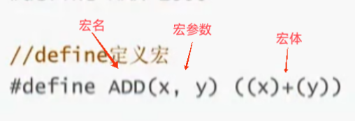

---
{
  "id": "3005a2dd-8276-8152-ab1b-cdc5f3c6772e",
  "url": "https://www.notion.so/define-3005a2dd82768152ab1bcdc5f3c6772e",
  "created_time": "2026-02-07T09:52:00.000Z",
  "last_edited_time": "2026-02-07T09:52:00.000Z"
}
---

#  #define定义常量和宏

# #define定义常量和宏
## #define声明宏
可以理解为简易版函数
声明语法：

IMG_20250409_162349
使用时用 宏体 替代 宏名 与 宏参
```c
#define 宏名(宏参) 宏体
```
注意：
宏名与宏参之间没有空格
宏只做字符的替换（原理），不会加任何括号（参见书p149－6.26）
宏的参数受括号保护
### 宏的使用
ps：
形参：定义宏时括号内的参数（被替换的参数）
实参：使用宏时括号内的参数（替换别人的参数）
宏展开：形参被替换的过程叫宏展开
```c
a=3+S(5,8)//其中S(5,8)是宏
```
### define定义常量
语法：
```c
#define 常量名 常量值
```
‍
