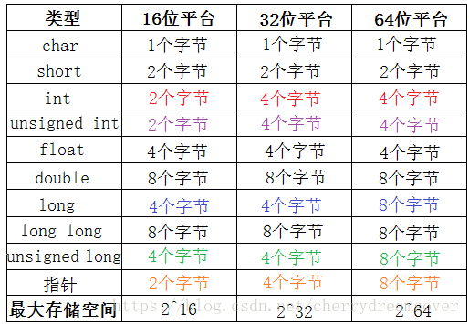

---
{
  "id": "3005a2dd-8276-8168-894b-ed2fb9f9c744",
  "url": "https://www.notion.so/3005a2dd82768168894bed2fb9f9c744",
  "created_time": "2026-02-07T09:52:00.000Z",
  "last_edited_time": "2026-02-07T09:54:00.000Z"
}
---

#  数据结构（数据类型）

# 数据结构（数据类型）

16位编译器
|  |  |  |  |
| --- | --- | --- | --- |
|  |  |  |  |
|  |  |  |  |
|  |
|  |
|  |
|  |
|  |
|  |
|  |
|  |
32位编译器
|  |
|  |
|  |
|  |
|  |
|  |
|  |
|  |
|  |
64位编译器
|  |
|  |
|  |
|  |
|  |
|  |
|  |
|  |
|  |
## ASCII码推算
只需记住几个具有代表性字符的十进制ASC11码值，即可算出常用字符的ASCII码了。
1. ‘0’的十进制ASCII码为48
1. ‘A’的十进制ASCII码为65
1. 'a'的十进制ASCII码为97
1. 大小字母ASCI码差32
数字及字母只需将上一个字符的十进制ASCII码加一
## 类型转换
### 自动类型转换
‍
### 强制类型转换
强制类型转换的一般形式如下：
```c
（类型名） （表达式）
```
```c
int i = 10;
float f;
f = (float)i;// 强制转换int为float类型
```
‍
## 不同位数设备数据类型字节数


