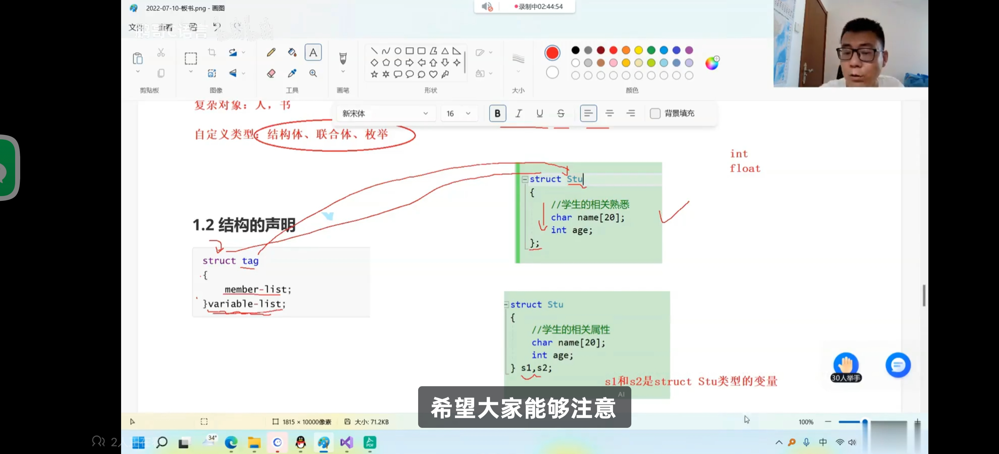

---
{
  "id": "20a5a2dd-8276-80ac-ad5e-f215c327a1fd",
  "url": "https://www.notion.so/20a5a2dd827680acad5ef215c327a1fd",
  "created_time": "2025-06-06T08:33:00.000Z",
  "last_edited_time": "2025-10-04T10:12:00.000Z"
}
---

#  结构体（自定义数据类型）

可以理解为能存储多种数据类型的数组（不严谨）
**事实上是创建了一个名为 “struct 结构体名” 的数据类型，因此在重命名时需要带struct**
**结构体不存储数据，数据存储在结构体变量中，所以结构体变量与正常变量的定义和调用无异**
把结构体就当自定义数据类型处理，结构体变量就当该类型的变量处理（别听什么比喻，都会出错）
## 声明：
```c
struct 结构体名
{
成员列表；//存放该结构体的属性（每个下辖变量的属性）
}
变量列表；//变量列表声明改结构体下辖的变量，用逗号隔开
```

也可以：
先声明好结构体的属性
再声明结构体变量
用这个：
```c
struct 结构体名 变量1，变量2;
```
ps：变量列表不只可以定义变量，还可以定义 指针,数组 等
## 匿名结构体类型
ps：如果没给结构体命名就是“匿名结构体类型”：
后续无法为结构体添加变量（因为该结构体无名字）
## 访问结构体成员
与数组不同，结构体不是通过下标访问的，而是通过变量名.成员名（结构体变量名）访问
例
```c
结构体变量名.成员名=1
```

## 访问结构体
像调用变量一样直接调用变量列表中的变量
## 注意事项
牢记结构体有成员列表和变量列表，
**访问结构体成员用的是变量列表**
**添加结构体变量用的是结构体名**
**如果结构体没有定义变量列表，则需要使用: struct+结构体名 的方式调用**
也可以使用 typedef struct 结构体名 变量名 来重命名该数据类型的类型名（以方便使用），**注意⚠️：typedef并非是添加/修改变量列表**
```c
struct 结构体名{
  成员列表；
}
/*结构体没有定义变量列表*/
struct 结构体名.成员列表

```

## 结构体数组
结构体数组就是由多个相同类型的结构体组成的数组
