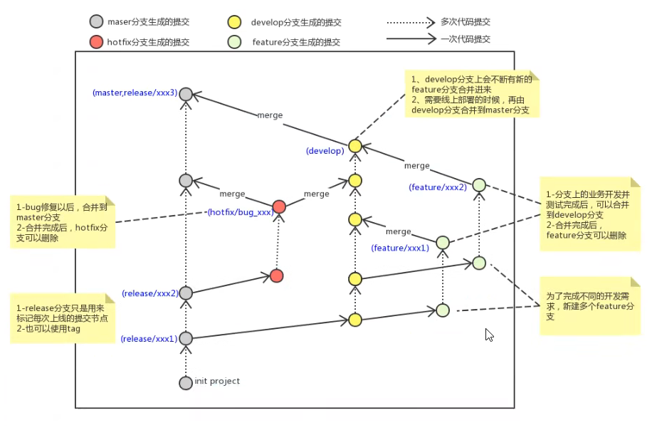

---
{
  "id": "62e5a2dd-8276-83c5-a42d-81f90fc92dfe",
  "url": "https://app.notion.com/p/10-62e5a2dd827683c5a42d81f90fc92dfe",
  "created_time": "2026-03-03T14:42:00.000Z",
  "last_edited_time": "2026-03-03T14:42:00.000Z"
}
---

#  10. 分支使用规范

- master分支（生产）
线上分支，主分支，中小规模项目作为线上运行的应用对应的分支

- develop分支（开发）
是从master创建的分支，一般作为主开发分支，开发完成再合并到master

- feature分支（临时开发分支）
名字不一定是feature，可以是功能或者其他的。要创建在develop分之下，合并到develop后可以删除。

- hotfix/bug分支（bug修复分支）
是从master分出来的分支。修复完成后合并回master，在合并给develop保持同步（因为规定master分支不合并到develop）

- 有的还有test分支（测试）pre分支（预上线）….

**注意⚠️：不要直接在develop分支上面开发，要先在develop分支上面创建一个新分支（featutre分支），在该分支上开发，开发完再合并会develop**
**feature分支（临时开发分支）合并到develop分支以后可以删除**
**develop分支合并到master分支后不要删除**
**bug分支除了要合并到main分支以外还要合并给develop分支，否则main分支和develop分支数据不一致。**

