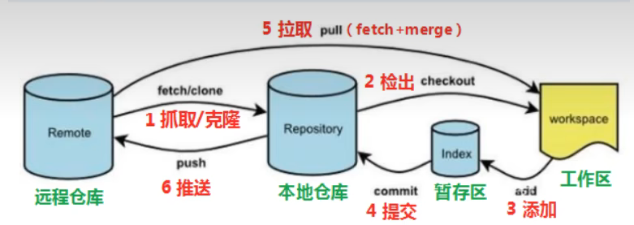

---
{
  "id": "a415a2dd-8276-831a-ad5b-81f0a0476b8b",
  "url": "https://app.notion.com/p/4-git-a415a2dd8276831aad5b81f0a0476b8b",
  "created_time": "2026-03-03T14:42:00.000Z",
  "last_edited_time": "2026-03-03T14:42:00.000Z"
}
---

#  4.git工作流程

