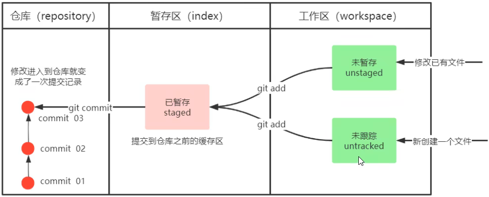
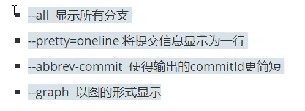

---
{
  "id": "bbe5a2dd-8276-839d-9487-013d783c5b59",
  "url": "https://app.notion.com/p/7-git-bbe5a2dd8276839d9487013d783c5b59",
  "created_time": "2026-03-03T14:42:00.000Z",
  "last_edited_time": "2026-03-10T08:50:00.000Z"
}
---

#  7. git常用命令（初始化/添加/历史/回退/忽略）

# 原理
Git工作目录下对于文件的增删改会存在几个状态，这些状态会随着我们执行git命令而发生变化

新创建的文件是未跟踪状态
已有文件被修改是未暂存状态
### 用如下命令将修改/新增添加至暂存区
```shell
git add 文件名或通配符
#将文件添加入暂存区
```
用通配符` . `表示所有文件/夹
### 用如下命令将暂存区文件提交至本地仓库
```shell
git commit [选项] 参数
#提交暂存区至仓库
```
| 选项 | 含义 |
| --- | --- |
| -m（常用） | 添加提交说明 |
| -a | 自动提交已跟踪文件（跳过 git add） |
| --amend | 把本次提交合并到上一次提交（常用于修改提交信息或补交漏掉的文件） |
| --no-verify | 跳过 pre-commit / commit-msg 等钩子校验（不建议常用） |
**PS：**
**Turtle git图形化界面将添加和提交一起执行了，实际上是两步，而不是直接提交**
**PS：**
**先添加后提交！**
不添加-m，会自动弹出编辑器让你写备注
### 查看当前目录git控制状态（仓库中/未跟踪/未暂存/未提交）
```shell
git status
```
### 查看提交历史
```shell
git log [选项]
```
| 选项 | 含义 |
| --- | --- |
| --all | 显示所有分支的提交历史 |
| --oneline | 每条提交显示为一行（简洁显示） |
| --graph | 用 ASCII 图形显示分支与合并历史 |
| --decorate | 显示分支名、tag 等引用信息 |
| -n 数字 | 只显示最近 n 条提交（例如 -n 5） |
| --stat | 显示每次提交的文件变更统计 |
| -p | 显示每次提交的具体 diff 补丁 |
一般加入这些参数就直观了

（这里就可以使用Linux的指令别名，提前写好指令别名文件，降低调用指令所需的输入）
### 版本回退
```shell
git reset --hard 版本ID
```
PS：
版本ID可以用`git log`查看
**复制版本ID不要ctrl+c（在Linux里，这是停止的意思）直接点击对应的版本ID就复制上了**
**粘贴的时候也不要ctrl+v点一下鼠标滚轮就粘贴上了**
同样的回退也可以撤销，同样的方法输入对应的版本ID即可（找不到ID可以执行`git reflog`）
### Git忽略
只需要创建一个文件`.gitignore`，在里面写上相应的文件名或通配符，Git就会忽略
注意`.gitignore`文件也需要提交才能生效y
