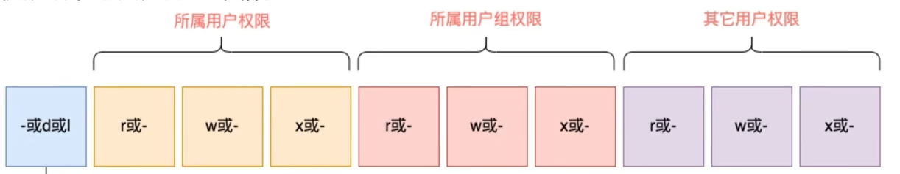

---
{
  "id": "3155a2dd-8276-810e-94e3-dad3734ff274",
  "url": "https://www.notion.so/3-3-3155a2dd8276810e94e3dad3734ff274",
  "created_time": "2026-02-28T12:47:00.000Z",
  "last_edited_time": "2026-02-28T12:47:00.000Z"
}
---

#  3.3 查看权限控制

本节没有命令，只是阐述Linux权限
在 ls -l 中，结果以：
**权限信息**，**硬连接数**，**所属用户**，**所属用户组**，**文件大小**，**最后修改时间**，**文件名**
来展示
# 权限信息
权限信息用10位的字符表示：

**除了第一位外，剩下的9位被分为三组，分别是：****所属用户权限****，****所属用户组权限****，****其他用户权限**
### 第一位：-/d/l
-：表示文件
d：表示文件夹
l：表示软链接
### 第2~4位：（所属用户权限）
三位按先后顺序分别是r w x
r/-：read ，有/无读权限
w/-：write，有/无写权限
x/-：execute，有/无执行权限
### 第5~7位：（所属用户组权限）
同样是r w x三位，表示文件所属用户组的读、写、执行权限
### 第8~10位:(其他用户权限)
同样是r w x三位,表示其他用户的读、写、执行权限
### 解释
读权限：只能查看（如ls）
写权限：增删改
执行：运行（如cd）
