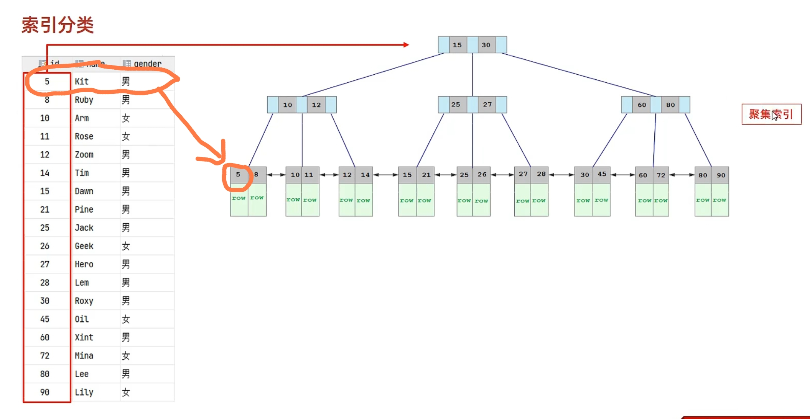

---
{
  "id": "2c55a2dd-8276-8192-9074-c00679cf08be",
  "url": "https://www.notion.so/13-2c55a2dd827681929074c00679cf08be",
  "created_time": "2025-12-10T08:14:00.000Z",
  "last_edited_time": "2025-12-10T08:14:00.000Z"
}
---

#  13.索引

作用：索引是加速查询的
没有索引查询需要全表扫描（慢）
有索引只需要查询索引即可（快）
| 优点 | 缺点 |
| --- | --- |
| 降低io | 占空间 |
| 降低cpu | 降低了更新表速度（改数据还得改索引，ps：不用手动改） |
# 索引结构
  | 结构 | 描述 |
  | --- | --- |
  | B+Tree 索引 | 最常见索引类型，所有引擎基本都支持 |
  | Hash 索引 | 底层使用哈希表实现，只有精确匹配索引列查询才有效，不支持范围查询 |
  | R-tree（空间索引） | 是MyISAM引擎的一个特殊索引，主要用于地理空间数据类型，较少使用 |
  | Full-text（全文索引） | 通过建立倒排索引，快速匹配，较少使用 |
  引擎支持情况
  | 索引 | Innodb | myisam | memory |
  | --- | --- | --- | --- |
  | B+Tree索引 | 支持 | 支持 | 支持 |
  | Hash索引 | 不支持 | 不支持 | 支持 |
  | R-tree索引 | 不支持 | 支持 | 不支持 |
  | Full-text索引 | 5.6版本之后支持 | 支持 | 不支持 |
  ## B+树索引
  ### 没有指定索引默认是B+树索引
  度数：一个节点下的子节点个数
  
  优点：
  相比于二叉树，B+树的层级更少，查询效率更高
  所有数据都存储在叶子节点，非叶子节点只存储索引，叶子节点形成有序链表
  支持范围查询和排序操作
  缺点：
  索引的更新和维护成本较高
  对于频繁插入、删除操作的表，B+树需要频繁调整结构
  不适合存储大量重复值的列作为索引
  ## Hash 索引
  优点：
  查询速度非常快，时间复杂度为O(1)
  只需要一次计算就能定位数据位置
  适合等值查询场景
  缺点：
  不支持范围查询
  不支持排序操作
  存在哈希冲突问题
  > InnoDB不支持哈希索引，但有自适应hash功能
# 索引分类
  | 分类 | 含义 | 特点 | 关键字 |
  | --- | --- | --- | --- |
  | 主键索引 | 针对表中主键创建的索引 | 默认自动创建，只能有一个 | PRIMARY |
  | 唯一索引 | 避免同一个表中某数据列中的值重复 | 可以有多个 | UNIQUE |
  | 常规索引 | 快速定位特定数据 | 可以有多个 |  |
  | 全文索引 | 全文索引查找的是文本中的关键词，而不是比较索引中的值 | 可以有多个 | FULLTEXT |
  ## InnoDB引擎中索引存储形式
  | 分类 | 含义 | 特点 |
  | --- | --- | --- |
  | 聚集索引（Clustered Index） | 将数据存储与索引放到了一块，索引结构的叶子节点保存了行数据 | 必须有，而且只有一个 |
  | 二级索引（Secondary Index） | 将数据与索引分开存储，索引结构的叶子节点关联的是对应的主键 | 可以存在多个 |
  ### 聚集索引
  **聚集索引选取规则：**
  1. 如果存在主键，主键索引就是聚集索引。
  1. 如果不存在主键，将使用第一个唯一（UNIQUE）索引作为聚集索引。
  1. 如果表没有主键，或没有合适的唯一索引，则InnoDB会自动生成一个rowid作为隐藏的聚集索引。

  聚集索引数据存储情况：（以有主键的情况为例）
  
  如图：叶子节点5中的数据，就是表中主键为5这一行的数据
  **聚集索引叶子节点下挂的是该行的行数据**
  ## 二级索引
  **二级索引下挂的是该值的主键/第一个唯一字段/rowid**
# 语法
  **创建索引（建表后创建）**
  ```sql
create [unique/fulltext] index 索引名 on 表名 (字段名，...)；
  ```
  可选项：（不指定则创建常规索引）
  unique：唯一索引
  fulltext：全文索引
  PS：
  一个索引关联一个字段叫单列索引
  一个索引关联多个字段叫联合索引

  **查看索引**
  ```sql
show index from 表名；
  ```
  查看表中所有索引

  **删除索引**
  ```sql
drop index 索引名 on 表名；
  ```
### 回表查询
**一个查询，先查询了其他索引找到主键，再查询主键索引找到其他数据**
这种查询过程叫回表查询
