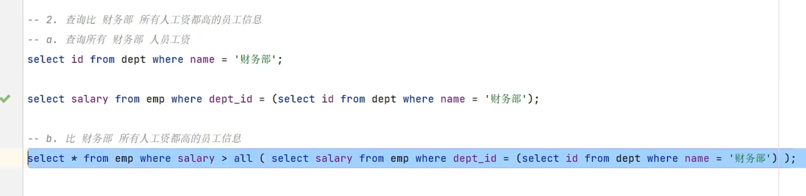
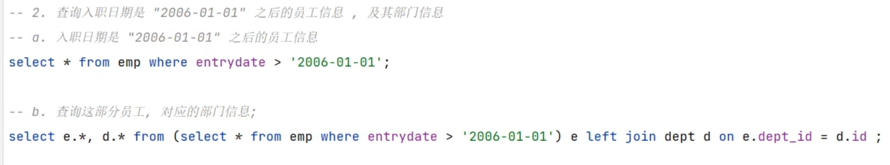

---
{
  "id": "2a55a2dd-8276-80f1-9642-fbf0f1385d9b",
  "url": "https://www.notion.so/9-2a55a2dd827680f19642fbf0f1385d9b",
  "created_time": "2025-11-08T08:19:00.000Z",
  "last_edited_time": "2026-01-11T13:03:00.000Z"
}
---

#  9.多表查询

# 多表关系
  **一对多（用外键管理）**
  如部门和员工
  **多对多（用中间表管理）（对应多表连接）**
  如学生和课程
  **一对一（用正常表管理，或拆分管理）（对应表拆分）**
  员工和工号
# 别名
  多表查询经常使用表别名
  语法如下（在表名后空一格紧跟别名即可）
  ```sql
select 字段列表
from 表名1 别名1 ,表名2 别名2....
...
...
...
  ```
# 多表查询
  说在最前面
  例子：
  ```sql
select 表名1.字段1,表名2.字段2 
from 表名1,表名2 
where 表名1.字段1=表名2.字段2;
--这是隐式内连接
  ```
  ps：**SQL支持同时查询多张表，只需要在表名后加逗号分隔开即可，但查询出来的结果如果不加限制，则是两个表的“笛卡尔积”（第一个表中的相应字段分别与第二个表中的相应字段排列组合，输出所有组合的结果）**
  **PS：所以多表查询要在后面限制查询条件，让两个表有逻辑的字段相等**
  ## 连接查询
  ### **内连接：匹配不上的不返回**
  **隐式**（用限制条件筛选结果）
  ```sql
select 表名1.字段1,表名2.字段2 
from 表名1,表名2 
where 表名1.字段1=表名2.字段2;
  ```
  PS：不在字段列表声明哪个字段属于哪个表也行，只要各个表字段名不重复，像这样↓
  ```sql
select 字段1,字段2 
from 表名1,表名2 
where 表名1.字段1=表名2.字段2;
  ```
  **显式**
  ```sql
select 表名1.字段1,表名2.字段2
from 表1 [inner]join 表2 
on 表名1.字段1=表名2.字段2;

--join后跟要连接的右表
--on后跟连接逻辑（哪两个字段相等）
  ```
  PS：显式与隐式没有区别，只是可读性不同
  ### **外连接**：匹配不到的也返回
  左外连接：
  返回左表的所有记录，即使右表中没有匹配的行；右表匹配不到的字段将填充为 NULL**（按照on/where后指定的字段匹配）**
  ```sql
select 字段列表
from 表1 left[outer]join 表2
on 条件;
  ```
  右外连接：
  返回 右表的所有记录，即使左表中没有匹配的行；左表匹配不到的字段填 NULL**（按照on后指定的字段匹配）**
  ```sql
select 字段列表
from 表1 right[outer]join 表2
on 条件;
  ```
  自连接：
  当前表自身连接查询，必须用表别名
  应用：查找同一个表中有联系的字段
  ```sql
select 字段列表
from 表1 别名1 join 表2 别名2
on 条件...;
  ```
  **PS：join…on连接后结果是笛卡尔积，一般使用group by（分组查询）来筛选结果**
# 联合查询
  ```sql
select 字段列表 from 表1 ...
union [all]
select 字段列表 from 表2 ...;
  ```

  联合查询是将两个查询语句一次执行，将两个输出结果拼接起来
  **PS：与多表查询不同：多表查询按照相应关系查找两个表结果并组合，联合查询只是分别查询两个表，并将结果一次性输出（不组合）**
  **PS：对于联合查询，两表列数必须一致，字段类型必须一致**
  **PS：union all 会直接合并数据，union 会合并后去重**
# 子查询（适用多步骤查询用一个语句执行）
  insert / update / delete / select 内再嵌套一个 select 就叫子查询
  > **子查询用括号括起来**
  > **构建子查询方法：将多个步骤分布写出，然后再合并**
  ### 标量子查询（返回单个值）
  **常用操作符**
  | 操作符 | 描述 |
  | --- | --- |
  | **=** | 等于 |
  | **< >** | 不等于 |
  | **<** | 小于 |
  | **>** | 大于 |
  | **>=** | 大于于等于 |
  | **<=** | 小于等于 |
  例子1
  
  例2
  
  ### 列子查询（返回一列）
  **常用操作符**
  | 操作符 | 描述 |
  | --- | --- |
  | in | 在指定范围内，多选一 |
  | not in | 不在指定范围内 |
  | any | 有一个满足就行 |
  | some | 与any等价 |
  | all | 所有值必须满足 |
  例1:
  
  例2:
  
  例3:
  
  ### 行子查询（返回一行）
  常见操作符
  | 操作符 | 描述 |
  | --- | --- |
  | = | 等于 |
  | <> | 不等于 |
  | in | 在某范围内，多选一 |
  | not in | 不在范围内 |
  > 匹配多个字段有两种方法
    1. 字段1=值1  and  字段2=值2
    1. （字段1，字段2）=（值1，值2）
    在行子查询中需要使用第二种方法
  例：
  
  ### 表子查询（返回多行列）
  | 操作符 | 描述 |
  | --- | --- |
  | in | 在某范围内 |
  与行子查询写法相同，只是将=改成in
  原理：以行子查询为基础，只要有一行全匹配就行
  例1:
  
  例2:
  
  PS：表子查询结果后接一个别名，可以作为一个新表使用
