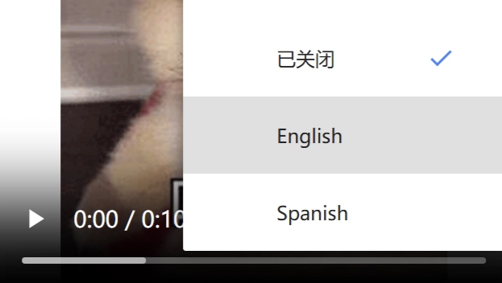

---
{
  "id": "3595a2dd-8276-80a4-b460-dbeb1dcd7080",
  "url": "https://app.notion.com/p/3595a2dd827680a4b460dbeb1dcd7080",
  "created_time": "2026-05-07T06:48:00.000Z",
  "last_edited_time": "2026-05-08T07:51:00.000Z"
}
---

#  音视频

# 视频
  ## 视频标签
  `<video>`：双标签，块级元素
  与其他标签不同，视频的部分属性是通过嵌套标签来设置的
  接下来按照：video属性  和  嵌套标签来讲
  ## video属性
  `width`和`height`属性：控制宽和高
  `controls`属性：添加视频控制控件（这个属性没有值）
`autoplay`属性：自动播放（这个属性没有值） 
`loop`属性：循环播放（这个属性没有值）
  `muted`属性：禁音播放（这个属性没有值）
  `poster`属性：设置视频封面，值填封面地址

  ## 嵌套标签
  ### `<source>`标签：视频相关（单标签）
    **属性**
    - `src`属性指定视频路径
    - `type`属性设置视频类型
    > 一般`mp4`类型就是`video/mp4`，当然也有很多其他格式的视频，如果有多个格式的视频，也可以多写几个`source`标签以便于不同浏览器的兼容性。
  ### `<track>`标签：字幕相关（单标签）
    **属性**
    - `src`属性字幕文件的路径
    - `kind`表示字幕类型
    > 字幕类型：
      1. **subtitles**：用于提供翻译或字幕，通常显示在视频的底部。
      1. **captions**：类似于字幕，但不仅包含对话，还包括音效描述（例如，音乐类型、声音效果等）。
      1. **descriptions**：提供关于视频内容的额外描述，帮助视觉障碍人士理解视频中的场景和动作。
      1. **chapters**：用于定义视频的章节或部分，方便用户导航。
      1. **metadata**：用于提供额外的信息，通常用于程序性访问，不直接显示给用户。
    - `srclang`属性表示该字幕对应的语言
    - `label`属性字幕语言显示给用户的名称
    
# 音频
  ## 音频标签
  `<audio>`：双标签，块级元素
  与视频几乎一致，略
