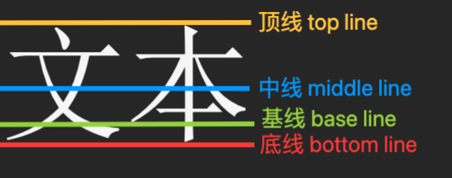

---
{
  "id": "3585a2dd-8276-8051-8979-d8cfb6803e74",
  "url": "https://app.notion.com/p/3585a2dd827680518979d8cfb6803e74",
  "created_time": "2026-05-06T07:13:00.000Z",
  "last_edited_time": "2026-05-19T02:31:00.000Z"
}
---

# 🔗 前端

来源：哔哩哔哩 青空の霞光

[HTML](html/index.md)
  这些都不用死记，了解原理后可以查权威文档
  视频文档：https://www.itbaima.cn/zh-CN/document/bsisgazdftiz3o9c
  HTML权威文档：https://developer.mozilla.org/zh-CN/docs/Web/HTML/Element/meta/name
  html基础内容
    HTML基础
      HTML：超文本标签语言
      HTML文件以标签书写
      分单便签和双标签（双标签的`/`代表结束标签）
      标签内可以配置属性，按如下格式书写
      HTML渲染时会忽略代码中的空格和换行
      ### 标签格式
      ```html
<标签 属性=＂值＂>
      ```
      - 属性的值必须是囊括在双引号内
      - 有多个不同属性时，使用空格隔开
    HTML文件结构
      ```html
<!DOCTYPE html>
<html lang="zh">
  <head>
  </head>
  <body>
  </body>
</html>
      ```
      这就是基础HTML文件结构
      ## 解释
      `<!DOCTYPE html>`：声明文档类型和HTML版本
      `<html>`：双标签，这个网页的所有信息被这个标签包住
      `<head>`：双标签，页头内容，定义网页的基本信息，如标题、介绍、特殊信息。一般不会在这里编写网页中需要展示的内容
      `<body>`：双标签，页身，几乎所有页面中需要展示的内容都在这里编写
      ## 页头标签<head>
      页头有哪些标签可用？（这里只介绍两种）
      `<title>`：双标签，声明网页的标题
      `<meta>`：单标签，定义页面的特殊信息，如页面的关键字，页面的描述以及一些针对于搜索引擎的属性等
      举个例子：
      ```html
<meta charset="UTF-8">
      ```
      这个不用死记，知道原理，可以查权威文档：
      https://developer.mozilla.org/zh-CN/docs/Web/HTML/Element/meta/name
      ## 页身标签
      只介绍一个
      <div>：双标签，盒子标签，是个容器
    文本相关标签
      直接在body中编写文本（不用标签），此文本也会被浏览器渲染
      但这样太丑了
      ## 文本相关标签
      - **标题标签**：有6个，从`<h1>`到`<h6>`，都是双标签，标题大小依次减小
      - 段落标签：`<p>`，双标签，表示一个段落
      - 水平线：`<hr>`，单标签，画一条水平线
      - 加粗标签：`<b>`或`<strong>`，双标签，被包住的文本加粗
      - 斜体标签：`<i>`，`<em>`，`<cite>`：双标签，被包住的文本斜体
      - 上标标签：`<sup>`，双标签，被包住的文本作为上标
      - 下标标签：`<sub>`，双标签，被包住的文本作为下标
      - 删除线标签：`<s>`，双标签，被包住的文本有删除线效果
      - 下划线：`<u>`，双标签，被包住的文本有下划线效果
      - 小字体标签：`<small>`
      - 大字体标签：`<big>`
      - 换行标签：`<br>`，单标签
      这里不一一列举了，查权威文档去
    注释和特殊符号
      注释不会被浏览器解析
      ## 注释
      ```html
<!--  注释  -->
      ```
      ## 特殊符号
      HTML编码规则占用了部分符号，为了区分代码和文本，被占用的符号用**转义字符**表示
      - 转义字符以`＆`开头，`;` 结尾
      例子：
      空格在HTML编写中会被忽略，所以空格用`&nbsp;`表示
      ### 特殊符号表（部分）
      | 符号 | 名称 | 转义字符 |
      | --- | --- | --- |
      | “ | 英文双引号 | &quot; |
      |  | 空格 | &nbsp; |
      | > | 大于 | &gt; |
      | < | 小于 | &lt; |
      | & | 与 | &amp; |
      更多请查：https://developer.mozilla.org/zh-CN/docs/Glossary/Entity
    行内元素和块级元素
      HTML中，元素分两种类型：行内元素，块级元素，它决定了占据页面的大小和布局
      ## 块级元素
      - 块级元素会独占一行
      - 大多数块级元素（并非所有）则既可以包含行内元素也可以包含块级元素
      ## 行内元素
      - 行内元素不独占一行
      - 大多数（并非所有）行内元素只能包含行内元素，不可包含块级元素
      ## 两个容器
      容器是布局的重要手段
      `<div>`：双标签，块级容器
      `<span>`：双标签，行内容器
      PS：容器内未装东西就不会被撑开，此时容器大小是0
    图片元素
      ## 图片标签
      ：单标签
      img是行内块元素（既是行内元素又是块级元素）
      ## 标签属性
      - `src`属性：地址属性，可以填绝对/相对/网络地址（推荐相对地址）
      - `alt`属性：加载失败时显示的文本
      - title属性：图片标题（鼠标放到图片上时显示）
      - `loading`属性：用于指示图片加载策略，默认值`eager`（打开网站立即加载），设置为`lazy`（延迟加载）
      - `height`和`width`属性：控制图片高和宽
      ## 路径相关
      - 相对路径：不在路径前加`/`，路径将从当前html文件的位置开始
      - 绝对路径：在路径的最前面加`/`，路径将从当前项目根目录开始
      推荐使用相对路径（防止因上级路径改变造成无法访问）
      ## 高dpi与像素
      像素图就是位图，与之相对的是矢量图（缩放不失真）
      **图片取材时，建议像素是需要显示大小的两倍（兼容高分辨率屏）**
      ## 图片格式
      ### 像素图
      .jpg
      .png
      .webp
      .gif
      ### 矢量图
      .ai
      .swf
    链接标签
      ## 链接标签
      <a>：双标签，行内元素
      虽然<a>标签是行内元素，但也可以嵌套块级元素（特例）
      ### 属性
      - `herf`属性：指定跳转的链接
      - `target`属性：打开方式，默认值`_self`（当前页面打开），设为`_blank`（新窗口打开）
      ## 链接的用途
      1. 外部跳转（herf属性填外部链接）
      1. 内部跳转（herf属性填内部地址）
      1. 使某个组件成为链接（将相应组件嵌套进去）
      1. 锚点，可实现页内跳转（配合id属性使用，herf属性填`#+id`）
        例子：
        ```html
<div id="div1">
666
</div>

 <a href="#div1">链接</a>
        ```
      这样，我们在点击链接时，页面就会自动滚动到对应位置，且浏览器顶部路径栏中会自动拼接此锚点。
    音视频
      # 视频
        ## 视频标签
        `<video>`：双标签，块级元素
        与其他标签不同，视频的部分属性是通过嵌套标签来设置的
        接下来按照：video属性  和  嵌套标签来讲
        ## video属性
        `width`和`height`属性：控制宽和高
        `controls`属性：添加视频控制控件（这个属性没有值）
`autoplay`属性：自动播放（这个属性没有值） 
`loop`属性：循环播放（这个属性没有值）
        `muted`属性：禁音播放（这个属性没有值）
        `poster`属性：设置视频封面，值填封面地址


        ## 嵌套标签
        ### `<source>`标签：视频相关（单标签）
          **属性**
          - `src`属性指定视频路径
          - `type`属性设置视频类型
          > 一般`mp4`类型就是`video/mp4`，当然也有很多其他格式的视频，如果有多个格式的视频，也可以多写几个`source`标签以便于不同浏览器的兼容性。
        ### `<track>`标签：字幕相关（单标签）
          **属性**
          - `src`属性字幕文件的路径
          - `kind`表示字幕类型
          > 字幕类型：
            1. **subtitles**：用于提供翻译或字幕，通常显示在视频的底部。
            1. **captions**：类似于字幕，但不仅包含对话，还包括音效描述（例如，音乐类型、声音效果等）。
            1. **descriptions**：提供关于视频内容的额外描述，帮助视觉障碍人士理解视频中的场景和动作。
            1. **chapters**：用于定义视频的章节或部分，方便用户导航。
            1. **metadata**：用于提供额外的信息，通常用于程序性访问，不直接显示给用户。
          - `srclang`属性表示该字幕对应的语言
          - `label`属性字幕语言显示给用户的名称
          
      # 音频
        ## 音频标签
        `<audio>`：双标签，块级元素
        与视频几乎一致，略
    列表
      列表通过嵌套标签的方式编写
      ## 有序列表
        `<ol>`标签声明有序列表（双标签）

`<li>`标签声明列表项（双标签）
        ```html
<ol>
  <li>列表项1</li>
  <li>列表项2</li>
</ol>
        ```
        ### `<ol>`标签属性
        `type`属性：更改有序列表样式
        值如下↓
        > 
          - **1**：阿拉伯数字1/2/3/4排序
          - **a**：小写英文字母abcd排序
          - **A**：大写字母ABCD排序
          - **i**：小写罗马数字i、ii、iii排序
          - **I**：大写罗马数字I、II、III排序
      ## 无序列表
        `<ul>`标签声明无序列表（双标签）
        `<li>`标签声明列表项（双标签）
        ```html
<ul>
  <li>我是第一项</li>
  <li>我是第二项</li>
</ul>
        ```
        ### `<ul>`标签属性
        `type`属性：修改无序列表样式
        值如下↓
        > 
          - **disc**：实心圆（默认）
          - **circle**：空心圆
          - **square**：正方形
      ## 定义列表
        `<dl>`标签声明定义列表（双标签）
        `<dt>`标签声明定义名称（双标签）
        `<dd>`标签声明定义解释（双标签）
        ```html
<dl>
  <dt>Java语言</dt>
  <dd>一门非常火热的语言，学完即可高薪就业，低至2K起</dd>
  <dt>Go语言</dt>
  <dd>一门大厂狂推语言，学历不够学完直接失业</dd>
  <dt>Ruby语言</dt>
  <dd>光启动项目就要3分钟的语言，内存占用分分钟爆炸</dd>
  <dd>光启动项目就要3分钟的语言，内存占用分分钟爆炸</dd>
</dl>
        ```
        对于<dt>标签和<dd>标签的数量和排列顺序，并不做强制要求（可以连着放好几个）
        效果↓
        
    表格
      表格通过嵌套标签的方式编写
      ## 基础表格
        `<table>`标签定义表格（双标签）
        `<caption>`标签定义表格名称（双标签）
        `<tr>`标签定义行（双标签）
        `<td>`标签定义单元格（双标签）
        `<th>`标签定义表头单元格（双标签）（与td使用方法一致）
        ```html
<table border="1">
  <caption>2025年装机清单</caption>
  <tr>
    <th>配件名称</th>
    <th>型号</th>
  </tr>
  <tr>
    <td>CPU</td>
    <td>Ultra9 285K</td>
  </tr>
  <tr>
    <td>显卡</td>
    <td>RTX4090</td>
  </tr>
</table>
        ```
        ### `<table>`标签属性
        `border`属性：其值定义边框宽度（单位像素）（默认0）
        `width`属性：控制表格宽度
        `cellspacing`属性：控制单元格间距
        `bgcolor`属性：设置表格颜色
      ## 高级用法（合并单元格）
        ### <td>标签属性
        `colspan`属性：横向合并单元格（值为从左到右占据单元格数）
        `rowspan`属性：纵向合并单元格（值为从上到下占据单元格数）
      ## 表格语义化
        用`<thead>`标签嵌套表头
        用`<tbody>`标签嵌套表身
        用`<tfoot>`标签嵌套表脚
        这三个标签没什么用，将对应的代码段放进去可以提高可读性和语义化
    内联框架
      内联框架就是在一个一个页面内开一个画中画
      ## 内联框架
        `<iframe>`标签：声明内联框架（双标签）
      ## `<iframe>`标签属性
        `src`属性：指明内嵌网站的地址
        `width`和`height`属性：指定其宽高
        `frameborder`属性：是否显示内嵌网页边框（值：yes/no）
        `allowfullscreen`属性：此网站全屏展示
      ## 内联框架内链接跳转
        在内联框架内的链接有3种跳转方式
        这取决于`<a>`标签的`target`属性的值↓
        > `_parent`在其父级嵌套页面中跳转         
          `_top`直接在最外层跳转
          `_blank`直接打开一个新窗口
    其他标签
      HTML5中还新增了很多语义化标签，以增强网页的语义性
这里我们简单介绍一下即可：
      > 
        <header>: 定义页面或部分的头部，通常包含标题和导航。
        <nav>: 定义导航链接的部分。
        <article>: 表示独立的内容块，通常是可以独立分发的文章。
        <section>: 定义文档中的区域或章节，用于组织内容。
        <aside>: 表示与主内容相关的附加信息，通常用于侧边栏。
        <footer>: 定义页面或部分的底部，通常包含版权信息和联系信息。
        <mark>: 用于高亮显示文本。
        <time>: 用于表示特定的时间（日期、时间等）。
        <progress>: 用于表示任务的进度。
  html高级内容

    html表单
      ## 表单
        `<form>`标签定义表单（双标签）
        可在其内部嵌套组件
        ### 属性
        > action：指定表单数据提交的目标 URL。
          method：指定表单提交方法。常用值包括 GET 和 POST。
          enctype：指定表单数据编码类型，特别是在文件上传时。常用值包括 application/x-www-form-urlencoded、multipart/form-data 和 text/plain。
          target：指定表单提交后响应的目标窗口或框架。常用值包括 _self、_blank、_parent和 _top。
          name：为表单指定名称，便于在 JavaScript 中引用。
          id：为表单指定唯一标识符，便于在 CSS 和 JavaScript 中引用。
          autocomplete：指定表单是否启用自动完成功能。取值可以是 on 或 off。
          novalidate：禁用表单的默认验证。
      ## 输入框
        `<input>`标签定义输入框（单标签）（表单最常嵌套组件）
        ### `<input>`标签属性
        `value`属性：设置输入框自带的值（默认值）
        `size`属性：控制输入框的长度
        `maxlength`属性：限制输入文本最大长度
        `placeholder`属性：输入框提示信息
        `disbaled`属性：关闭输入框（布尔属性，无值）
        `readonly`属性：输入框设成只读（布尔属性，无值）
        `type`属性：设置输入类型，有以下值↓
        > 
          email：电子邮件地址输入，支持格式验证
          url：URL输入，支持格式验证
          tel：电话号码输入
          number：数字输入，可以使用上下箭头进行增减
          range：范围输入，通常以滑块形式呈现
          date：日期选择输入，通常显示日期选择器
          time：时间选择输入，通常显示时间选择器
          datetime-local：本地日期和时间输入
          month：月份选择输入
          week：周选择输入
          color：颜色选择输入，通常显示颜色选择器
          file：文件选择输入，允许用户上传文件
          hidden：隐藏输入，不在页面上显示
          search：搜索框输入，通常在样式上有所不同
          button：普通按钮
          submit：提交按钮
          reset：重置按钮
    表单提交
      ## `<label>`标签
        <label>标签：语义化标签（双标签），它可以和输入框绑定（嵌套进去/使用for属性+对应id）

        作用：
        - 点击文字也能选中输入框
        - 提高表单可访问性（无障碍）

        不用<label>标签不影响页面，但编辑器有警告
      ## 向后端传输
      ### 声明提交按钮
      提交按钮有两种声明方法↓
      1. <input>标签的type属性设为submit（会自动变成一个提交按钮，按下就会提交其所在的表单）
      1. 使用<button>标签（双标签）（type属性设为submit）

      按钮属性↓
      type属性：值有submit（提交），reset（重置）
      ### 设置输入框属性
      记得给<input>标签设置name属性，否则点击提交不会被提交
    <input>标签type属性详细值
      ## 时间选择器
      time：时间选择器
      date：日期选择器
      datetime-local：日期+时间选择器
      week：周选择器
      month：月份选择器
      ## 数字和范围选择器
      number：数字选择器（可用max属性min属性限制最大和最小值，可用step属性调整步长）
      range：数值选择器（滑块形式）
      ## 单选框和多选框
      radio：单选框
      PS：单选框注意设置value属性（传给后端的值）和name属性（同一组的单选框要使用相同的name属性），checked属性用来设置默认勾选项（布尔属性）

      checkbox：多选框
      PS：同样注意设置value属性（传给后端的值）和name属性（同一组的单选框要使用相同的name属性）
    下拉列表
      ## `<select>`标签（双标签）
        使用`<select>`标签定义下拉选择框（双标签）
        `<select>`标签要嵌套到表单里（不嵌套也行，但是没法提交）
        ### 属性
        size属性：定义显示在外面的数量
        multiple属性：决定是否可以多选（布尔属性）
        name属性：组件名称，**不设置这个没有办法向后端提交表单**
      ## `<option>`标签（双标签）
        <option>标签是嵌套在<select>标签中的，用来声明下拉选项
        ### 属性
        value属性：定义传给后端的值
        selected属性：默认选项
        下拉选项文本直接在option两个标签间写（直接写不用加标签）
    文本域
      <textarea>标签：声明文本域（双标签）
      ### 属性
      rows属性：控制文本域的默认行数
      col属性：控制文本域默认的列数
      maxlength属性：限制最大输入长度
      placeholder属性：提示信息
      disabled属性：关闭文本域（布尔属性）
      readonly属性：将文本域设成只读（布尔属性）
      PS：文本域的默认内容直接写到两个标签中间即可
    html矢量图
      ## <svg>标签
      <svg>标签声明矢量图（双标签）
      在<svg>内嵌套xml代码（与html很接近）
      这里不详细介绍xml语法
      PS：<svg>标签实际上是声明了一个画布，这个画布默认300×150大小，超出画布的部分会被遮住不显示
      ## `<map>`标签
      `<map>`标签：声明图片映射（双标签）
      `<map>`标签配合``标签使用
      用于在图片中指定特定的区域，这些区域可以执行跳转
      `<map>`标签内嵌套`<area>`标签（图片热点区域），通过设置`<area>`标签属性定义图片的特定区域形状和大小
      ### <area>标签属性
      > shape区域形状
        coords坐标
        href点击后跳转
        alt描述文本
      PS：需要在<map>标签中定义name属性，并在对应的图片中将usemap属性设置为该值，即可完成图片映射
    无障碍
      我们还可以对网页做无障碍优化
      要求：
      1. 尽量使用语义化标签（这样读屏器知道当前选择的是什么组件）
      1. 如果无法使用语义化标签，可以使用一写属性使其语义化
      ### 语义化属性
      - 图片的alt属性（图片替代文本）
      - role属性：值声明当前div标签是什么东西
      - aira-*属性：声明当前组件有什么属性（如：输入框只读）
[CSS](css/index.md)

  基础入门
    css核心部分
      css主要功能
        - 控制页面布局：设置元素的位置、大小、边距、边框等。
        - 定义字体和颜色：设置文本的字体、大小、颜色、背景色等。
        - 实现响应式设计：通过媒体查询适配不同设备（如手机、平板、桌面）。
        - 动画与过渡效果：实现元素的动画、渐变、变换等交互效果。
        - 样式继承和层叠：多个样式规则可以叠加应用，优先级由层叠规则决定。
      样式引入
        将css样式引入html有三种方法
        ## 1. 直接在标签里设置style属性（内联样式）
        这种方法想必很熟悉
        ## 2. 在同一文件内定义<style>标签（内部样式）

        通过在<style>标签中设置对应的样式和需要应用的组件来批量设置
        ## 3. 使用外部的css文件（外部样式）
        在外部文件中写好css
        在HTML中使用<link>标签连接
        ### <link>标签
        <link>标签：引入资源
        ### 属性
        - rel：关系类型（资源应用到哪）
        - href资源地址
        - type资源 MIME 类型（资源文件类型）
        - media适配设备
        - sizes图标尺寸
        PS：rel的值决定该资源是应用给图标还是样式表等…
        引入css固定写法：
        ```html
<link rel="stylesheet" type="text/css" href="css地址">
        ```
        # 现在常用第3种，方便维护
        # 样式表优先级
        内联样式 > 内部样式表 = 外部样式表 > 浏览器默认样式
      基本选择器
        # css语法
        ```html
选择器 {  
属性: 值;
}
        ```
        PS：除了字符串要加引号，其他值都不加引号（单双引号没区别）
        # 基本选择器
          ## 标签选择器
          写法：直接在选择器位置输入标签名即可
          作用范围：这会选择所有该标签
          例
          ```css
p {  color: blueviolet;}
          ```
          ## 类选择器
          在html中所有标签都有一个class属性，用来定义类名，使用这种选择器需要先在html中定义类名
          写法：`.类名`
          作用范围：所有该类组件
          ## ID选择器
          html中标签可以定义ID属性
          写法：`#ID`
          作用范围：对应ID组件
          > 对于ID的命名存在一定的规范，需要注意以下几点：
            - 不能和HTML标签同名
            - 只能有字母、数字、下划线，且必须以字母开头
            - 大小写严格区分
          ## 通配符选择器
          写法：`*`
          作用域：选中所有标签
          例
          ```css
* {  color: blueviolet;}
          ```
        # 较高级的选择器
          ## 交集选择器
          在基本选择器的基础上，使用某些选择器的交集
          写法（顺序）：`标签选择器 类选择器 ID选择器`
          注意⚠️：
          1. 真实写法没有空格，这里空格是提高笔记可读性
          1. 写法这里只代表先后顺序，并非都要有
          1. 实际上不造成歧义就行，这里的顺序仅供参考
          作用范围：几种选择器交集
          例：
          ```css
p.test#p {  
color: blueviolet;
}
          ```
          ## 并集选择器（选择器列表）
          在基本选择器的基础上，使用某些选择器的并集
          写法：`选择器1，选择器2，选择器3`
          作用范围：几个选择器并集
          例
          ```css
p, a, div {  
color: blueviolet;
}
          ```
      高级选择器
        ## 后代选择器
        选择某个元素的后代元素（子元素或更深层次的元素）
        写法：
        `选择器/父元素 选择器/子元素 选择器/孙元素`
        作用域：指定的后代元素
        PS：
        - 不止能指定到孙元素，理论上能指定无限层
        - 不止能指定元素，也可以指定基础选择器
        - 这个选择器/元素之间有空格
        例
        ```css
.content div p {  
color: blueviolet;
}
/*指定的是content类下的div下的p标签*/
        ```
        ## 子选择器
        选择某个元素的直接子元素
        写法：
        `选择器/父元素 > 选择器/子元素`
        作用域：指定子元素
        PS：只能指定到子元素，不能指定无限层
        例：
        ```css
.content > p {   
/* 为了美观，>两边也可以打上空格，不影响语义 */  
color: blueviolet;
}
        ```
        ## 相邻兄弟选择器
        选择某个元素的下一个相邻兄弟元素
        写法：
        `指定元素 + 兄弟标签名`
        作用域：指定元素的下一个相邻元素
        例：
        ```css
.content + p {  
color: blueviolet;
}
        ```
        PS：可用通配符`*`指定兄弟标签名
        ## 通用兄弟选择器
        选择某个元素之后的所有兄弟元素
通用兄弟选取器弥补了相邻兄弟选择器只能选择下一个相邻兄弟的缺点，它可以一次性选择所有兄弟节点
        写法：
        `指定元素 ~ 兄弟标签名`
        作用域：指定元素后的所有兄弟元素
        例：
        ```css
.content ~ p {  
color: blueviolet;
}
        ```
        PS：可用通配符`*`指定兄弟标签名
        ## 属性选择器
        属性选择器可以根据标签中的某些属性和值来进行元素选择
        写法：`[属性=＂值＂]`
        作用域：有相关属性的组件
        PS：可以和其他选择器组合使用
        例
        ```css
body > a[href*="Bing" i] 
{  
color: blueviolet;
}
        ```
      选择器优先级
        当多个选择器同时修改一个组件的同一个属性时，css选择器按优先级来处理冲突
        ## 优先级计算
        每个选择器优先级通常用一组数字表示：（a，b，c，d）
        - **a**: 行内样式的数量（**这个数量代表的是有没有内联样式，而非内联样式写了多少，所以只有1和0**）（**行内/内联样式：直接写在标签里的css属性**）
        - **b**: ID 选择器的数量。
        - **c**: 类选择器、属性选择器和伪类的数量。
        - **d**: 元素选择器和伪元素的数量。
        **每个选择器得出的数字比较大小，最大的优先级最高**
        **数字一样大，后声明的选择器会覆盖先声明的配置（后声明优先级高）**
        ## 提升优先级
        **给css属性的值后面加上****`!important`****，可强制提升该属性的优先级至最高（比内联样式还高）**
      样式继承
        **在嵌套标签时，子元素会自动继承父元素的部分css属性（并非全部）**
        文本相关的属性，如 color, font-family, font-size, line-height, visibility, cursor 等会被继承
        其他属性如盒子模型相关的 margin, padding, border, width, height 等，都不会自动继承

        - 如果不想继承父元素的属性，可以手动定义子元素的属性，如
          将color属性设为 `initial`（浏览器默认）或`revert`（用户默认）
        - 如果某属性不支持自动继承，可以将属性值设为`inherit`，就会继承父元素属性
    字体样式

      文本字体
        # 指定字体
        CSS使用`font-family`属性来指定字体
        - 可以同时设置多种字体来增强兼容性（优先级从左向右）
        ```css
p {  font-family: 'Microsoft YaHei', 'PingFang SC';}
        ```
        - 可以不指定具体字体，而是指定字体族（更有兼容性）
        ### 字体族：
        **字体族不代表具体字体，只代表某种字体风格**
        serif（衬线字体）
        sans-serif（无衬线字体）
        monospace（等宽字体）
        cursive（手写字体）
        fantasy（奇幻字体）
        # 自定义字体
        使用`@font-face`做选择器名来创建自定义字体：
        需要指定属性↓
        `font-family`字体名称
         `src`字体地址
        ```css
@font-face {  
font-family: 'YuanShen';  
src: url("../font/yuanshen.ttf");  
/* 使用url("")函数来指定位置，注意这个不一定是本地文件，甚至可以是一个网络文件 */
}
        ```
        # 注意
        字体属性会被自动继承
      字体大小
        ## 相关属性
        font-size属性：控制字体大小，后面接大小和单位
        值写法：使用small等预设值，或`大小+单位`
        字体大小有相对大小和绝对大小
        ## 绝对大小
        单位：px（像素）
        **此外，small，meidum、large、x-large等预设值，都是绝对尺寸**
        注意：
        - 像素都是整数，不要写浮点像素
        - 默认文本大小：16px
        - h1等标签也可以修改字体大小
        ## 相对大小
        单位：em 或 rem
        - 1.5em表示是其父元素的大小的1.5倍
        - 2rem表示是跟元素的2倍
        - 默认文本大小：16px
      字重
        字重就是字体粗细
        ## 相关属性
        font-weight：控制字体粗细
        ## PS
        - 有些字体不支持调整粗细（部分浏览器会自动做一定兼容）
        - 默认粗细是400
        - 字体粗细范围100~900
      字体风格
        目前只支持斜体和正常两种风格（默认正常）
        ## 斜体
        属性：font-style
        值：italic（斜体）（就这一个）
        ## PS
        部分字体不支持斜体
      字体颜色
        ## 相关属性
        color：控制颜色
        ## 预设值
        有red，blue，green…等
        ## RGB值
        需要使用 rgb() 函数
        ```css
.test{
color:rgb(r值,g值,b值);
}
        ```
        或
        用16进制表示三个值↓
        ```css
.test{
color:#FFFFFF;
}
        ```
        ### PS
        - rgb范围：0~255
        - rgb表示法也可以表示阿尔法通道（透明度）：需要使用 rgba() 函数 或直接16进制表示
        - 阿尔法通道范围：0~1（小数）
        - α通道16进制表示时范围是：0~255
    文本样式
      首行缩进
        ## 属性
        text-ident：控制首行缩进
        ## 值
        可填相对大小（一个字大小）和绝对大小（像素）
      对齐方式
        ## 属性
        text-align
        ## 值
        - start：如果内容方向是左至右，则等于 left，反之则为 right。
        - end：如果内容方向是左至右，则等于 right，反之则为 left。
        - left：行内内容向左侧边对齐。
        - right：行内内容向右侧边对齐。
        - center：行内内容居中。
        - justify：文字向两侧对齐，对于非等宽字体不会搞得一侧是锯齿状，对最后一行无效。
        - justify-all：和 justify 一致，但是强制使最后一行两端对齐。
        - match-parent：和 inherit 类似，区别在于 start 和 end 的值根据父元素的书写方向确定，并被替换为恰当的 left 或 right 值。
        ## PS
        **text-align属性只能添加到块级元素中，并对其中的行内元素生效**
        不能添加到行内元素中（因为行内元素占据的空间本身就是内容的宽度，没有多余的空间来让其对齐）
      文本修饰
        文本修饰就是设置下划线，中划线…等
        ## 属性
        text-decoration：修饰文本
        ## 值
        可以写多个值，如：颜色，修饰类型，大小，样式…
        修饰类型：
        - none：取消原有的划线
        - underline：下划线
        - line-through：中划线
        - overline：上划线
        线条样式：
        - 实线solid
        - 波浪线wavy
        - 小点dotted
        - 双实线double
        - 虚线dashed
        颜色：
        预设值或rgb色
        宽度：
        相对宽度或绝对宽度
      文本大小写
        ## 属性
        text-transform：控制文本大小写
        ## 值
        - uppercase：大写
        - lowercase：小写
        - capitalize：首字母大写
      行高
        ## 属性
        line-height：控制行高
        ## 值
        直接写倍数(默认相对大小)
        or
        相对大小
        or
        绝对大小（不建议）
      文本间距
        字与字之间间距
        ## 属性
        letter-spacing：控制字间距
        word-spacin：单词间距
        ## 值
        - normal：默认值（浏览器决定）
        - 绝对大小or相当大小
        ## PS
        不建议调这个属性，调不好很乱
      文本换行
        ## 属性
        word-break：控制文本换行策略
        overflow-wrap：控制长度超过一行的单词是否被拆分换行（该属性要与word-break属性配合使用）
        text-wrap：新版控制文本换行策略（部分浏览器未支持）
        ## 值
        word-break属性↓
        - normal – 使用默认换行规则，禁止出现单词分割。
        - break-all – 只要到达本行末尾，就强制对单词进行拆分。

        overflow-wrap属性↓
        - break-word

        text-wrap属性↓
        - wrap：自动换行
        - nowrap：禁止换行
        - balance – 平衡每行的字符数，让每一行看起来都舒适。
        - pretty – 和默认换行相同，只是用户代理将使用较慢的算法，该算法更倾向于更好的布局而不是速度。
        - stable – 和默认换行相同，只是当用户编辑内容时，他们正在编辑的行之前的行保持不变，这对于文本框来说很实用。
      文本空白处理
        本节介绍了对于代码中的空格和换行该如何处理
        默认忽略空格和换行
        ## 属性
        white-space：声明代码中的空格和换行该如何处理
        ## 值
        - pre ：保留源码空格和换行 ，其他情况一律不换行（除了<br>标签）
        - pre-wrap ： 同上，但超出宽度换行
        - pre-line ：不保留源码空格序列，只保留源码换行
        - nowrap ：完全禁止换行
  盒模型和布局
    盒子模型

      盒子模型的概念
        在盒子模型的概念中，为了方便浏览器布局，我们将每个组件都视为一个矩形盒子（无论是<p>标签还是<div>）
        ## 盒子的组成部分
        一个盒子有四个部分
        - 内容区（content）
        - 内边距（padding）
        - 边框（border）
        - 外边距（margin）
        **其中盒子大小默认是内容区大小**

        这种标准很反直觉，不如IE当年的标准：“盒子大小就是所有区域总大小”
        但IE标准寄了，所以现在很多项目会多做一步设置
        ```css
* {  
box-sizing: border-box;
}
/*将所有的盒子大小改为边框大小*/
        ```
        **注意⚠️：**
        **外边距不被算作盒子大小**
        ## 属性
        box-sizing：控制盒子大小计算方式
        ## 值
        - content-box： 只包含内容区
        - border-box：连边距边框一起计算
      内容区域
        ## 宽高属性
        可以通过width和height属性修改某盒子内容区域大小
        **PS：盒子大小默认是指内容区域大小，所以设置某个元素的宽高实际上是设置盒子大小**
        **例外**⚠️：
        **行内元素盒子无法设置宽高**
        （虽然行内元素也是盒子）
        **行内块/块级元素可以设置宽高**
        ## 值
        - 默认值是auto：把尺寸决定权交给 layout algorithm（布局算法）
        - fit-content：尽量包住内容，但不要超过可用空间
        - max-content：元素内容在完全不换行、不压缩的情况下，需要的最大尺寸
        - min-content：最小尺寸
        - 百分比：占外部盒子的百分比（可以超过100%）
        - 绝对大小（像素）
        - 相对大小
        ## 注意
        一般来说内容区域没有东西，盒子不会被撑开（除非手动设置盒子宽高）
      背景设置
        ## 属性
        background-color：背景颜色
        background-image：背景图片
        background-size：背景大小（搭配背景图片使用）
        background-repeat：是否重复显示（搭配背景大小使用）
        background-position：控制背景图片在盒子中的位置（搭配背景图片使用）
        background-attachment：背景图片是否随着页面滚动
        ## 值
        背景颜色
        - 预设值：red，blue…
        - rgb值

        背景图片
        - url(”地址”)

        背景大小
        - auto：默认，按图片固有尺寸显示，如果图片没有固有尺寸，则根据容器尺寸来显示。
        - cover ：缩放背景图，保持比例，使其完全覆盖（优先窄边缩放）
        - contain ：缩放背景图，保持比例，使其完全覆盖（优先宽边缩放，可能出现重复展示）
        - 10px 10px：像素，破坏了原有比例
        - 100% 100%：占父盒子百分比

        是否重复显示
        - no-repeat：不重复
        - repeat：重复
        - repeat x：重复x方向
        - repeat y：重复y方向

        图片位置
        | 水平关键字 (X) | 垂直关键字 (Y) | 描述 |
        | --- | --- | --- |
        | left | top | 将图片左上角对齐容器的左上角。 |
        | center | center | 将图片中心点对齐容器的中心点。 |
        | right | bottom | 将图片右下角对齐容器的右下角。 |
        例： `background-position: left center; `

        - 也可以用百分比定义图片的中心相对于盒子的中心的偏移量
        例：`background-position: 50% 50%`;
        background-attachment：
        - scroll：默认，背景跟着元素滚动

        - fixed：背景固定，不跟页面滚动

        - local：背景会跟随元素内部内容滚动
        ## 注意⚠️
        background是前5个属性的简写属性，
        background下的属性可以写到一起
        （适当部分要加`/`分割避免歧义）
        ```css
.test {
  background: red no-repeat url("https://img2.baidu.com/it/u=4082245214,2139971588&fm=253&fmt=auto&app=120&f=JPEG?w=889&h=500") 10px 20px / contain;
  }
        ```
        等于
        ```css
.test {  
background-color: red;	
background-image: url("https://img2.baidu.com/it/u=4082245214,2139971588&fm=253&fmt=auto&app=120&f=JPEG?w=889&h=500");	
background-repeat: no-repeat;	
background-position: 10px 20px;	
background-size: contain;}
        ```
      盒子边框
        # 总设置
        ## 边框属性
        border-width：控制边框的宽度
        border-style：控制边框的样式
        border-color：设置边框颜色
        border-radius：设置边框圆角
        ## 值
        边框宽度
        - 像素

        边框样式
        - none - 无样式，默认值
        - solid - 实线样式，一根普通的边框线，也是用的最多的一种
        - dashed - 虚线形式dotted - 点线形式，一堆小点点围绕盒子
        - double - 双实线形式，两条实线围绕盒子（边框宽度至少需要2-3px才能正确显示）
        - ridge/groove - 相框形式，比较古老的样式，不符合现代审美

        边框颜色
        - rgb
        - 预设值

        边框圆角
        - 像素：设置的圆角半径
        - 百分比：圆角百分比，设置出来就是圆角被削了一部分（真丑）
        # 单独设置四个边
        ## 属性
        border-top：上边样式
        border-bottom：下边样式
        border-left：左边样式
        border-right：右边样式
        ## 值
        同总设置

        # 注意⚠️
        - `boder`是`border-width`，`border-style`，`border-color`（宽度，颜色，风格）的简写属性，可以在boder属性下写到一起
        - 如果同时使用了边框总设置和单边设置，此时会按照声明的顺序进行覆盖
        - `border-top`是`border-top-color`，`border-top-width`，`border-top-style`的简写（其他三个边一样是简写）
        - 对于圆角的设置可以只设置某个角圆角：`border-top-left-radius：50px`
      内边距
        # 总设置
        ## 属性
        padding：设置边距大小

        ## 值
        边距大小
        - 像素
        - 百分比：相对父元素宽度大小（宽高都按父元素宽度计算😓）
        # 四边分别设置
        ## 属性
        `padding-top`， `padding-right`，`padding-bottom`，`padding-left`
        ## 值
        值同总设置
        ## 简写
        ```css
.test {  
padding: 10px;             /* 四边都是10px */  
padding: 10px 20px;        /* 上下10px，左右20px */  
padding: 10px 20px 30px;   /* 上10px，左右20px，下30px */  
padding: 10px 20px 30px 40px; /* 上10px，右20px，下30px，左40px */}
        ```
        # 注意⚠️
        给行内元素设置内边距，盒模型不参与垂直方向上的布局计算
        人话：给行内元素设置内边距，外部左右的元素会被挤开，但上下的元素不会被挤开，但盒子却实实在在的被撑大了（背景变大）
      外边距
        外边距不被算作盒子大小
        ## 属性
        margin：控制外边距
        ## 值
        - `20px`：四个方向上的外边距
        - `20px 10px`：上下和左右外边距
        - `20px 15px 10px 5px` ：上下左右外边距
        - 百分比：父元素宽度（长宽都基于父元素宽度）
        - auto：水平居中块级元素（对纵向没有效果）
        ## 注意⚠️
        嵌套在内部的盒子，外边距从父元素的内容区域开始计算
        行内元素设置外边距，只有左右生效（纵向由行高和文本决定）
        ## margin折叠
        1. 块级兄弟盒子，纵向上会出现margin折叠（两个盒子的外边距不会叠加），横向不会折叠
        1. 在父子元素中，在内层盒子中使用margin-top属性时，它会直接连带父盒子一起产生边距效果（仅限margin-top会出现这种情况）
        父子盒子margin折叠解决方案：
        - 父元素有 padding-top（哪怕是 1px）
        - 父元素有 border-top（哪怕是透明边框）
        - 父元素形成新的块格式化上下文（BFC，后续会介绍，比如设置overflow属性）
        1. 空的块级元素: 如果一个块级元素没有内容、padding（内边距）、border（边框），并且 height 为 auto，那么它自己的 margin-top（上外边距） 和 margin-bottom （下外边距）会发生折叠。
        ## 提示
        margin折叠是早期css作为排版系统的特性，但现在用起来非常SB，在实际开发中应避免使用margin属性
      用户代理样式（浏览器默认样式）
        用户代理样式就是浏览器的默认样式
        我们之前学过三种样式引入方法：
        1. 内联样式
        1. 内部样式
        1. 外部样式
        现在还有一种样式
        1. 用户代理样式

        这种样式的优先级最低，它的作用是给没有写css的页面一个兜底样式（由浏览器提供）
        不过有的浏览器有这东西，有的没有
        **所以建议使用外部样式确保多端统一**
      滚动区域
        而当内容超出容器但我们又希望保持布局整洁、不让内容溢出到外面时，就需要使用 滚动区域
        ## 属性
        overflow：滚动条属性
        overflow-x：单独设置x滚动条
        overflow-y：单独设置y滚动条
        ## 值
        - auto：自动，超出后出现滚动条
        - scroll：滚动条常驻
        - hidden：隐藏超出部分（可被js强制滚动）（创建了滚动容器）
        - clip：裁切超出部分（无法被js强制滚动）（没创建滚动容器）
        ## PS
        滚动条不占内容区/内边距/边框区域，它是独立的一层，滚动条被包裹在边框内，拖动滚动条padding（内边距）和内容区一起滚动
        同样的<html>标签也有overflow属性，可以控制窗口的滚动
      UI设计1，2
        ## 卡片背景和边框
        - 卡片背景与网页背景要有区别
        - 卡片背景与卡片文字要有对比度
        - 可以使用盒子阴影增加质感
        ## 卡片边距
        - 卡片不能没有内边距，否则非常拥挤
        - 边距推荐是4的倍数
        ## 卡片圆角
        - 卡片要加一定圆角，否则太生硬
        - 圆角越大，内边距就得越大
        ## 页面颜色
        页面颜色要贴近主题
        - 蓝色：科技、可信赖、冷静
        - 红色：警告、禁止、热情
        - 绿色：安全、通过、自然、清新
        - 黄色：提醒、高能注意
        颜色建议
        - 主色（Primary） —— 品牌、主按钮、重点视觉
        - 辅色（Secondary）—— 辅助内容、背景分区，一般不会和主色调差别过大
        - 强调色（Accent） —— 强调、提醒、交互反馈，建议采用主色调的反色或相差较大的颜色
        注意
        时刻注意对比度，别太大（难看），别太小（看不清）
    布局
      定位布局
        浏览器默认使用的是普通文档流布局（static）
        ## 属性
        position：选择布局方式
        ## 值
        - relative（相对定位）
        - absolute（绝对定位）
        - fixed（固定定位）
        - sticky（粘滞定位）
        - static（流式定位）（默认）
        相对定位
          相对定位：相对于父盒子的内容区上下左右偏移
          ## 属性（需要先将position属性设置为相对定位）
          left：离父盒子左侧距离
          right：离父盒子右侧距离
          top：离父盒子上方距离
          bottom：离父盒子下方距离
          **子盒子定位是从父盒子边框内径，内边距外径处开始计算的**
          ## 值
          - 5px：像素
          ## 注意
          **相对定位只是视觉效果上发生了位移，盒子所占据的大小和位置还是停留在原地**
        绝对定位
          绝对定位让盒子完全脱离文档流
          **绝对定位将于最近的设置了定位布局的层中布局**
          **人话：如果父元素没有设置position属性的值，则继续往上一层，直到找到设置了position属性的层，并认该层为父层**
          **如果一直没有，那就认<html>或<body>标签为父层**
          PS：改变父层这个行为并不实际存在，只是为了解释绝对定位会以哪层为参考定位的惯性思维（专业叫法：包含块 [包含块](https://app.notion.com/p/3645a2dd82768091bb55ea4e049ed150) ）
          ## 属性（需要先将position属性设置为绝对定位）
          left：离父盒子左侧距离
right：离父盒子右侧距离
top：离父盒子上方距离
bottom：离父盒子下方距离
          **子盒子定位是从父盒子边框内径，内边距外径处开始计算的**
          ## 值
          - 5px：像素
          ## 注意
          **与相对布局不同，绝对布局不只是在视觉上移动了盒子，而是真的把盒子移动了**
          **如果absolute没有定位祖先，当body或html存在滚动条时，盒子将会跟随滚动条一起向上滚动**
          这种将盒子从页面常规排列中抽离出来，不再占据原本应有的位置，就是“脱离文档流”
        固定定位
          固定定位不受滚动条影响，始终固定在窗口某个位置（回顶部按钮的实现原理）
          ## 属性（需要先将position属性设置为固定定位）
          left：离父盒子左侧距离
          right：离父盒子右侧距离
          top：离父盒子上方距离
          bottom：离父盒子下方距离
          **子盒子定位是从父盒子边框内径，内边距外径处开始计算的**
          ## 值
          - 5px：像素
        粘滞定位
          粘滞定位可以让元素在页面滚动时，先像相对定位一样，当滚到特定位置时，就像固定定位一样
          ## 属性（需要先将position属性设置为粘滞定位）
          left：离父盒子左侧距离多远转换成固定定位
          right：离父盒子右侧距离多远转换成固定定位
          top：离父盒子上方距离多远转换成固定定位
          bottom：离父盒子下方距离多远转换成固定定位
          **子盒子定位是从父盒子边框内径，内边距外径处开始计算的**
          ## 值
          - 5px：像素
          ## 注意
          粘滞布局虽然表现得像脱离文档流，但是盒子本身所占据的区域依然存在（所以不是脱离文本流）
        包含块
          css的部分属性计算不基于父盒子，而是基于“包含块”
          ## 有哪些属性？
          - 尺寸（Size）：当元素的 width, height, padding, margin 设置为百分比（%）时，这些值是相对于包含块计算的。
          - 定位（Position）：当元素使用绝对定位（absolute）或固定定位（fixed）时，它的偏移属性（top, right, bottom, left）是相对于包含块的边缘进行
          ## 如何确定包含块？
          1. 静态与相对定位 ：父元素就是包含块
          1. 绝对定位：找最近的position 值不为 static 的祖先元素的内边距区域，如果所有祖先元素都没有设置定位，这个初始包含块通常就是浏览器窗口
          1. 固定定位 :它的包含块始终是视口
        z轴顺序
          当多个元素发生重叠时，z轴顺序决定，谁在上面，谁被挡住
          默认情况下，DOM顺序（标签顺序）靠后的会覆盖靠前的
          ## 属性
          z-index：设置z轴优先级（数大的在上面）
          ## 值
          - 只能是整数
          ## 注意⚠️
          z轴顺序不会对普通文档流元素生效，只对设置了定位方式的元素生效
        层级上下文
          ## 什么是层级上下文
          浏览器不是简单按 z-index 全局排序。
而是：
          > 每个“堆叠上下文”内部独立排序。
          可以理解成：
          - 页面被分成多个“图层世界”
          - 每个世界内部比 z-index
          - 不同世界之间整体排序
          ## 谁会创建堆叠上下文
          - 盒子存在非static定位，且使用了z-index属性（即使是z-index: 0）此时盒子会创建一个新的层级上下文盒子
          - 使用了fixed定位（即使没有z-index），会直接创建一个新的层级上下文盒子
          - 使用了sticky定位且处于粘滞状态时，会创建一个新的层级上下文
          - 盒子使用了filter、perspective、clip-path、isolation: isolate和will-change属性时。
          - 盒子使用了transform进行了三维变换（下一章介绍）
          - 盒子使用了opacity属性改变了盒子的透明度
          ## 所以
          **即便子层级的z-index超级大，但父层级的z-index较小，子元素仍会被压在下面**
      网格布局
        ## 属性
        display：用于控制盒子的展示效果（块级？行内？网格？）
        ## 值
        - grid：网格
        - inline：行内
        - block：块级
        基础设置
          网格中添加的每一个直接子元素会被自动放入到划分出来的网格中，我们一般称其为网格项
          ## 网格属性（需先将该盒子display属性设置成grid）
          grid-template-columns ：控制行属性
          grid-template-rows：控制列属性
          gap：控制网格间隙
          ## 值
          grid-template-columns/grid-template-rows属性：
          - 100px 100px 100px：表示创建3个100px的行/列
          - 1fr 1fr 1fr：表示将该容器横/纵向分3部分，每部分占比为1/3（网格占满容器）
          - repeat()函数：下面讲

          gap属性：
          - 10px：间隙大小

          ## repeat（）函数：
          语法
          ```css
repeat(行｜列数,尺寸)
          ```
          行/列数可传入参数：
          - auto-fill：自动，在不换行的情况下，尽可能多地往一行里塞入行/列
          - 数字：指定行/列数
          尺寸可传入参数：
          - 像素数（单位：px）
          - 1fr：分数比例（单位：fr）
          - minmax(200px, 1fr)：minmax()函数，定义最小尺寸和行/列数
          ## PS
          gap属性会牺牲一部分格子的大小来为格子之间留出空间，从而实现间距效果
        显式网格和隐式网格
          网格结构有两种创建策略，显示网格和隐式网格
          ## 显式网格
          显式网格就是你在容器中明确定义了几行几列，浏览器直接按你声明的行列创建
          ## 隐式网格
          没在容器中明确定义行列，或容器内元素超出原定的行列数时，浏览器的默认网格创建策略
          ## 逻辑
          当你的子元素超过了你定义的显式网格范围或没定义，CSS 会自动帮你“补网格”，这部分就是隐式网格。
          ## 属性
          - grid-auto-rows ：控制自动生成的行（隐式行）有多高
          - grid-auto-columns ：控制自动生成的列（隐式列）有多宽
          - grid-auto-flow：修改填充顺序（横向/纵向）和隐式行扩展方向（横向/纵向）
          ## 值
          grid-auto-rows ：
          - 像素
          grid-auto-columns ：
          - 像素
          grid-auto-flow：
          - row：横向排列，纵向扩展
          - column：纵向排列，横向扩展
          ## ps
          grid-auto-rows 和grid-auto-columns 属性只定义扩展行列的尺寸，不能改变原有显示网格的尺寸
        元素的定位与合并
          # 指定元素位置
          可以通过网格线（Grid Lines）的编号来指定元素的位置。
          ### 属性
          - grid-column-start:指定列开始网格线
          - grid-column-end: 指定列结束网格线
          - grid-row-start:  指定行开始网格线
          - grid-row-end: 指定行结束网格线
          或使用简写属性↓
          - grid-column: 列开始线 和 结束线
          - grid-row: 行开始线 和 结束线
          ### 值
          grid-column-start/grid-column-end/grid-row-start/grid-row-end：
          - 网格线序号（从左往右数，从1开始）
          grid-column/grid-row:
          - 序号/序号
          # 合并单元格
          Grid （网格布局）可以让一个元素跨越多个格子（合并单元格）
          **合并单元格需要在内部嵌套的盒子中设置属性↓**
          ### 属性
          grid-column：声明从哪合并到哪
          ### 值
          - `网格线序号/网格线序号`
          - `span 数字`：从当前位置跨几个格子
          ps：网格线序号可以是负数，负数是倒着数
        网格对齐
          按层级分，有三大类对齐方式
          # *-content
            *-content管网格在父元素中的对齐方式
            ### 属性
            justify-content：网格在父元素行轴（横轴）上的对齐方式
            align-content：网格在父元素块轴（纵轴）上的对齐方式
            ### 值
            - stretch (默认值): 如未设置格子具体宽度，网格将拉伸以填满空间
            - start: 行轴起点（左上角）
            - end: 行轴的终点（右上角）
            - center: 行轴中心位置
            - space-between: 拉伸格子间隙，铺满行轴
            - space-around: 保证每个格子两侧的间隔相等（左右）
            - space-evenly: 保证每个格子之间的间隔一致（上下左右）
          # *-self
            *-self管网格内子元素单个的对齐方式，需要在子元素中设置
            ### 属性
            justify-self：子元素行轴（横轴）对齐方式
            align-self：子元素块轴（纵轴）对齐方式
            ### 值
            - stretch（默认值）：如未设置格子具体宽高，子元素将拉伸填满网格区域
            - start：对齐到起点（左上角）
            - end：对齐到终点（右下角）
            - center：居中对齐
          # *-items
            *-items管网格内所有子元素整体的对齐方式，需要在父元素中设置
            ### 属性
            justify-items：所有子元素行轴（横轴）对齐方式
            align-items：所有子元素块轴（纵轴）对齐方式
            ### 值
            - stretch（默认值）：子元素拉伸填满各自的网格区域
            - start：对齐到起点
            - end：对齐到终点
            - center：居中对齐
        网格区域
          我们可以直接利用网格快捷直观的布局，而不是用传统方法填充
          ## 传统网格填充方式：
          1. 按顺序自动填充
          1. 指定单元格的起始网格线和结束网格线（合并单元格的方法）
          1. 用span指定跨几格（合并单元格的方法）
          PS：说这么多其实底层只有一种填充方法：自动填充（因为第2，3种都是基于自动填充的单元格合并）
          ## 使用grid-template-areas属性快速填充：
          ```html
<div class="grid-box">
  <div class="grid-item header">1</div>
  <div class="grid-item nav">2</div>
  <div class="grid-item content">3</div>
  <div class="grid-item footer">4</div>
</div>
          ```

          ```css
.grid-box {
  display: grid;
  grid-template-columns: repeat(3, 1fr);
  grid-template-rows: 40px 140px 40px;

  grid-template-areas:
    "header header header"   /* 从上往下从左往右，编写每个格子分别属于哪个盒子，连续的两个或多个格子会自动相连 */
    "nav    content content"
    "nav    footer footer";
}
          ```
          可以发现，该属性直接将布局较直观的表示了出来，并且省去了繁琐的合并单元格过成
          **注意⚠️**
          **grid-template-areas属性使用元素别名来布局，需要先给相应元素设置别名**
          **使用****`grid-area`****属性**
          ```css
.grid-item { background-color: gray; }
.header  { grid-area: header; }
.aside { grid-area: nav; }
.main    { grid-area: content; }
.footer  { grid-area: footer; }
          ```
          **如果某个格子想留空，可以使用点号 (.) 来表示一个空的网格单元**
      弹性布局
        Flex布局是目前Web开发中使用最广泛、最流行的布局方式，使用弹性布局，需要先将父容器的display属性的值设置为flex
        > 采用弹性布局，盒子会呈线性排列，无论是块级还是行内元素，并且即使是块级元素，也会直接无视其排斥特性。
        - 弹性布局默认会将所有元素挤到同一行（不换行）
        - 当一行元素过多，放不下时，子元素宽度会被强行压缩
        - 可以使用flex-wrap属性来控制当展示不下时是否自动换行（避免了强行压缩）
        ## 属性
        display：用于控制盒子的展示效果（块级？行内？网格？）
        flex-wrap：是否自动换行
        ## 值
        display：
        - grid：网格（块级样式）
        - inline-grid：网格（行内样式）
        - inline：行内
        - block：块级
        - flex：弹性布局（块级样式）
        - inline-flex：弹性布局（行内样式）

        flex-wrap：
        - wrap：换行
        - nowrap（默认）：不换行
        - wrap-reverse：换行，但交叉轴方向相反
        对齐方式
          Flexbox 的核心在于它引入了两个非常重要的概念：主轴（Main Axis） 和 交叉轴（Cross Axis）
          - **主轴（Main Axis）**：Flex项目排列的主要方向，默认是水平从左到右。
          - **交叉轴（Cross Axis）**：与主轴垂直的方向，如果主轴是水平的，交叉轴就是垂直的。
          ## 属性
          `flex-direction`属性：改变主轴方向
          **`justify-content`** ：控制 **主轴 (Main Axis)** 上的对齐。
          **`align-content`**：控制 **交叉轴 (Cross Axis)** 上的对齐。
          ## 值
          flex-direction：
          - `row` (默认值): 主轴为水平方向，起点在左端。
          - `row-reverse`: 主轴为水平方向，起点在右端。（项目从右向左排）
          - `column`: 主轴为垂直方向，起点在上沿。
          - `column-reverse`: 主轴为垂直方向，起点在下沿。（项目从下向上排）

          justify/align-content：
          - `flex-start/start` (默认值): 从主轴起点开始对齐。
          - `flex-end/end`: 从主轴终点开始对齐。
          - `center`: 在主轴上居中对齐。
          - `space-between`: 优先两端对齐，项目之间的间隔都相等。第一个项目贴近起点，最后一个项目贴近终点。
          - `space-around`: 每个项目两侧的间隔相等。所以，项目之间的间隔比项目与边框的间隔大一倍。
          - `space-evenly`: 所有项目之间的间隔，以及项目与边框的间隔，都完全相等。

          ## PS
          主轴上只有`justify-content`属性
          交叉轴上有`align-content`，`align-items`，`align-self`三种属性
          类似于： [网格对齐](https://app.notion.com/p/3665a2dd827680e18b32fe179afbe6d4) 
          align-content要配合换行（flex-wrap属性）使用
        空间分配
          这节介绍在页面空间改变时，盒子的缩放逻辑
          ## 属性
          flex-shrink属性：制盒子缩小倍数
          flex-grow属性：控制盒子放大倍数
          flex-basis属性：统一控制元素在主轴上占据的空间大小
          flex属性：是前面三个属性的简写
          ## 值
          flex-shrink：
          - 数字：代表盒子缩小倍数，默认1，0代表不缩小
          flex-grow：
          - 数字：代表盒子放大比例，默认0，0代表不放大
          - 如果所有盒子的 flex-grow 都为 1，它们将平分剩余空间。
          - 如果一个盒子的 flex-grow 为 2，其他盒子都为 1，那么它将获得比其他盒子多一倍的剩余空间，以此类推。
          flex-basis：
          - 默认值是 auto，表示盒子的大小由其内容或 width/height 属性决定。
          - 也可以设置一个具体的长度值，如 100px，那么盒子在主轴上的尺寸也会自动调整为100px
          flex：
          ```css
.flex-item {
  flex: 1 0 auto;
}
          ```
          等价于
          ```css
.flex-item {
  flex-grow: 1;
  flex-shrink: 0;
  flex-basis: auto;
}
          ```
      布局行内展示
        我们已经知道，通过设置 display: flex，一个容器就变成了“Flex容器”，它的直接子元素就成了“Flex项目”。不过，这种容器依然是一个块级元素（block-level element）
        CSS支持将这些常用的布局设置为行内形式，让其变为行内特性
        将flex属性和替换成inline-flex属性或inline-grid属性即可
      块级格式化上下文BFC
        ## 什么是BFC容器？
        BFC容器内部元素不会影响外部布局（如：不会margin折叠）
        BFC可以包含浮动元素
        （如：浮动元素不会导致高度塌陷）
        ## 如何开启BFC？
        - **将容器的overflow的属性为hidden（最简单）**
        还有其他开启方法↓
        - 根元素 `<html>`
        - 浮动元素 (元素的 `float` 属性不为 `none`)
        - 绝对定位元素 (元素的 `position` 值为 `absolute` 或 `fixed`)
        - `display` 值为 `inline-block`, `table-cell`, `table-caption`, `flex`, `inline-flex`, `grid` 或 `inline-grid` 的元素
        - `overflow` 值不为 `visible` 的块级元素（如 `hidden`, `auto`, `scroll`)
        ## 效果
        如：margin折叠问题
        我们只需要给两个盒子都开启BFC就不会发生margin折叠
        ## 注意⚠️
        最好是在子盒子外面套一个开启了BFC的盒子，而不是直接在子盒子打开BFC（有可能会裁切）
        overflow属性：内容超出盒子后做何处理
      UI设计：顶部导航栏
        使用定位布局-固定定位，固定导航栏
        将离左右边框距离设为0即可占满顶部

        写内容部分时注意调整上内边距，不要被导航栏遮住了

        至于图标，网上有很多图标库可用
        icinfont.com
        https://fontawesome.com/
        https://iconpark.oceanengine.com/official
    选择器进阶

      伪类选择器
        伪类选择器用于选择特定状态的元素，如：点击过的链接，鼠标悬停的元素….
        用于实现更多功能
        ## 语法
        回顾一下css语法
        ```css
选择器 {  
属性: 值;
}
        ```
        伪类选择器：以`：`开头
        ## 链接/输入框相关
        - **`:link`** 和 **`:visited`**: 分别用于设置链接未被访问和已被访问时的样式。
        - **`:hover`**: 用于设置鼠标悬停在元素上时的样式。这是最常用的伪类之一，可以用于任何元素，不仅仅是链接。
        - **`:active`**: 用于设置元素被激活时的样式（例如，鼠标在元素上按下但还未释放）。
        - **`:focus`**: 用于设置元素获得焦点时的样式，通常用于表单输入框、按钮等可交互元素。
        **注意：** 当这几个伪类一起使用时，为了保证它们都生效，需要遵循 **LVHA** 顺序：`:link` — `:visited` — `:hover` — `:active`
        例：
        ```html
<a href="#">这是一个链接</a>
        ```
        ```css
a:link {
  color: green; /* 未访问的链接为绿色 */
}
a:visited {
  color: red; /* 已访问的链接为红色 */
}
a:hover {
  color: purple; /* 鼠标悬停时变为紫色 */
  text-decoration: none;  /* 鼠标悬停时移除下划线 */
}
a:active {
  color: orange; /* 点击时变为橙色 */
}
        ```
        ## 结构类伪类
        它们会根据元素在文档树（就是HTML代码）中的位置来选取元素：
        - **`:first-child`**: 选取其父元素下的第一个子元素。
        - **`:last-child`**: 选取其父元素下的最后一个子元素。
        - **`:nth-child(n)`**: 选取其父元素下的第 `n` 个子元素。`n` 可以是：
          - 数字：如 `li:nth-child(3)` 选取第3个 `li`。
          - 关键字：`even` (偶数) 或 `odd` (奇数)。
          - 公式：`an+b` 的形式，如 `2n+1` 表示所有奇数项。
        - **`:only-child`**: 选取父元素中唯一的子元素。
        - **`:nth-of-type(n)`**: 与 `:nth-child(n)` 类似，但它只在同类型的兄弟元素中计数。例如，`p:nth-of-type(2)` 会选取父元素下的第二个 `<p>` 元素，而不管它前面有多少个其他类型的兄弟元素。
        ## 附加伪类选择器
        语法
        ```css
：附加伪类选择器（条件）
        ```
        - 使用`:not`伪类，来实现反向判断的效果
        - 使用`:where`来实现多选效果（满足）
        - `:where`表示判断只要是其中几个选择器的其中一个满足条件即可
        - `:has`伪类用于判定某个元素是否存在满足条件的子元素或是兄弟元素
        例：
        ```css
div:has(> a:first-child) {
  background-color: green;
}
        ```
      伪元素选择器
        伪元素选择器是 CSS 里用来“选中元素的一部分内容”或“在元素前后插入虚拟内容”的选择器。
        它和普通选择器最大的区别是：
        - 普通选择器：选中“整个元素”
        - 伪元素：选中“元素内部的一部分”
        - 伪元素选择器可以选择普通选择器无法选中的
        ## 语法
        常见写法使用 :: 开头，例如：
        ```css
p::first-line
/*表示选中 <p> 标签的第一行文字。*/
        ```
        # 常见伪元素
        生成型伪元素
        1. ::before
        在元素内容之前插入内容
        1. ::after
        在元素内容之后插入内容
        1. ::first-line
        选中文本第一行
        1. ::first-letter
        选中文本第一个字母
        1. ::selection
        选中文本时的样式

        非生成型伪元素
        1. ::placeholder
        选择输入框中的提示文本
        1. ::marker
        选中列表项前面的标记
        ## 属性
        content属性：配合生成型伪元素使用（否则生成型伪元素无法显示）
      嵌套选择器
        嵌套选择器就是让css支持嵌套写法（没想到吧，这东西24年前还不支持）
        直接上例子：
        ```css
.card {
  background-color: white;
}

.card p { line-height: 1.6; }
.card a { color: blue; }
        ```
        等价于
        ```css
.card {
  background-color: white;
  
  p { line-height: 1.6; }
  a { color: blue; }
}
        ```
        ## 注意⚠️
        在嵌套选择器中，使用伪选择器和类选择器仍然要声明伪选择器和类选择器的父选择器
        这时，我们可以使用`&`符号代表父选择器
        ```css
.card::before { content: "xxxx"; }
        ```
        等价于
        ```css
.card {
  ::before { content: "xxxx"; }
}
        ```
  变换和过渡

    盒子模型进阶

      最大宽度和最小宽度
        css除了绝对宽高width和height外，还有最大和最小宽高
        这在响应式布局中很有用，可以防止元素变得过窄或过宽
        ## 属性
        - `max-width`: 设置元素的最大宽度
        - `min-width`: 设置元素的最小宽度
        - `max-height`: 设置元素的最大高度。
        - `min-height`: 设置元素的最小高度。
        ## 值
        - 像素
        - 百分比（占父元素的百分比）
      盒子轮廓
        轮廓（outline）是绘制在元素`border`（边框）之外的一条线，用于突出元素。它与边框非常相似，但有几个关键区别：
        1. **不占据空间**：轮廓在元素之上绘制的，不影响元素尺寸或布局，它不是盒子模型的一部分
        1. **在盒子的边框外进行绘制**：轮廓在盒子的边框外进行绘制，可能造成遮挡
        ## 属性
        outline：控制盒子的轮廓（简写属性）
        outline-style: 轮廓样式
        outline-width: 轮廓宽度
        outline-color：轮廓颜色
        outline-offset：轮廓到边框的距离
        ## 值
        outline-style:
        - [none](https://developer.mozilla.org/zh-CN/docs/Web/CSS/Reference/Properties/outline-style#none)无轮廓 
        - [dotted](https://developer.mozilla.org/zh-CN/docs/Web/CSS/Reference/Properties/outline-style#dotted)轮廓为一系列点
        更多略
        轮廓宽度/轮廓到边框的距离：
        - 像素
        轮廓颜色：
        - rgb值
        - 16进制
        ## PS
        轮廓不是边框
      盒子阴影
        ## 属性
        `text-shadow`属性，实现文字的阴影效果（和盒子阴影用法一致，不再赘述）
        `box-shadow` ：控制盒子阴影（简写属性）
        **~offset-x** - 水平方向的偏移，默认情况下阴影在盒子的正下方。
        **~offset-y** - 垂直方向的偏移，默认情况下阴影在盒子的正下方。
        **~(可选) blur-radius** - 模糊半径，默认阴影是纯色的，该属性改成了渐变
        **~(可选) spread-radius** - 扩展半径，默认阴影和盒子一样大，该属性可以缩放阴影大小
        **~color** - 阴影的颜色。
        注意⚠️：~代表前面是`box-shadow`
        ## 值
        **~offset-x/~offset-y：**
        - 像素
        **~color：**
        - rgb
        - 16进制
        **~(可选) blur-radius：**
        - 像素

        还有`box-shadow`属性的直属值`inset`表示这是内阴影

        ## 还能同时编写多个阴影
        ```css
 box-shadow:   /* 多个阴影可以逐行编写，但是注意需要用逗号分割 */
      0 -4px 3px rgba(0, 42, 255, 0.12),
      0 4px 8px rgba(255, 0, 0, 0.2);
        ```
        ## PS
        - 阴影也是在盒子上层绘制的，不影响布局，但可能会被父盒子截断
        - 阴影和轮廓一样，形状随盒子形状变化
        - 由于 DPI / 缩放不同，1px不一定是屏幕上 1 个像素
      行内纵向对齐
        ## 属性
        vertical-align：控制行内元素的纵向对齐方式
        ## 值
        - baseline：与文字基线对齐
        - top ：与文字顶线对齐
        - bottom ：与文字底线对齐
        - middle ：与文字中线对齐
        
        ## PS
        一般是给行内块设置vertical-align属性，让他和文字对齐
      精灵图
        精灵图（也称“雪碧图”）是一种网页图片应用处理方式。它将一个页面涉及到的所有零星图片都包含到一张大图中，然后利用 CSS 的 `background-image`、`background-position` 和 `width`、`height` 属性来显示大图中的特定部分。
        > 优点：通过将多个图片合并成一张，减少了HTTP请求的数量，从而加快了页面加载速度。
        ```css
.vip-icon {
  display: inline-block;
  width: 40px;
  height: 40px;
  background-position: -57px 0;
  background-image: url("/img/sprites.png");
}
        ```
        属性都是学过的，详见 [背景设置](https://app.notion.com/p/3625a2dd82768087a010eb4a876d0c08)
      颜色渐变
        # 属性
        background-image：设置背景渐变
        # 值
        ### 线性渐变函数：
        颜色沿着一条直线过渡
        **语法**
        `linear-gradient(方向，颜色1 百分比, 颜色2 百分比，...)`
        **最少参数写法：**
        `linear-gradient(颜色1 , 颜色2 )`
        例：
        ```css
.container {
  width: 300px;
  height: 50px;
  background-image: linear-gradient(to right, red, yellow);
}
        ```
        **方向参数：**
        | to bottom | 上 → 下（默认） |
        | --- | --- |
        | to top | 下 → 上 |
        | to right | 左 → 右 |
        | to left | 右 → 左 |
        | to right bottom | 左上 → 右下 |
        **还可以使用图片渐变：**
        ```css
background:
  linear-gradient(rgba(0,0,0,.4), rgba(0,0,0,.4)),
  url(bg.jpg);
        ```

        - 径向渐变 函数：颜色从一个中心点向外辐射过渡
  多插一嘴
    CSS很恶心，这是由于它有巨大的历史包袱，后来通过各种补丁来完善所导致的，
    css天然具有
    全局污染：class 会互相影响
隐式继承：字体/行高会继承
布局规则复杂：历史兼容
不是真正编程语言：没有作用域/模块系统
调试困难：样式覆盖链太长
    的问题
    ## 所以
    为了避开复杂且没有规律的特性，十分推荐使用现代布局：
    网格布局 和 弹性布局（它们几乎不用碰那些复杂的特性）
    ## 另外
    为了解决页面变动就得改代码（响应式）的问题，可以使用vue框架
