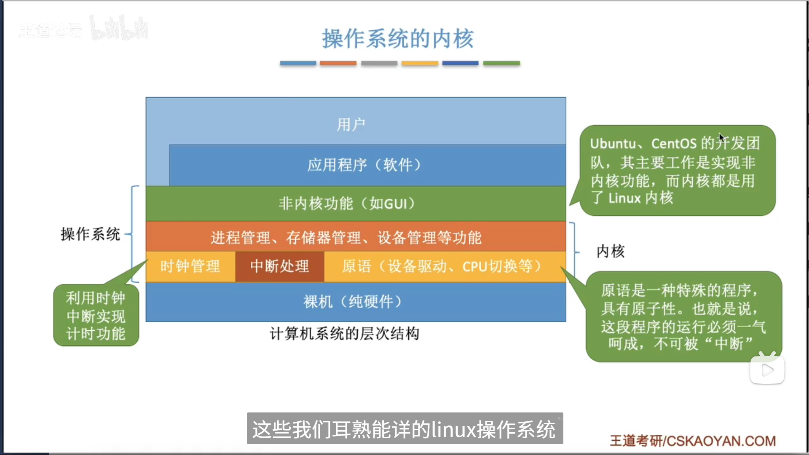
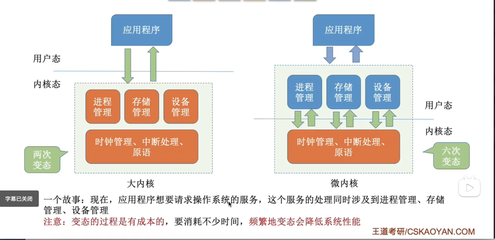

---
{
  "id": "2465a2dd-8276-8075-8a8e-c43a4bc5d30d",
  "url": "https://www.notion.so/1-4-2465a2dd827680758a8ec43a4bc5d30d",
  "created_time": "2025-08-05T14:00:00.000Z",
  "last_edited_time": "2025-08-05T14:17:00.000Z"
}
---

#  1.4操作系统体系结构（上）

### 操作系统内核

大小内核

大内核性能比微内核性能高（因为CPU切换状态次数少）

### 总结

