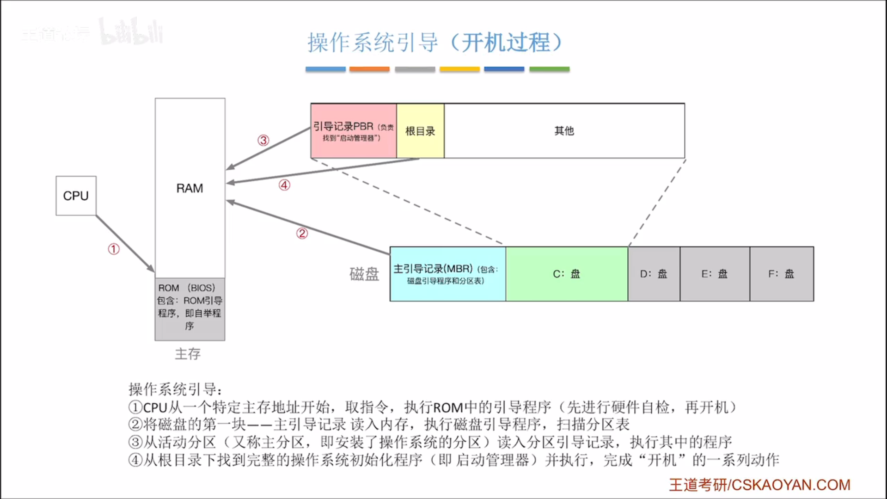

---
{
  "id": "2465a2dd-8276-80e4-9264-d617cd136187",
  "url": "https://www.notion.so/1-5-2465a2dd827680e49264d617cd136187",
  "created_time": "2025-08-05T15:00:00.000Z",
  "last_edited_time": "2025-08-05T17:07:00.000Z"
}
---

#  1.5操作系统引导

注意⚠️本节阐述的MBR+BIOS+Wondows的引导顺序GPT+UEFI/Linux/MacOS等，与这个过程不同
ps：
MBR翻译：主引导记录
GPT翻译：全局唯一标识符分区表
### 磁盘结构
ps：
1. 磁盘包含主引导记录和各分区
1. 主引导记录包含磁盘引导程序和分区表

### 开机过程
ps：
1. bios包含（BOOT）引导程序（全名叫ROM引导程序或叫自举程序）和（POST）自检程序
1. 根目录就是C盘打开的目录
1. BOOT（引导）是个宽泛概念，不同层级有不同的boot，他们不是一个东西，也不存储在同一位置
通电开机→BIOS执行硬件自检→BIOS执行BOOT程序（指示CPU将磁盘主引导记录读入内存）→主引导记录中的磁盘引导程序根据分区表寻找c盘→读取c盘中的引导记录至内存→引导记录找到启动管理器（启动管理器存放在根目录下）→运行启动管理器→启动管理器完成一系列启动工作

### 各引导程序名称（BOOT）
存放于bios中的引导程序：ROM引导程序/自举程序
存放于磁盘主引导记录中的引导程序：磁盘引导程序
存放于磁盘C盘中的引导程序：bootMGR引导程序
存放于磁盘C盘根目录中的引导程序：启动管理器
