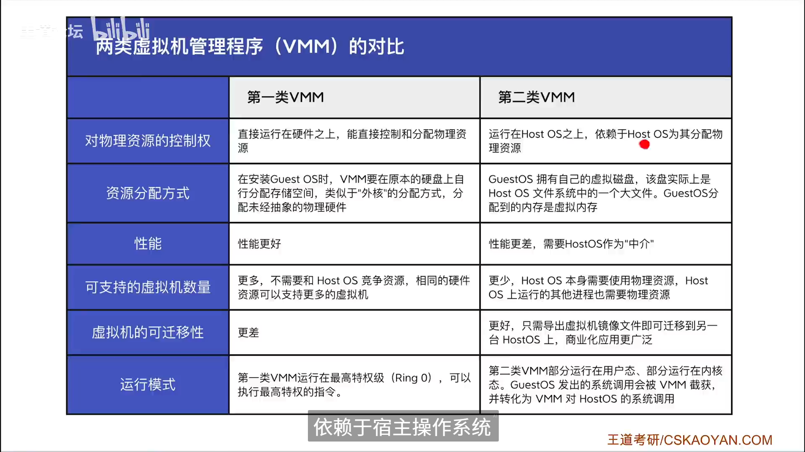

---
{
  "id": "24e5a2dd-8276-80a2-8077-edc481ff8aa8",
  "url": "https://www.notion.so/1-6-24e5a2dd827680a28077edc481ff8aa8",
  "created_time": "2025-08-13T07:45:00.000Z",
  "last_edited_time": "2025-08-13T08:03:00.000Z"
}
---

#  1.6虚拟机

### 虚拟机有两类：
**第一类：**
**一个物理机上直接运行一个“虚拟机管理程序”，各系统运行在该程序上**
**（只有“虚拟机管理程序”运行在内核态）**
**第二类：**
**在宿主操作系统上安装一个“虚拟机管理程序”，在该程序上运行其他操作系统**
（虚拟机管理程序部分运行在内核态：安装一个驱动程序）

区别：

解释：
GuestOS：虚拟机内安装的操作系统
HostOS：宿主操作系统
VMM：虚拟机管理程序
