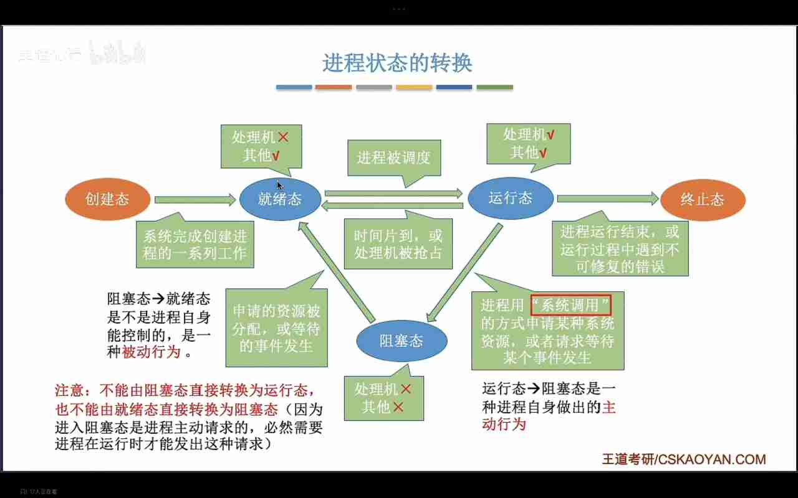

---
{
  "id": "31c5a2dd-8276-80b2-9235-c59df0aca332",
  "url": "https://www.notion.so/2-1-3-31c5a2dd827680b29235c59df0aca332",
  "created_time": "2026-03-07T06:40:00.000Z",
  "last_edited_time": "2026-03-07T07:08:00.000Z"
}
---

#  2.1.3进程的状态与转换

# 进程的状态
操作系统在PCB（进程控制块）中标记进程的状态
### 创建态
指系统正在创建该进程：
系统为该进程分配资源，初始化PCB
### 就绪态
进程创建完成就进入就绪态
（只有就绪态的进程才能上CPU运行）
### 运行态
指该进程正在CPU上运行
### 阻塞态
指该进程执行指令被阻塞：
如等待io
（被阻塞的进程要先回到就绪态才能继续运行）
### 终止态
指该进程运行完毕，系统正在回收资源（CPU，外设，内存，PCB等）
# 进程的转换

# 进程的组织方式
### 链式方式
按照进程状态分成多个队列（队列先进先出）
优先级高的进程排前面
### 索引方式
按照进程状态创建几张索引表（表想取哪就取哪）
操作系统控制指向索引表的指针
