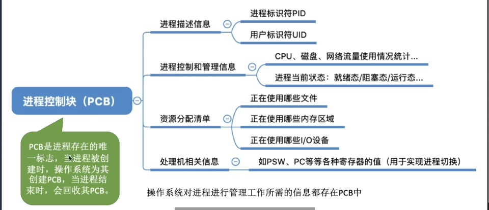
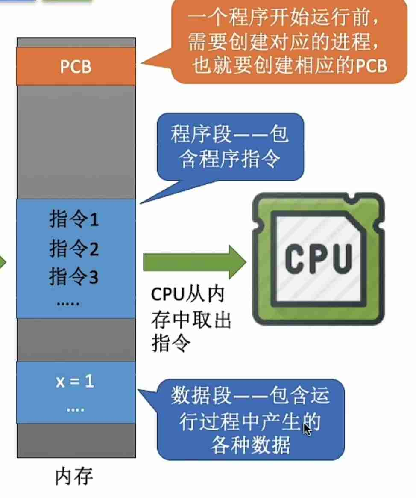

---
{
  "id": "24e5a2dd-8276-8006-bd67-e5f96dd88d47",
  "url": "https://www.notion.so/a2-1-1-2-1-2-24e5a2dd82768006bd67e5f96dd88d47",
  "created_time": "2025-08-13T08:04:00.000Z",
  "last_edited_time": "2026-03-06T09:06:00.000Z"
}
---

#  a2.1.1+2.1.2进程概念，组成，特征

### 进程概念
程序：静态的可执行文件
进程：动态，程序的一次执行过程
### 进程组成（在内存中）
1. 进程控制块PCB

1. 程序段
该程序的各种指令
1. 数字段
该程序运行产生的各种数据

进程实体是进程在运行中某一时刻的状态，是静态的
进程是动态的
