---
{
  "id": "2455a2dd-8276-80b9-8e49-f2de479a19f8",
  "url": "https://www.notion.so/2455a2dd827680b98e49f2de479a19f8",
  "created_time": "2025-08-04T14:08:00.000Z",
  "last_edited_time": "2025-08-13T08:04:00.000Z"
}
---

# 💻 操作系统

本笔记与b站《王道计算机考研 操作系统》视频架构一致，从1.2节开始
[1.2操作系统发展](12操作系统发展/index.md)
  ### 手工操作系统（串行处理，人工输入）
  人➡️纸带机➡️计算机➡️打孔机➡️人
  
  缺点：
  人操作慢
  从纸带到内存读取时间长（纸带机运行慢）
  CPU长时间闲置
  ### 单道批处理系统（串行处理，磁带输入）
  人（程序）➡️纸带机➡️磁带➡️计算机➡️另一个磁带
  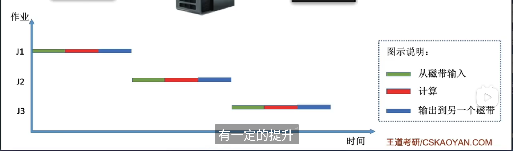
  优点：
  先统一输入到磁带中，再由磁带分批输入计算机，提高了速度
  缺点：
  读取时不能计算CPU长时间闲置（IO时间长）
  ### 多道批处理系统（串行处理，处理的同时读取）
  二维图更形象（默认输入输出不是同一个设备）
  
  优点：处理器利用率高
  缺点：
  看似并行操作，实际上处理器仍是串行处理，前面的程序卡住会阻塞后面的程序运行
  ### 分时操作系统（宏观并行）
  各个程序轮流占用处理器若干时间，时间到没执行完就暂停，让别的程序运行
  优点：
  宏观上看是并行处理，一个程序卡住不会影响其他程序
  缺点：
  程序执行不分优先级，无法“优先处理”
  ### 实时操作系统（宏观并行，有优先级）
  在分时操作系统的基础上加入了程序按优先级执行的功能
  分硬实时（规定时间必须执行完）和软实时（规定时间不执行完也行）
[1.3.1操作系统运行机制](131操作系统运行机制/index.md)
  ### 内核程序与应用程序
  操作系统不是所有部分都是由内核实现的
  内核是操作系统核心，负责管理系统资源
  ### 特权指令与非特权指令
  应用程序只能执行非特权指令
  系统内核可以执行特权与非特权指令
  ### 内核态（管态）与用户态（目态）
  CPU有两种状态：内核态，用户态
  在内核态运行操作系统内核，可执行特权指令
  在用户态运行应用程序，不能执行特权指令
  ps：CPU的程序状态寄存器（psw），有一个二进制位，为1是内核态，为0是用户态
  ### 内核态与用户态切换
  内核态→用户态：执行特权指令——修改psw寄存器
  用户态→内核态：由中断触发
  应用程序越权执行特权指令会触发中断，且该指令会被拒绝执行
[1.3.2中断和异常](132中断和异常/index.md)
  ps：中断只表示从用户态到内核态的过程
  ，不表示从内核态到用户态的过程
  ### 内中断与外中断
  内中断：CPU内部的中断信号
  外中断：CPU外部的中断信号
  ### 内中断例子（异常，例外）
  1. 当前指令非法（越权执行，参数错误）会触发内中断
  1. 执行陷入指令，将控制权换给内核（系统调用就是这么实现的）
  ps：陷入指令不是特权指令
  ### 外中断例子（正常中断）
  1. 时钟中断（外边时钟电路每隔一段时间就给CPU发送一个中断信号）
  1. IO中断请求（如打印机打印完成后会发送一个中断信号，内核会进行相应处理）
  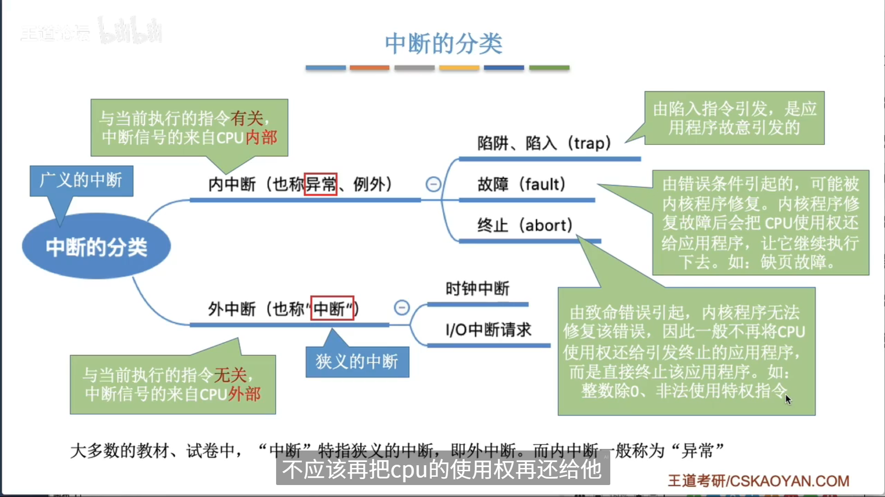
  ### 中断机制的基本原理（中断后内核如何处理）
  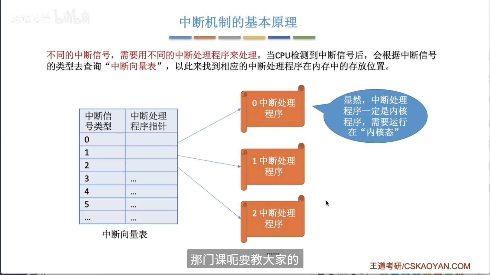
  ### 总结
  
[1.3.3系统调用](133系统调用/index.md)
  系统调用是提供内核服务的接口
  （要想执行特权指令需要使用系统调用，而非使用越权的指令）
  ### 系统调用与库函数的区别
  一个程序可以用汇编直接使用系统调用
  也可以使用库函数间接使用系统调用（库函数直接使用系统调用）
  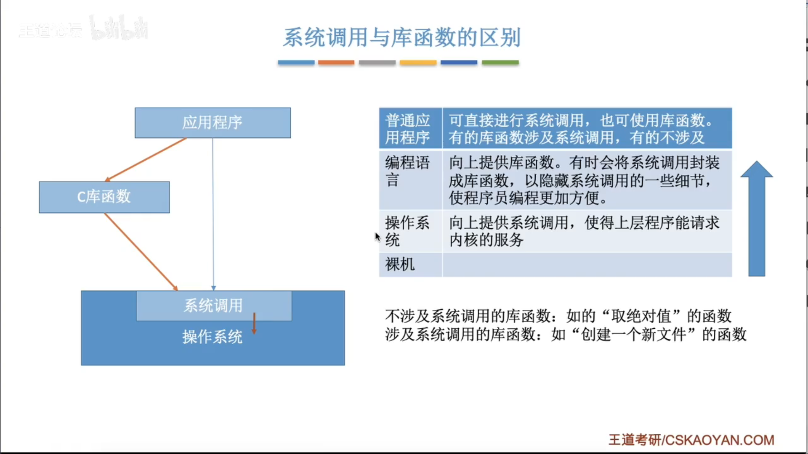
  ### 为什么要系统调用
  例：当多个进程同时使用一种设备资源（如摄像头）需要内核决定使用顺序，否则会出现争抢摄像头的情况
  ### 什么功能要系统调用
  
  ### 系统调用过程
  传参指令……（用户态）→陷入指令（用户态）[引发中断]→中断处理程序（内核态）[选择相应的系统调用处理程序]→相应系统调用处理程序（由传入的参数决定）
  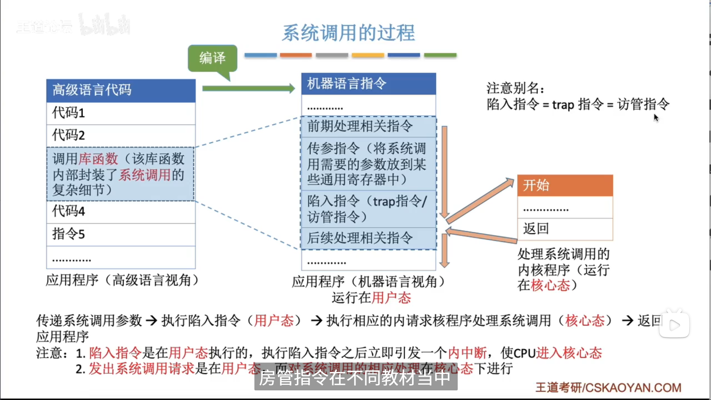
  ps：陷入指令=访管指令=trap指令
  ### 总结
  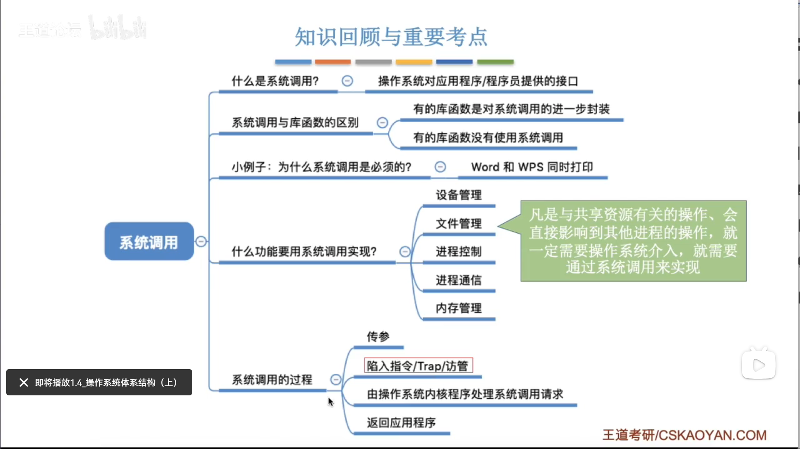
[1.4操作系统体系结构（上）](14操作系统体系结构上/index.md)
  ### 操作系统内核
  
  大小内核
  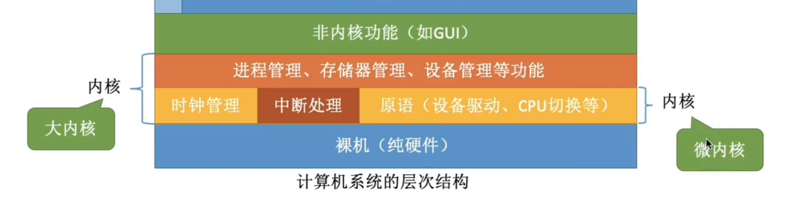
  大内核性能比微内核性能高（因为CPU切换状态次数少）
  
  ### 总结
  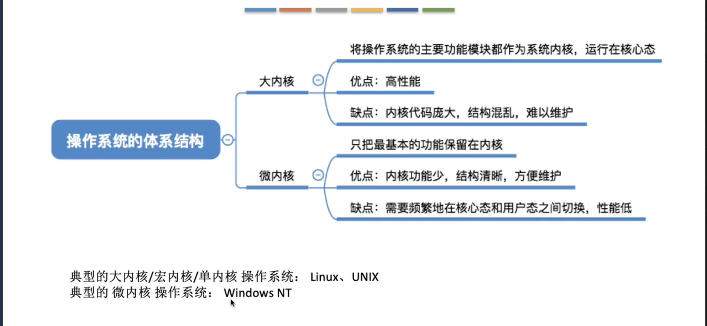
[1.4操作系统体系结构（下）](14操作系统体系结构下/index.md)
  ### 分层结构（内核结构）
  只能调用相邻层
  只能上层调用下层
  优：便于调试
  缺：执行效率低
  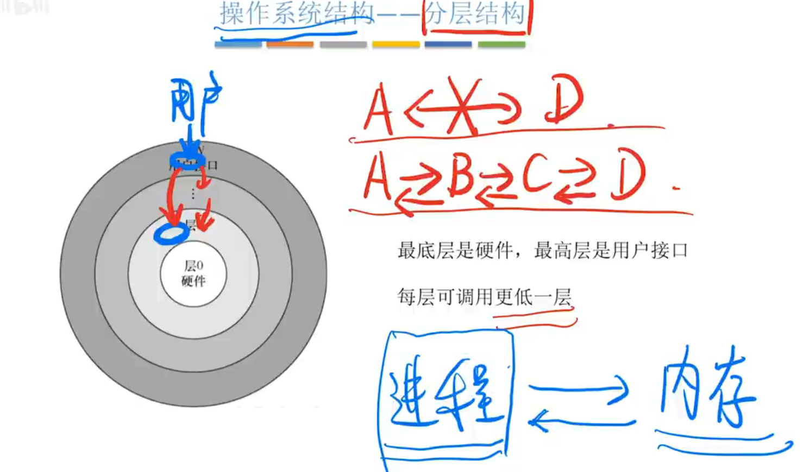
  ### 模块化结构（内核结构）
  一个主模块（内核运行所需最小组件）+多个可加载模块
  
  优：
  模块化易维护
  支持动态加载模块到内核中
  各模块可直接调用其他模块，效率高
  缺：
  模块相互调用难调试
  ### 外核（内核结构）
  可以理解为双内核
  一个是正常的内核
  另一个“内核”是外核（只负责分配/回收/保护未经抽象的硬件资源）
  这对于某些软件需要在物理内存上申请连续的块非常友好（机械硬盘可提升性能）
  优：
  减少了虚拟硬件资源带来的性能损耗
  应用程序可以更灵活的使用硬件
  缺：
  系统复杂
  ### 总结
  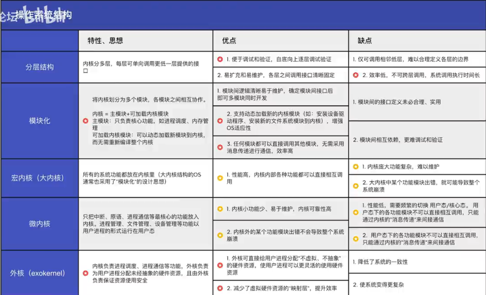
[1.5操作系统引导](15操作系统引导/index.md)
  注意⚠️本节阐述的MBR+BIOS+Wondows的引导顺序GPT+UEFI/Linux/MacOS等，与这个过程不同
  ps：
  MBR翻译：主引导记录
  GPT翻译：全局唯一标识符分区表
  ### 磁盘结构
  ps：
  1. 磁盘包含主引导记录和各分区
  1. 主引导记录包含磁盘引导程序和分区表
  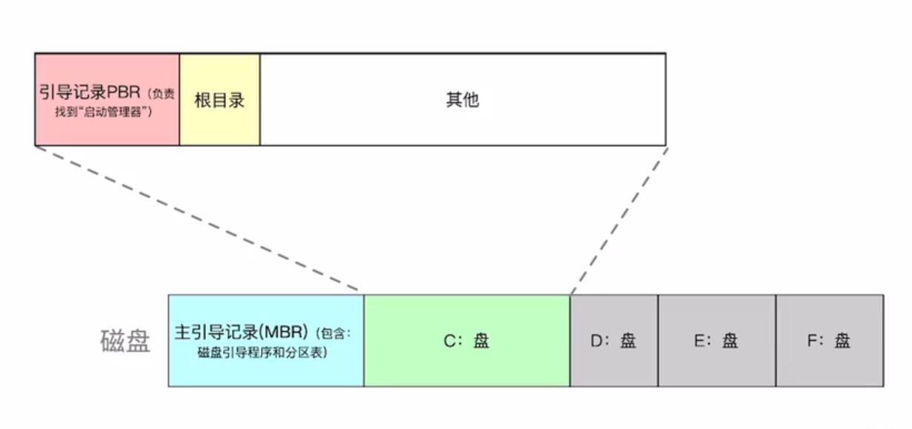
  ### 开机过程
  ps：
  1. bios包含（BOOT）引导程序（全名叫ROM引导程序或叫自举程序）和（POST）自检程序
  1. 根目录就是C盘打开的目录
  1. BOOT（引导）是个宽泛概念，不同层级有不同的boot，他们不是一个东西，也不存储在同一位置
  通电开机→BIOS执行硬件自检→BIOS执行BOOT程序（指示CPU将磁盘主引导记录读入内存）→主引导记录中的磁盘引导程序根据分区表寻找c盘→读取c盘中的引导记录至内存→引导记录找到启动管理器（启动管理器存放在根目录下）→运行启动管理器→启动管理器完成一系列启动工作
  
  ### 各引导程序名称（BOOT）
  存放于bios中的引导程序：ROM引导程序/自举程序
  存放于磁盘主引导记录中的引导程序：磁盘引导程序
  存放于磁盘C盘中的引导程序：bootMGR引导程序
  存放于磁盘C盘根目录中的引导程序：启动管理器
[1.6虚拟机](16虚拟机/index.md)
  ### 虚拟机有两类：
  **第一类：**
  **一个物理机上直接运行一个“虚拟机管理程序”，各系统运行在该程序上**
  **（只有“虚拟机管理程序”运行在内核态）**
  **第二类：**
  **在宿主操作系统上安装一个“虚拟机管理程序”，在该程序上运行其他操作系统**
  （虚拟机管理程序部分运行在内核态：安装一个驱动程序）
  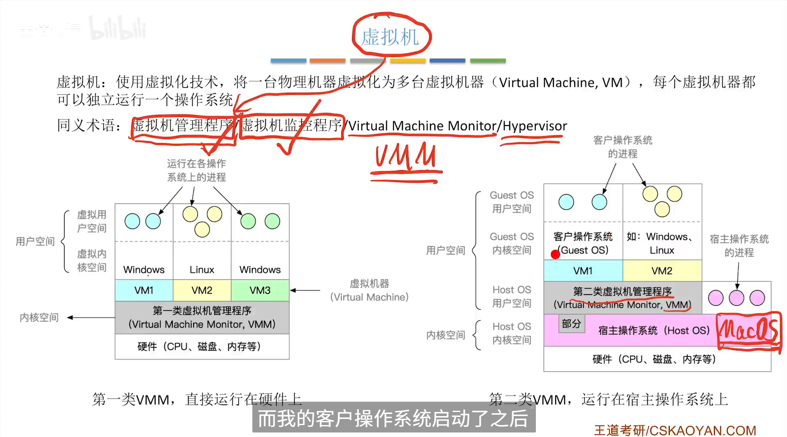
  区别：
  
  解释：
  GuestOS：虚拟机内安装的操作系统
  HostOS：宿主操作系统
  VMM：虚拟机管理程序
[2.1.1+2.1.2进程概念，组成，特征](211212进程概念组成特征/index.md)
  ### 进程概念
  程序：静态的可执行文件
  进程：动态，程序的一次执行过程
  ### 进程组成
  1. 进程控制块PCB
  
  1. 程序段
  1. 数字段
