---
{
  "id": "2455a2dd-8276-80b9-8e49-f2de479a19f8",
  "url": "https://app.notion.com/p/2455a2dd827680b98e49f2de479a19f8",
  "created_time": "2025-08-04T14:08:00.000Z",
  "last_edited_time": "2026-06-27T09:34:00.000Z"
}
---

# 💻 操作系统

本笔记与b站《王道计算机考研 操作系统》视频架构一致，从1.2节开始
[第一章](第一章/index.md)
  1.2操作系统发展
    ### 手工操作系统（串行处理，人工输入）
    人➡️纸带机➡️计算机➡️打孔机➡️人
    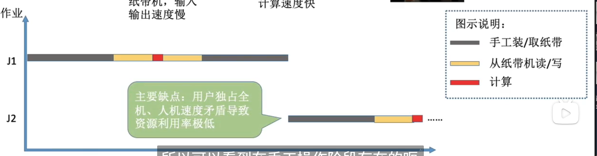
    缺点：
    人操作慢
    从纸带到内存读取时间长（纸带机运行慢）
    CPU长时间闲置
    ### 单道批处理系统（串行处理，磁带输入）
    人（程序）➡️纸带机➡️磁带➡️计算机➡️另一个磁带
    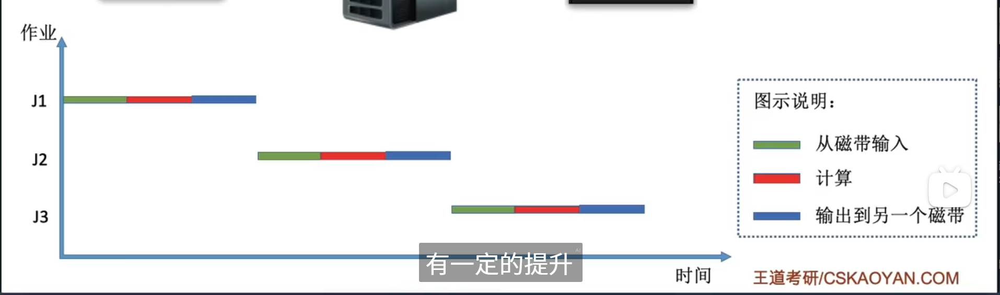
    优点：
    先统一输入到磁带中，再由磁带分批输入计算机，提高了速度
    缺点：
    读取时不能计算CPU长时间闲置（IO时间长）
    ### 多道批处理系统（串行处理，处理的同时读取）
    二维图更形象（默认输入输出不是同一个设备）
    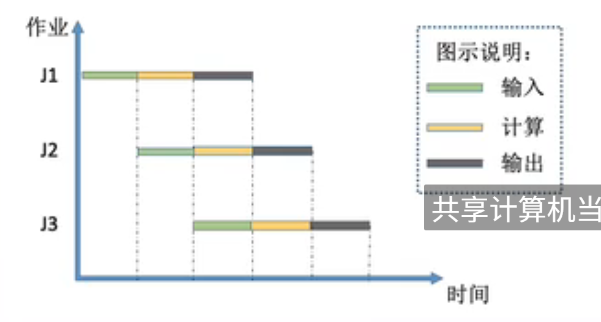
    优点：处理器利用率高
    缺点：
    看似并行操作，实际上处理器仍是串行处理，前面的程序卡住会阻塞后面的程序运行
    ### 分时操作系统（宏观并行）
    各个程序轮流占用处理器若干时间，时间到没执行完就暂停，让别的程序运行
    优点：
    宏观上看是并行处理，一个程序卡住不会影响其他程序
    缺点：
    程序执行不分优先级，无法“优先处理”
    ### 实时操作系统（宏观并行，有优先级）
    在分时操作系统的基础上加入了程序按优先级执行的功能
    分硬实时（规定时间必须执行完）和软实时（规定时间不执行完也行）
    # 总结
    单道批处理：要等 io，无并发
    多道批处理：不等 io，无并发
    分时操作系统：不等 IO，可并发
    实时操作系统：RTOS，实时，轻量，稳定
  1.3.1操作系统运行机制
    ### 内核程序与应用程序
    操作系统不是所有部分都是由内核实现的
    内核是操作系统核心，负责管理系统资源
    ### 特权指令与非特权指令
    应用程序只能执行非特权指令
    系统内核可以执行特权与非特权指令
    ### 内核态（管态）与用户态（目态）
    CPU有两种状态：内核态，用户态
    在内核态运行操作系统内核，可执行特权指令
    在用户态运行应用程序，不能执行特权指令
    ps：CPU的程序状态寄存器（psw），有一个二进制位，为1是内核态，为0是用户态
    ### 内核态与用户态切换
    内核态→用户态：执行特权指令——修改psw寄存器
    用户态→内核态：由中断触发
    应用程序越权执行特权指令会触发中断，且该指令会被拒绝执行
  1.3.2中断和异常
    ps：中断只表示从用户态到内核态的过程
    ，不表示从内核态到用户态的过程
    ### 内中断与外中断
    内中断：CPU内部的中断信号
    外中断：CPU外部的中断信号
    ### 内中断例子（异常，例外）
    1. 当前指令非法（越权执行，参数错误）会触发内中断
    1. 执行陷入指令，将控制权换给内核（系统调用就是这么实现的）
    ps：陷入指令不是特权指令
    ### 外中断例子（正常中断）
    1. 时钟中断（外边时钟电路每隔一段时间就给CPU发送一个中断信号）
    1. IO中断请求（如打印机打印完成后会发送一个中断信号，内核会进行相应处理）
    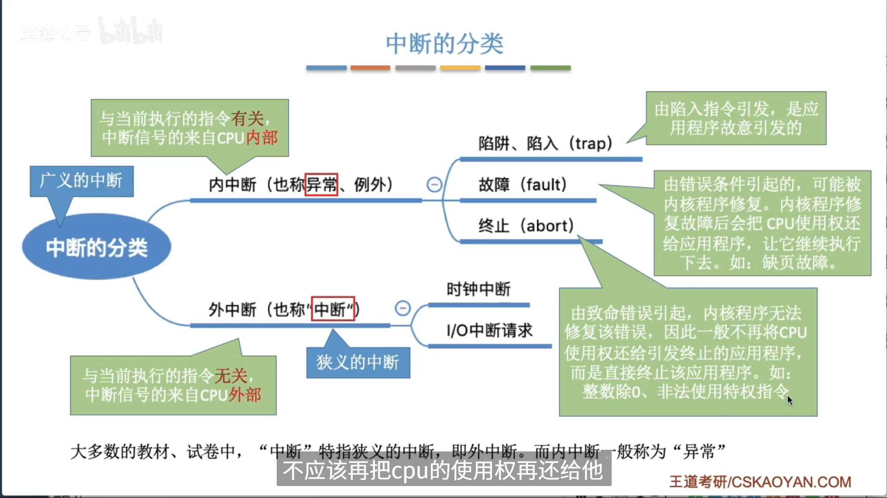
    ### 中断机制的基本原理（中断后内核如何处理）
    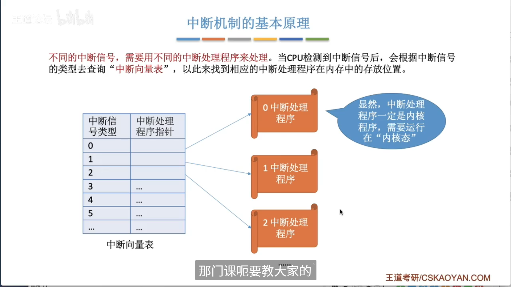
    ### 总结
    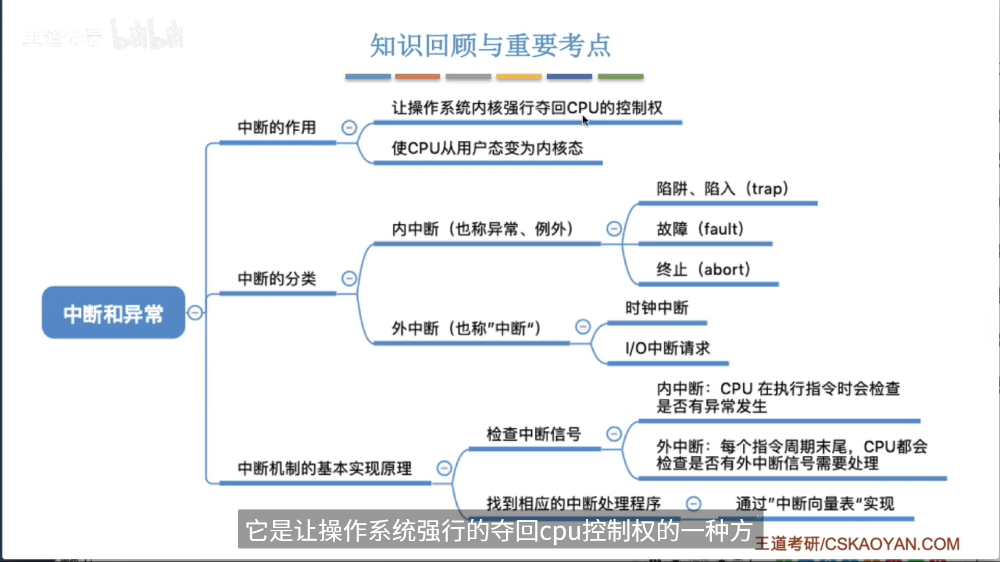
  1.3.3系统调用
    系统调用是提供内核服务的接口
    （要想执行特权指令需要使用系统调用，而非使用越权的指令）
    ### 系统调用与库函数的区别
    一个程序可以用汇编直接使用系统调用
    也可以使用库函数间接使用系统调用（库函数直接使用系统调用）
    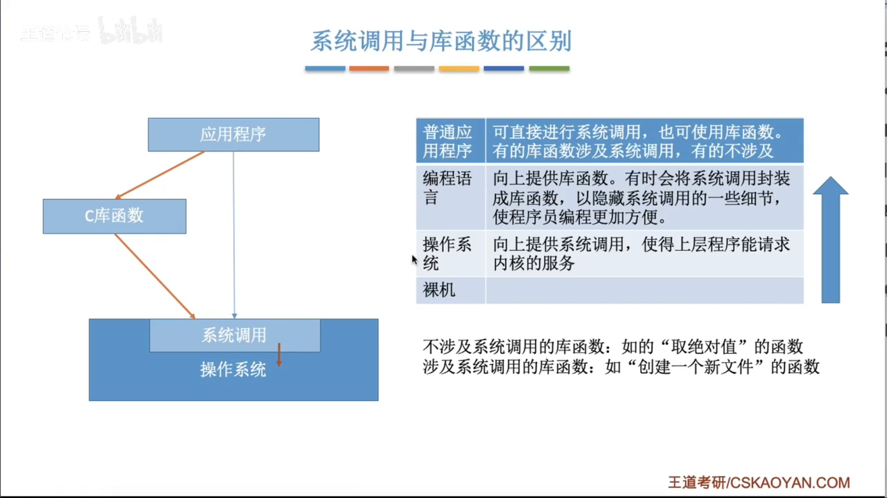
    ### 为什么要系统调用
    例：当多个进程同时使用一种设备资源（如摄像头）需要内核决定使用顺序，否则会出现争抢摄像头的情况
    ### 什么功能要系统调用
    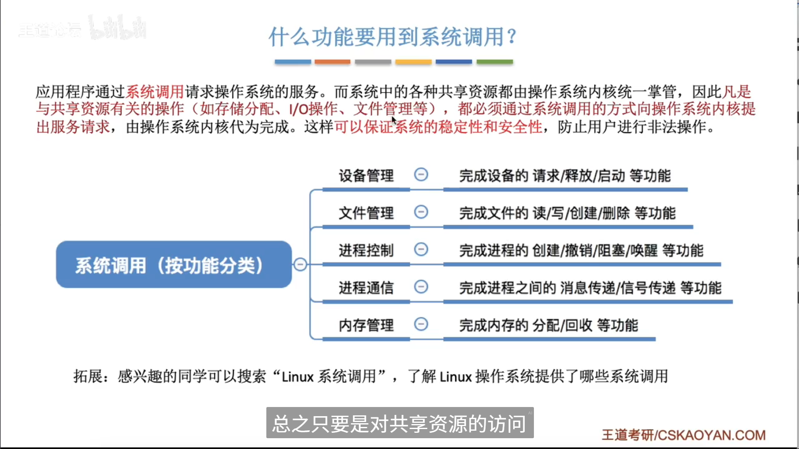
    ### 系统调用过程
    传参指令……（用户态）→陷入指令（用户态）[引发中断]→中断处理程序（内核态）[选择相应的系统调用处理程序]→相应系统调用处理程序（由传入的参数决定）
    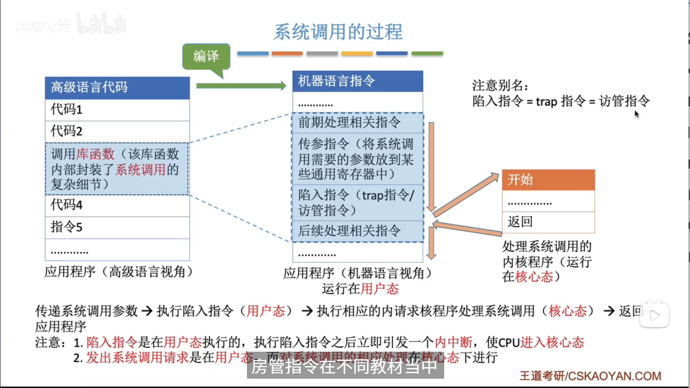
    ps：陷入指令=访管指令=trap指令
    ### 总结
    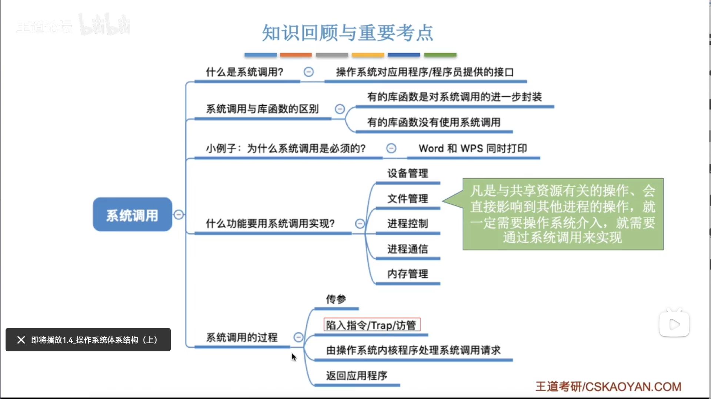
  1.4操作系统体系结构（上）
    ### 操作系统内核
    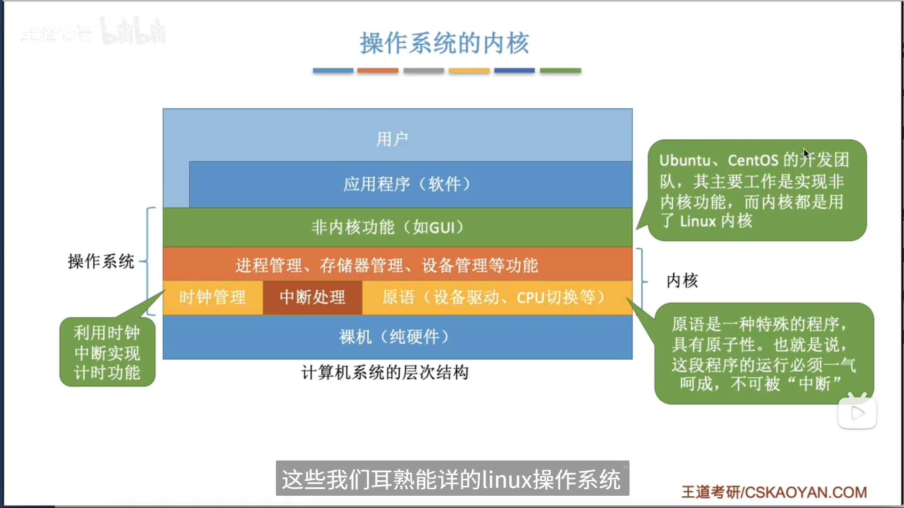
    大小内核
    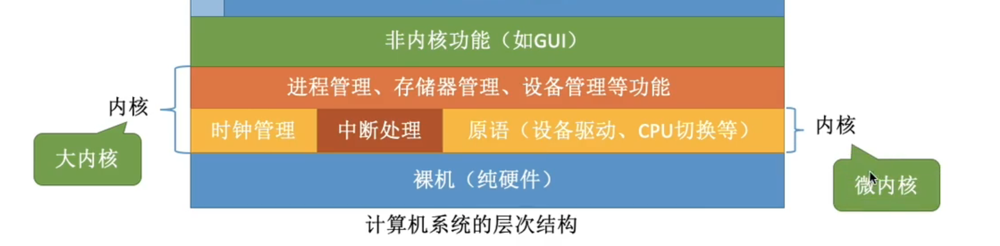
    大内核性能比微内核性能高（因为CPU切换状态次数少）
    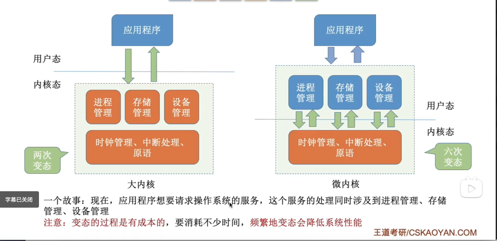
    ### 总结
    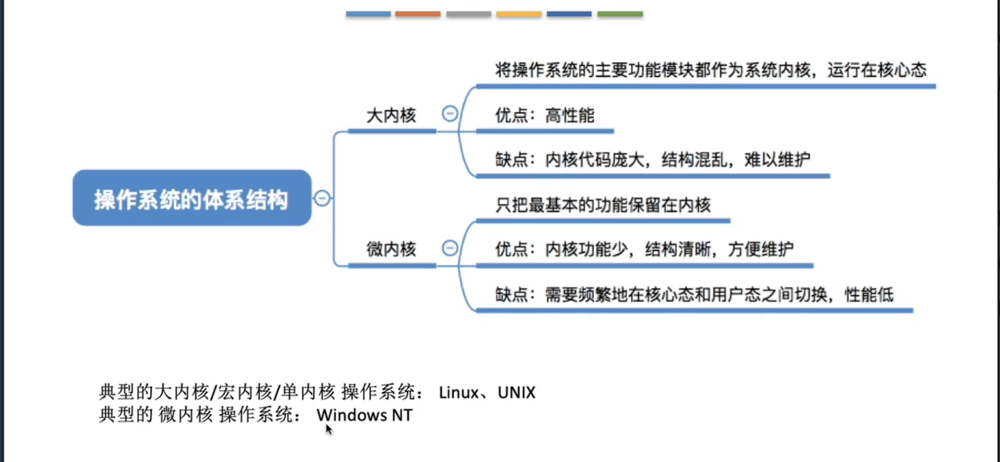
  1.4操作系统体系结构（下）
    ### 分层结构（内核结构）
    只能调用相邻层
    只能上层调用下层
    优：便于调试
    缺：执行效率低
    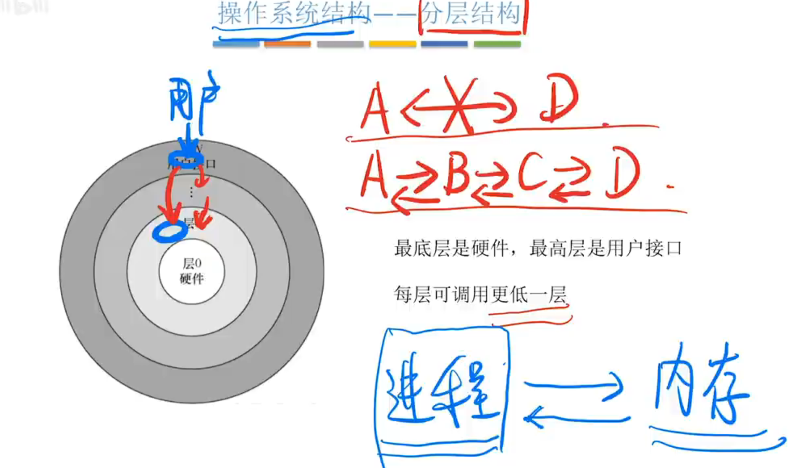
    ### 模块化结构（内核结构）
    一个主模块（内核运行所需最小组件）+多个可加载模块
    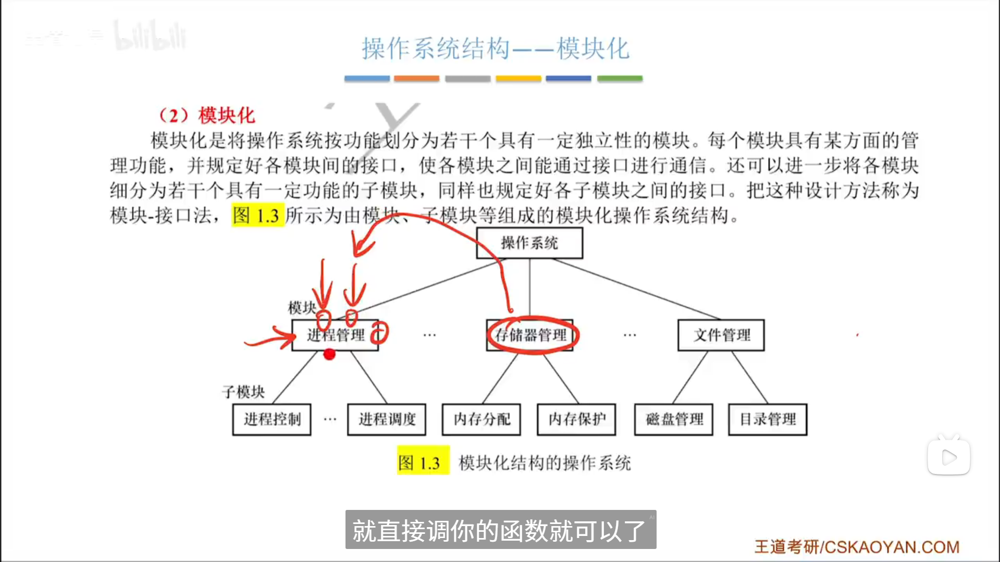
    优：
    模块化易维护
    支持动态加载模块到内核中
    各模块可直接调用其他模块，效率高
    缺：
    模块相互调用难调试
    ### 外核（内核结构）
    可以理解为双内核
    一个是正常的内核
    另一个“内核”是外核（只负责分配/回收/保护未经抽象的硬件资源）
    这对于某些软件需要在物理内存上申请连续的块非常友好（机械硬盘可提升性能）
    优：
    减少了虚拟硬件资源带来的性能损耗
    应用程序可以更灵活的使用硬件
    缺：
    系统复杂
    ### 总结
    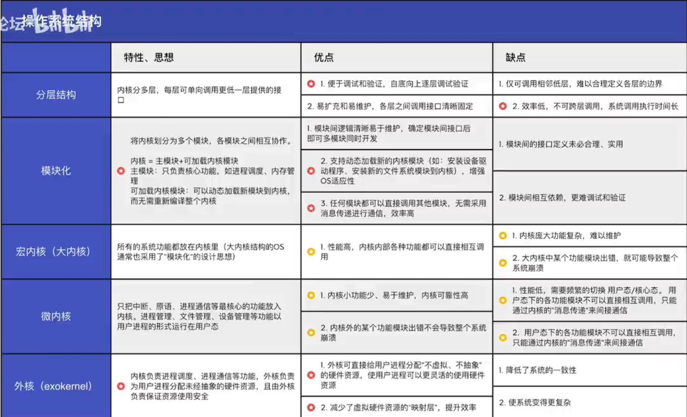
  1.5操作系统引导
    注意⚠️本节阐述的MBR+BIOS+Wondows的引导顺序GPT+UEFI/Linux/MacOS等，与这个过程不同
    ps：
    MBR翻译：主引导记录
    GPT翻译：全局唯一标识符分区表
    ### 磁盘结构
    ps：
    1. 磁盘包含主引导记录和各分区
    1. 主引导记录包含磁盘引导程序和分区表
    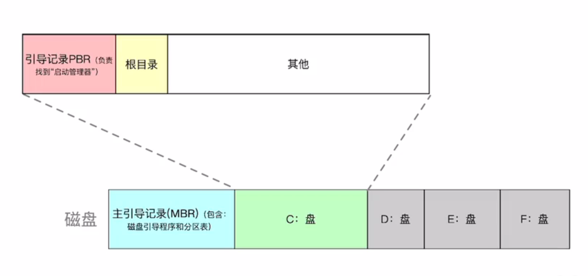
    ### 开机过程
    ps：
    1. bios包含（BOOT）引导程序（全名叫ROM引导程序或叫自举程序）和（POST）自检程序
    1. 根目录就是C盘打开的目录
    1. BOOT（引导）是个宽泛概念，不同层级有不同的boot，他们不是一个东西，也不存储在同一位置
    通电开机→BIOS执行硬件自检→BIOS执行BOOT程序（指示CPU将磁盘主引导记录读入内存）→主引导记录中的磁盘引导程序根据分区表寻找c盘→读取c盘中的引导记录至内存→引导记录找到启动管理器（启动管理器存放在根目录下）→运行启动管理器→启动管理器完成一系列启动工作
    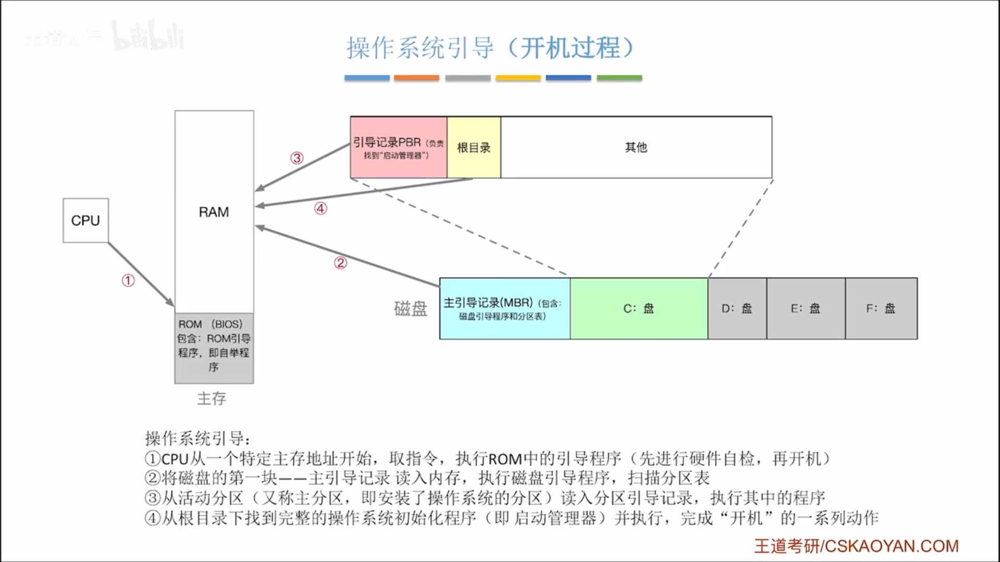
    ### 各引导程序名称（BOOT）
    存放于bios中的引导程序：ROM引导程序/自举程序
    存放于磁盘主引导记录中的引导程序：磁盘引导程序
    存放于磁盘C盘中的引导程序：bootMGR引导程序
    存放于磁盘C盘根目录中的引导程序：启动管理器
  1.6虚拟机
    ### 虚拟机有两类：
    **第一类：**
    **一个物理机上直接运行一个“虚拟机管理程序”，各系统运行在该程序上**
    **（只有“虚拟机管理程序”运行在内核态）**
    **第二类：**
    **在宿主操作系统上安装一个“虚拟机管理程序”，在该程序上运行其他操作系统**
    （虚拟机管理程序部分运行在内核态：安装一个驱动程序）
    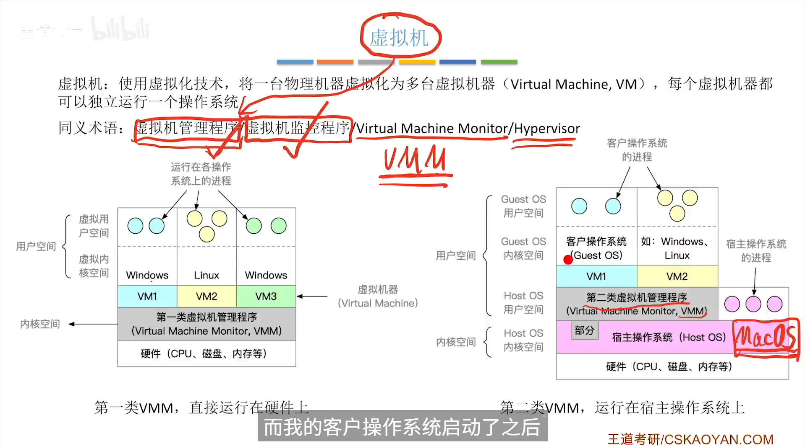
    区别：
    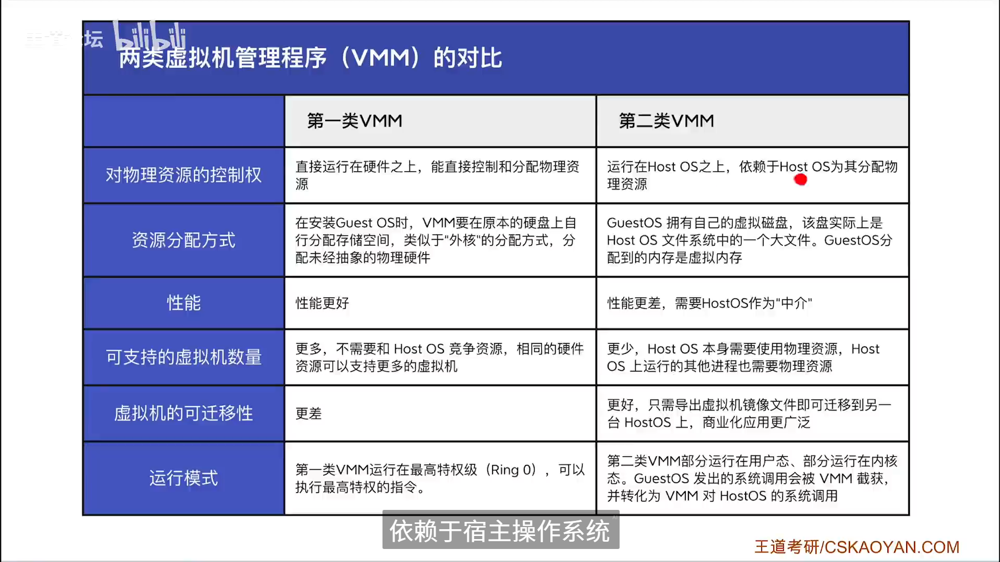
    解释：
    GuestOS：虚拟机内安装的操作系统
    HostOS：宿主操作系统
    VMM：虚拟机管理程序
[第二章](第二章/index.md)
  a2.1.1+2.1.2进程概念，组成，特征
    ### 进程概念
    程序：静态的可执行文件
    进程：动态，程序的一次执行过程
    ### 进程组成（在内存中）
    1. 进程控制块PCB
    

    1. 程序段
    该程序的各种指令
    1. 数字段
    该程序运行产生的各种数据

    
    进程实体是进程在运行中某一时刻的状态，是静态的
    进程是动态的
  2.1.3进程的状态与转换
    # 进程的状态
    操作系统在PCB（进程控制块）中标记进程的状态
    ### 创建态
    指系统正在创建该进程：
    系统为该进程分配资源，初始化PCB
    ### 就绪态
    进程创建完成就进入就绪态
    （只有就绪态的进程才能上CPU运行）
    ### 运行态
    指该进程正在CPU上运行
    ### 阻塞态
    指该进程执行指令被阻塞：
    如等待io
    （被阻塞的进程要先回到就绪态才能继续运行）
    ### 终止态
    指该进程运行完毕，系统正在回收资源（CPU，外设，内存，PCB等）
    # 进程的转换
    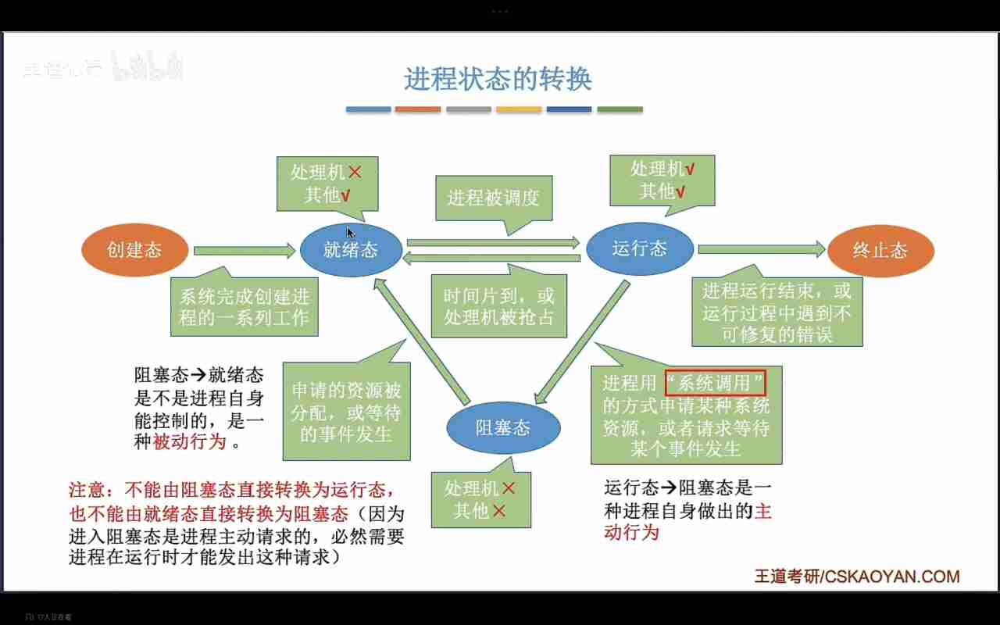
    # 进程的组织方式
    ### 链式方式
    按照进程状态分成多个队列（队列先进先出）
    优先级高的进程排前面
    ### 索引方式
    按照进程状态创建几张索引表（表想取哪就取哪）
    操作系统控制指向索引表的指针
  2.1.4进程控制
    进程控制就是实现进程状态转换
    # 如何实现进程控制
    需要使用原语实现：
    因为原语可以一气呵成不被中断，如果在进程状态转换中被中断了，可能导致数据不统一（就绪队列和阻塞队列不同步）
    # 原语如何实现原子性？
    因为使用了“关中断”和“开中断”两个特权指令
    关中断：执行后，机器不再理会中断信号
    开中断：执行后，恢复正常中断效果
    # 进程控制相关原语
    ## 进程创建
      ### 进程创建
        申请空白PCB→为进程分配资源→初始化PCB→将PCB插入就绪队列
      ### 引起进程创建的事件
        用户登录
        作业调度：将内容从硬盘移动到内存
        提供服务
        应用请求
    ## 进程终止
      ### 撤销原语
        从PCB集合中找到相应PCB→若进程正在运行，则立即剥夺CPU→终止子进程→回收相应资源→删除PCB
      ### 引起终止的事件
        正常结束：程序调用exit系统调用
        异常：系统给程序抛个异常
        外界干预：用户手动杀死
    ## 进程阻塞和唤醒
      ### 进程阻塞
        阻塞原语：找到对应进程PCB→保存运行状态→将PCB插入阻塞队列
        引起阻塞的事件：等待资源，等其他进程
      ### 进程唤醒
        唤醒原语：找到对应PCB→将对应PCB从阻塞队列移除，设置PCB为就绪态→将PCB放入就绪队列
        引起唤醒的事件：等待的资源加载完成
    ## 进程切换
      ### 切换原语
        将运行环境存入PCB→PCB移入相应队列→选择另一个进程运行，并更新PCB→（后续）根据PCB恢复进程运行环境
      ### 引起进程切换的事件
        当前进程时间片到了
        有更高优先级进程插队
        当前进程主动阻塞
        当前进程终止
  2.1.5-1进程通信IPC
    Q：进程通信为什么要操作系统支持
    A：各进程拥有的内存空间相互独立（为了保证安全）
    ## **进程通信有三种方式**
    ## 共享存储
      一个进程可以申请一个共享存储区，共享存储区的内容可被其他进程访问
      
      使用共享存储做进程间通信方式需要注意访问互斥，避免同时访问造成数据冲突（需要进程自己处理）
      可使用内核提供的同步互斥工具（P/V操作）
      **共享存储分两种↓**
      ### 基于数据结构的共享
        如：共享空间只能放10位的数组
      ### 基于存储区的共享
        直接给一片内存，共享内存里写什么都行（更自由）
    ## 消息传递
      进程间以格式化的消息传递信息，通过操作系统的“发送/接收消息”原语进行交换
      消息分：消息头，消息体
      消息头：发送进程ID，接收进程ID，消息长度等
      
      **↓消息传递也有两种↓**
      ### 直接通信
        消息发送要指定接收进程ID
        详细步骤：
        发送：
        发送进程写好消息→发送进程调用发送原语→消息从发送进程的内存中被复制到接受进程的消息队列（消息队列在PCB中，PCB在属于内核的内存中）
        接收：
        接收进程调用接收原语→消息队列中对应的数据被复制到接收进程的内存中
      ### 间接通信
        通过信箱间接通信
        详细步骤：
        创建信箱：
        接收进程使用系统调用在内核空间创建一个信箱或多个信箱
        发送：
        发送进程调用发送原语给某个信箱发送信息
        接收：
        接收进程调用接收原语从一个或多个信箱接收信息
        与直接通信区别：
        信箱通信可以多个进程从一个信箱接收，多个进程可以给一个信箱发送
    ## 管道通信
      像管道一样，数据在某时间内只能单向流动
      管道是一类特殊共享文件：pipe文件，就是在内存中开辟一个大小固定的缓存区
      Q：**那这和共享内存通信有什么区别？**
      A：**共享内存可以随机读写，管道通信是先进先出（队列）**
      **特点**：
      - 只支持半双工通信（除非建两个管道）
      - 互斥访问（但由操作系统自动管理，不用进程实现）
      - 管道实际上是缓冲区，有容量上限，写满后写进程被阻塞
      - 管道读空后，读进程阻塞
      - 管道数据一旦被取出，就彻底消失，有两种解决方案：①一个管道允许多个写进程，只允许一个读进程  ②允许多个读，多个写，但系统控制读进程轮流读
  2.1.5-2信号
    信号量：实现进程同步，互斥
    信号：实现进程间通信IPC
    # 信号作用
      信号：用于通知进程某事件完成✅
      不同操作系统信号不一样
      例：
      | 序号 | 信号名 | 事件 | 处理 |
      | --- | --- | --- | --- |
      | 1 | SIGINT | 键盘中断 | 终止 |
      | … | … | … | … |
      注意⚠️：
      信号名实际上就是宏定义的名称
      如：`#define SIGINT 2`
    # 实现原理—信号发送和保存
      ### 发送
      在进程PCB中，有两个nbit的位向量（数据结构：位图）：待处理信号，被阻塞信号
      - 待处理信号：已经发送给进程，但还没有被处理的信号
      - 被阻塞信号/信号掩码：收到也不处理的信号（可自行设置）
      

      注意⚠️：由于待处理信号是位图数据结构，所以同一个信号重复发送，只会生效第一个
      用户→用户（有限制），内核→用户，是可以发送信号的
      ### 处理
      Q：什么时候处理信号？
      A：进程从内核态转为用户态时，例行检查有无待处理信号，如果有就处理
      （人话：内核把CPU还给进程后立刻处理）

      Q：如何选择处理程序？
      A：
      1. 将待处理信号与取反的被阻塞信号按位与
      1. 根据第一步得到的值就可以确定对应的信号处理程序
      1. 运行对应程序
      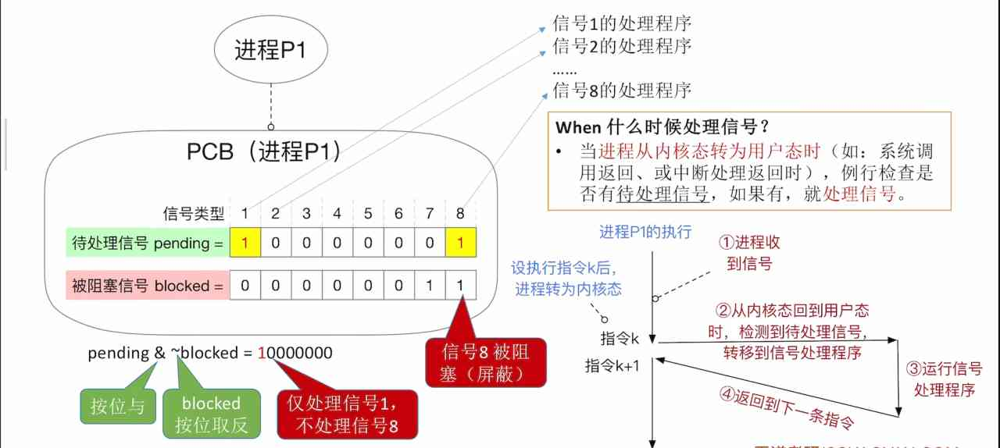

      Q：怎么处理？
      A：操作系统给每个信号都有默认处理程序，也可以自定义处理程序
      如：按下Ctrl+c会触发信号：SIGINT→默认处理：终止。
      在文本编辑器中则会复制（自定义）

      Q：处理完发生什么？
      A：返回进程继续执行下一条指令（除非终止或阻塞）
      注意⚠️：
      重复信号只会处理第一个
      当收到多个信号，优先处理信号序号小的（信号有处理优先级）
    # 信号与异常的关系
    信号可以作为异常的配套机制
    有些异常可以由内核独自处理
    例：整数除0→内核默认：终止进程
    有些异常内核无法独自处理，需要用户进程配合处理
    例：整数除0→自定义：“输入错误”
  2.1.6_1 线程概念多线程模型
    # 什么是线程，为什么引入线程
    没有线程程序只能串行执行一个进程，引入线程增加了并发度，加快进程运行速度，提高多核CPU利用率
    # 引入线程的变化
      ### 调度，资源分配
      传统进程机制：进程是资源分配和调度的基本单位
      线程：进程是资源分配的基本单位，线程是调度的基本单位
      ### 并发
      传统进程机制：只能进程间并发
      线程：线程间可以并发
      ### 系统开销
      传统进程机制：单核条件下，如果要实现进程间并发，由于进程是轮流运行的，需要频繁运行环境，系统开销大
      线程：如果是同一进程内的线程切换，不需要频繁切换环境，系统开销小
    # 线程的属性
      - 线程是处理机调度的单位
      - 多CPU计算机中,各个线程可占用不同的CPU
      - 每个线程都有一个线程ID、线程控制块(TCB)
      - 线程也有就绪、阻塞、运行三种基本状态
      - 线程几乎不拥有系统资源
      - 同一进程的不同线程间共享进程的资源
      - 由于共享内存地址空间,同一进程中的线程间通信甚至无需系统干预
      - 同一进程中的线程切换，不会引起进程切换
      - 不同进程中的线程切换，会引起进程切换
      - 切换同进程内的线程，系统开销很小
      - 切换进程,系统开销较大
  2.1.6_2 线程的实现方式和多线程模型
    # 线程的实现方式
      ### 用户级线程
      早期操作系统不支持线程，所以由线程库实现
      
      优点：切换线程不用切换到内核态，系统开销小
      缺点：一个线程被阻塞，整个进程都会阻塞，在多核处理器上运行没有效率提升
      ### 内核级线程
      
      优点：
      一个线程阻塞不影响其他线程
      可在多核处理器上提高效率
      缺点：
      线程切换需要回到内核态，系统开销大
    # 多线程模型（系统支持多线程）
    分三种
    ### 一对一模型：
    一个用户线程对应一个内核线程
    优：一个线程被阻塞，不影响其他线程
    缺：线程切换要回内核态，开销大
    ### 多对一模型：
    多个用户线程对应一个内核线程
    优：线程切换在用户态，开销小
    缺：一个线程阻塞，整个进程阻塞
    ### 多对多模型：
    n个用户线程对应m个内核线程（n≥m）
    优：同时克服了一对一和多对一的缺点
  2.1.6_3线程的状态与转换
    线程的转换与进程的转换一致
    
    # 线程的组织与控制
    TCB（线程控制块）
    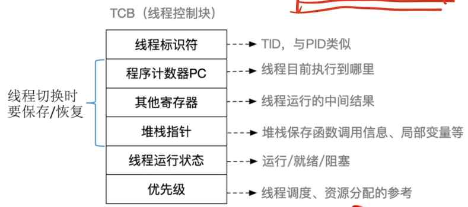
    多个TCB组织起来就形成线程表
  2.2.1 调度的概念
    # 调度的三个层次
      ### 高级调度
      作业：一个具体任务
      **高级调度（作业调度）：按一定的原则从外存的作业后备队列挑一个作业调入内存，并创建进程**
      每个作业只调入一次，调出一次
      作业调入时会建立PCB，调出时撤销PCB
      发生频率：低
      ### 低级调度
      **低级调度（进程调度/处理机调度）：按某策略从就绪队列中选取一个进程，将处理机分配给它**
      发生频率：高
      ### 中级调度
      内存不足时，某些进程的数据会被调出内存，在适当时机再调回来
      暂时被移出内存的进程状态为**挂起状态**
      被挂起的进程PCB会组成**挂起队列**
      **中级调度（内存调度）：按照某种策略决定将那个挂起的进程调回内存**
      发生频率：中
    # 七状态模型
      我们通常看到的是五状态模型，但也有七状态模型
      
    # 总结
    | 层次 | 频率 | 方向 |
    | --- | --- | --- |
    | 高级调度 | 低 | 外存→内存 |
    | 中级调度 | 中 | 挂起→激活 |
    | 低级调度 | 高 | 内存→处理器 |
  2.2.2_1+2.2.4进程调度时机
    # 进程调度的时机
      ### 需要进行进程调度的
        进程主动放弃处理机：
        - 程序终止
        - 发生异常
        - 主动阻塞
        被动放弃处理机：
        - 时间片用完
        - 高优先级进程插队
        - io中断
      ### 不能调度的情况
        1. 中断处理中
        1. 进程在内核临界区
        1. 原子操作中
      临界资源：只同时允许一个进程访问的资源（访问互斥）
      临界区：访问临界资源的代码
      PS：在用户态时，就算程序处在临界区，也可以被打断（调度），只有原语才能保证操作不被打断，打断不会影响互斥锁的状态（不会解锁）
    # 进程调度方式
      ### 非剥夺调度方式
      只允许进程主动放弃处理机
      ### 剥夺调度方式
      有更高优先级的进程会剥夺处理机
    # 进程切换过程
    1. 保存原来进程的运行数据
    1. 恢复新进程的数据
  2.2.2_2调度器，闲逛进程
    # 调度器/调度程序
    调度器控制：让谁上处理机（调度算法），运行多久（时间片大小）
    ### 触发调度的事件
    - 创建新进程
    - 进程退出
    - 运行进程阻塞
    - io中断
    - 非抢占式调度策略：只有运行进程阻塞或退出时才会触发
    - 强占式调度策略：每个时钟中断或k个时钟中断后会触发
    PS：
    不支持内核级线程的操作系统，调度对象是进程
    支持内核级线程的操作系统，调度对象是线程
    # 闲逛进程
    在没有进程需要处理机时，CPU不会关闭，而是运行一个闲逛进程
    ### 特性
    - 优先级最低
    - 可以是0地址进程，占一个完整的指令周期（指令周期末尾例行检查中断）
    - 能耗低
  2.2.3调度的目标
    # 调度算法的评价指标
    ## CPU利用率
    **利用率=使用时间/总时间**
    ## 系统吞吐量
    单位时间内完成的作业数量
    **系统吞吐量=总共完成作业数/总时间**
    ## 周转时间
    作业从提交到完成的时间间隔
    **周转时间=作业完成时刻-作业提交时刻**
    **平均周转时间=各作业周转时间之和/作业数**
    **加权周转时间=作业周转时间/作业实际运行时间**
    平均带权周转时间=各作业带权周转时间之和/作业数
    ## 等待时间
    指作业处于等待处理机状态的时间之和
    PS：
    对于进程来说：等待io不算等待时间（进程正在被io设备服务）
    对于作业来说：不仅要考虑建立进程后（进入内存后）的等待时间，还要考虑作业在外存后备队列中的（没进内存的）等待时间
    同样的也有平均等待时间
    ## 相应时间
    指用户提交请求到首次响应的时间
    ## 响应比
    **响应比=（等待时间+要求服务时间）/要求服务时间**
  2.2.5-1调度算法
    计算方法：
    
    用这种图计算各种调度算法指标
    # 先来先服务FCFS
    思想：按先后顺序服务
    是否抢占：非抢占
    优点：实现简单
    缺点：对长作业有利，短作业不利
    是否会饥饿（某进程长期得不到运行）：不会
    # 短作业优先SJF
    思想：用时最短的进程优先
    是否抢占：有的抢占（会中断当前进程），有的不抢占（不中断当前进程）
    优点：平均等待时间，平均周转时间，平均平均带权等待时间都降低
    缺点：可能导致长作业饿死（一直不运行），作业时间由用户提供（可能长作业被伪装成短作业）
    是否会饥饿：会
    # 高响应比优先HRRN
    思想：越高响应比，优先级越高
    响应比=（等待时间+要求服务时间）/要求服务时间
    是否抢占：非抢占
    优点：既保证了服务时间短的优先，也确保长服务不会饿死
    缺点：不关心响应时间，也不区分紧急程度
    是否会饥饿：不会
  2.2.5-2调度算法
    上节的调度算法都是早期操作系统的调度，没考虑响应时间，对用户的交互很不友好
    本节是现代操作系统调度算法（多道批处理系统）
    # 时间片轮转调度RR
    思想：按进程到达的先后顺序，让各进程轮流执行一个时间片，时间片结束剥夺处理机
    是否抢占：抢占
    优点：响应快，公平
    缺点：不区分任务紧急程度
    是否饥饿：否
    PS：
    如果时间片设计太大，就会变成先来先服务调度算法
    如果时间片设计太小，进程切换开销太大
    # 优先级调度算法
    思想：各进程有各自优先级，调度时选择优先级高的
    是否抢占：有抢占，有不抢占
    优点：区分优先级
    缺点：可能会饥饿（一直来高优先级）
    是否饥饿：会
    PS：
    - 就绪队列未必只有一个，可按照不同优先级组织，也可以把优先级高的放在靠近队头的位置
    根据优先级是否可以动态改变可分为
    - 静态优先级：创建时确定，之后一直不变
    - 动态优先级：创建时设置一个初始值，后面根据情况调整
    通常：
    **系统进程优先级高于用户进程**
    **用户进程优先级高于后台进程**
    ** 操作系统更偏好io型进程（io可以和处理机并行工作）**
    与之相对的是计算型进程
    如果某个进程等待时间过长可提高优先级
    # 多级反馈队列调度
    原理：
    设置多级就绪队列，各级优先级从高到低，时间片从低到高
    新进程到达，先进入第一级队列，按先来先服务排队，若时间片用完，进程还未结束，则进入下一级队列队尾
    如果已经处于最下级队列，则重新放回最下级队列队尾
    只有上级队列为空时才会给下级队列分配时间片
    被io抢占处理机的进程，重新放回当前队列队尾
    
    是否抢占：是
    优点：公平，短进程优先，避免用户伪造运行时间
    缺点：有可能饥饿（一直来短进程）
    饥饿：会
  进程调度（RTOS）
    前面介绍了分时操作系统，接下来介绍实时操作系统RTOS
    # RTOS分类
    硬实时系统：不能延迟
    软实时系统：尽量别延迟
    # 实时调度算法
    ## 基于优先级的调度
      固定优先级抢占调度（FPPS）
    ## 动态优先级调度
      ### EDF 算法（最早截止时间优先）：
      谁的截止时间（deadline）最早，谁先执行
      ### LLF 算法（最小松弛度优先）：
      谁“最来不及”谁先执行
      ```plain text
松弛度 L = 截止时间 D − 当前时间 t − 剩余执行时间 C
      ```
    ## 时间驱动
      时钟驱动 / 表驱动调度（Time-Triggered）：
      基于时钟中断的抢占
    ## 非抢占式调度（软实时）
      非抢占式优先级 / 轮转调度
  2.2.6多处理机调度
    多处理机调度就是多核CPU调度
    其中每个核心都能运行一个进程
    **需要考虑两个指标**
    1. 处理机亲和性：尽量让一个进程上一个处理机，以最大效率利用缓存
    1. 负载均衡
    # 方案1:公共就绪队列
    - 所有CPU共享一个就绪队列
    - 每个CPU都运行一个调度程序
    - CPU间访问就绪队列是互斥的（上锁）
    优点：
    天然具有负载均衡
    缺点：
    处理机亲和性不好

    改善处理机亲和性：
    - 软亲和：让调度程序尽量调度同一个进程
    - 硬亲和：进程调用系统调用，主动要求分配固定CPU
    # 方案2:私有就绪队列
    - 每个CPU都有一个私有的就绪队列
    - CPU从私有就绪队列中调度进程
    优点：
    天然具有处理机亲和性
    缺点：
    负载均衡不好

    解决负载均衡问题：
    - 推迁移：一个系统进程定期检查各CPU负载，将高负载的CPU就绪队列，匀给低负载的
    - 拉迁移：每个CPU运行一个进程，定期检查自己和其他CPU的负载，低负载时将别的CPU的进程拉给自己
    PS私有就绪队列同样可以由进程调用系统调用，来获得固定CPU
  2.3.1同步与互斥
    # 概念
      ## 进程同步
      多个进程（或线程）在并发执行时，为了正确共享资源、按照预期顺序运行，而进行的协调与控制机制
      ## 进程互斥
      进程互斥的访问资源
      **分4个部分：**
      进入区（检查是否可进临界区，并上锁）
      临界区（访问互斥资源的代码）
      退出区（解锁）
      剩余区（其他处理）
      **遵循以下原则：**
      1. 空闲让进（临界区空闲，允许进程进入临界区）
      1. 忙则等待（临界区有进程，其他进程必须等待）
      1. 有限等待（确保不会饥饿）
      1. 让权等待（没准备好的进程立即释放，不会进入）
    # 进程互斥软件实现
      ## 单标志法
      思想：一个进程访问完资源后将访问权限交给下一个进程
      （每个进程进入临界区的权限只能被另一个进程赋予）
      实现：
      1. 全局：定义一个变量turn来标记当前允许进入临界区的进程号
      1. 一个进程使用完将turn标记改写为下一个进程的编号
      1. 进程在头部循环检查turn标记
      
      缺点：如果下一个进程没准备好就会让处理机干等（违反空闲让进）
      ## 双标志先检查法
      思想：用一个布尔型数组存储各进程进入临界区的意愿，让有意愿的进程进入，进程会先检查数组中其他进程的意愿，其他进程没有意愿，它才会改写自己的意愿状态
      （进程主动谦让）
      实现：
      1. 全局：设置一个布尔型数组flag[]存储各进程进入意愿
      1. 初始意愿全设置为不进入
      1. 进程头部循环检查数组中其他进程意愿值
      1. 其他进程值都为0则将自己的意愿值设为1
      1. 执行完将自己的意愿值改为0
      
      缺点：如果两个进程并发检查，都检查不到对方
      ## 双标准后检查法
      思想：与双标志先检查法相似，只不过先改标记后检查
      实现：不写了，把改标记移到检查前面
      缺点：并行运行有可能出现两个进程相互无限等待（双方都能检查到对方有意愿）
      ## peterson算法
      思想：结合单标志和双标志的优点
      实现：
      1. 全局：设置单标记变量turn，和双标志数组flag[]
      1. 每个进程先将自己的意愿值设为1（表达意愿）
      1. 将单标志turn改为对方的进程号（谦让）
      1. 写一个空循环，检查对方的意愿是否为1且turn没被改成本进程ID，成立则一直循环卡住，不成立就退出循环继续执行↓
      1. 直接执行
      1. 将自己的意愿值改0
      并发情况：
      让给别人后被让回来→直接执行
      
      缺点：
      1. 让来让去和空循环浪费处理机资源
      1. 得检查每个进程的意愿，进程多了系统开销很大
    # 进程互斥硬件实现
      ## 中断屏蔽法
      使用开/关中断实现中断屏蔽
      缺点：不使用于多处理机（不能把所有核心全部关中断），开关中断权限过大
      ## testandset指令
      TSL指令，是硬件实现的，执行过程不可打断
      ## swap指令
      swap指令，执行过程不可打断
      和tsl指令区别不大
  2.3.3互斥锁
    互斥锁：
    基于acquire（）和release（）函数的硬件机制实现互斥访问的锁叫做**互斥锁**
    互斥锁缺点：
    忙等待，CPU需要循环调用acquire（）达到锁住的目的，浪费部分时间片
    自旋锁：
    进程拿不到访问权限就不退出就绪队列，一直循环检查锁是否释放（如TSL指令，swap指令）
  2.3.4信号量机制
    信号量也是一种并发同步机制，用来：
控制多个线程/进程对共享资源的访问

    # 信号量机制
    - 信号量机制用原语解决了上锁和检查不能一气呵成的问题（上锁和检查顺序导致的并发问题）
    - 信号量就是一个变量（可以是整型，也可以是更复杂的记录型）
    - 注意⚠️：信号量可以为负值（表示等待该资源的进程数）
    # 一对原语
    wait（S）：P操作（尝试获取资源并上锁）
    signal（S）：V操作（释放资源并解锁）
    # 整型信号量
    一个整型的变量作为信号量，表示系统中某资源数量
    **可以对其执行三种操作**
    - 初始化
    - P操作
    - V操作
    **原理**
    1. 系统会根据硬件初始化各资源的信号量（初始化）
    1. 进程先在wait原语中检查资源并将对应信号量数值-1（上锁）（P操作）
    1. 执行语句
    1. 进程使用完资源在signal原语中将信号量+1（释放）（V操作）
    

    **问题**
    会出现忙等（部分时间片空跑）
    # 记录型信号量
    用一个结构体作为信号量，结构体包含剩余资源数和一个等待队列（存放等待资源进程指针的队列）
    **可以对其执行三种操作**
    - 初始化
    - P操作
    - V操作
    **原理**
    - 用一个结构体作为信号量，结构体包含剩余资源数和一个等待队列（存放等待资源进程指针的队列）
    - 进程在wait原语中先将资源数-1，再检查有没有资源，没有资源则将进程地址放入等待队列最后使用block原语阻塞该进程
    - 进程使用完资源在signal原语中先将资源数+1，再将等待队列队头进程取出用wakeup原语唤醒（如果等待队列不为空）
    
    **好处：**
    不会出现忙等待（没有资源阻塞进程）
    # 总结
    本节将两段原子操作的代码抽象成了P操作（上锁）和V操作（解锁），为了降低复杂度，后面将会直接使用P/V操作这两个名称
  2.3.5生产者消费者问题
    系统中有一组生产者进程和一组消费者进程，生产者进程将产品（数据）写入缓冲区，消费者进程将产品（数据）取走
    这要求：
    - 缓冲区没满生产者才能生产
    - 缓冲区没空消费者才能消费
    - 各进程互斥访问缓冲区
    ## 实现
    因此我们可以设置3个信号量来满足需求
    - mutex：标识当前缓冲区访问状态
    - empty：标识缓冲区余量
    - full：标识产品数量
    

    1. 初始化上面三个信号量
    1. 生产者：先对empty执行p操作（empty-1）并上锁缓冲区（emtpy取反）写完数据对full执行V操作（full+1并解锁（emtpy取反）
    1. 消费者：先对full执行p操作（full-1）并上锁缓冲区（emtpy取反）读完数据对empty执行V操作（empty+1）并解锁（emtpy取反）
    ## PS
    p操作和上锁顺序能不能交换？（能不能先上锁后判断）
    **p操作和上锁顺序不能交换，否则有可能发生死锁**（生产者先上锁后发现缓冲区满被阻塞，但由于没有释放锁消费者没办法运行来消耗产品）
  2.3.5多生产者多消费者
    多生产者多消费者与上一节不同的是：多个生产者和消费者生产和消费不同的产品，但共用一个缓冲区
    ## 实现
    - mutex：标识当前缓冲区访问状态
    - empty：标识缓冲区余量
    - full1：标识产品1数量
    - full2：标识产品2数量
    - …
    ps:**多生产者多消费者问题，一种产品需要一个信号量，各生产/消费者使用各自产品的信号量，共用缓冲区余量**

    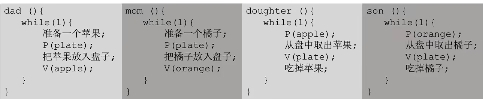
    ## 提问
    1. 能不能不用mutex来标识当前缓冲区访问状态？
    当缓冲区大小为1时可以（因为只要缓冲区有东西就会阻塞）
    1. 能不能先上锁后检查？
    不行，有可能死锁
  总结
    这里只说比较成熟的访问互斥算法
    单标志法和双标志法由于有较大缺陷不算在内
    ## peterson算法（不需要硬件支持原语）：
    先谦让后上锁
    缺点：每个进程都要检查其他进程的意愿，进程一多开销大
    ## 整型信号量机制（需要硬件支持原语）
    用整型表示资源数量，资源不足循环检查是否被释放
    P操作：
    **检查锁状态，被锁了→循环等待；没被锁→上锁（资源数-1）**
    V操作：
    **解锁（资源数+1）**

    缺点：对于单核处理器循环检查没有意义，因为单个时间片内只能运行一个进程，所以缺少的资源不可能在该时间片内被释放（忙等待）
    ## 记录型信号量（需要硬件支持原语）
    用结构体表示多个信号量，如果缺少资源则主动阻塞并放入等待队列
    **P操作（原语）：**
    **检查锁状态，被锁了→把进程地址放进等待队列并执行陷入指令（阻塞）；没被锁→上锁（资源数-1）**
    **v操作（原语）：**
    **解锁（资源数+1）然后执行唤醒指令唤醒等待队列中的进程**

    优点：不会忙等待（需要定义等待队列才行）
    缺点：有可能造成死锁
    ## PS：
    Q：别问我为什么整形信号量不这么干？
    A：整形信号量只有一个信号量，这个信号量已经用来存储资源状态了，没地方放那个等待队列
  2.3.5读者-写者问题
    读者-写者问题有几个要求：
    1. 可以同时读
    1. 不能同时写
    1. 写时不许读
    1. 写前其他进程退出读写
    ## 读优先实现
    思想：
    用3个信号量来控制↓
    - rw：表示文件上锁状态
    - count：记录当前有几个进程在读（等全读完再解锁rw）
    - mutex：记录count上锁状态（避免并发改count）
    写进程：
    1. 写前用原语改写rw信号量，加锁文件
    1. 写文件
    1. 写完用原语改写rw信号量，解锁文件
    读进程：
    1. 读前先用原语改写mutex信号量，锁上count（避免并发改count）
    1. 判断count是否为0，为0则改写rw（上锁文件）
    1. count+1
    1. 改写mutex，解锁count
    1. 读文件
    1. 用原语改写mutex信号量，锁上count（避免并发改count）
    1. count-1
    1. 判断count是否为0，为0则为0则改写rw（解锁文件）
    1. 改写mutex，解锁count

    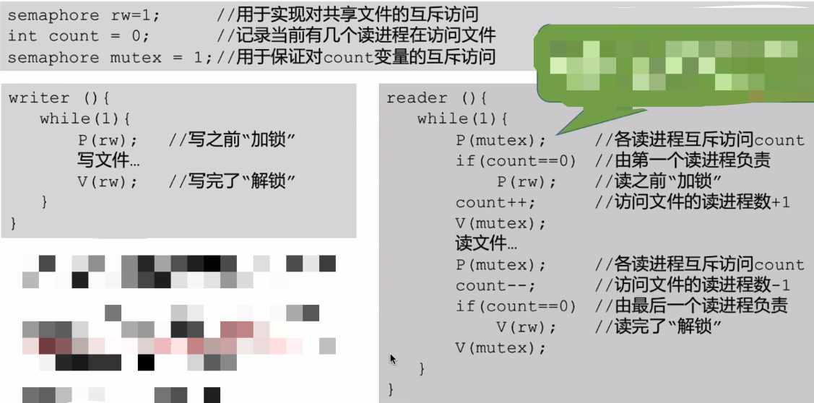

    ## 写优先实现
    读优先实现下如果没读完时间片耗尽，那么即便是切换到写进程也没办法写，因为文件没解锁，得等所有读进程读完才能写
    这样容易饿死写进程😢
    核心思想
    > 一旦有写者来了，后续新来的读者不允许再进入。
    需要加入一个信号量↓
    W：写预备标志，改变这个信号量，新来的读者会被直接阻塞（已有的不影响）
    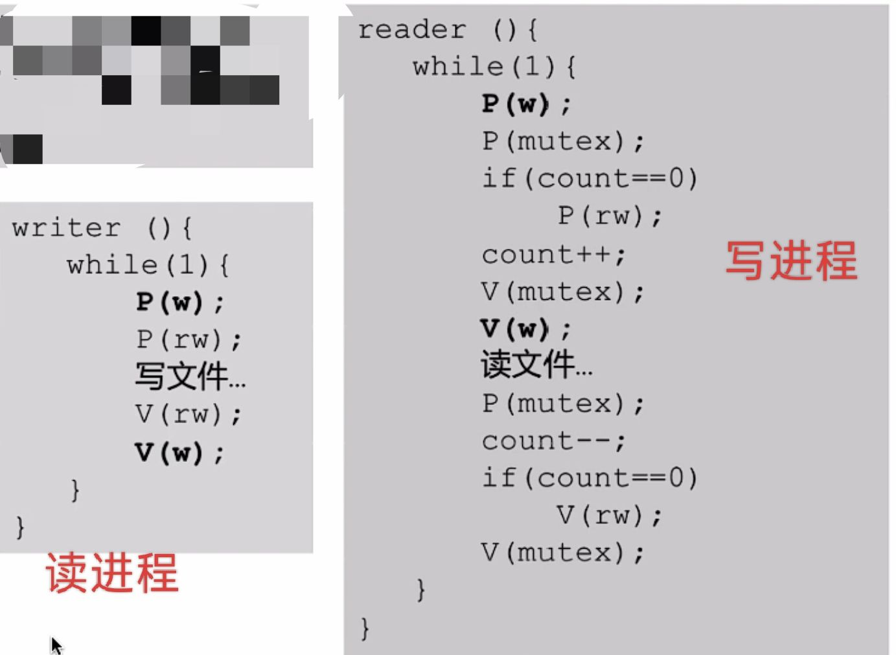
    PS：改写写预备标准不会立刻写，还得等文件rw解锁

    ## Q&A
    Q：为什么读也要加锁文件？读之间不是不互斥吗？
    A：这个锁是为了告诉写进程正在读，否则写进程不知道正在读

    Q：为什么需要count信号量？
    A：由于不能重复加锁，另一个并发的读进程会报错卡住，跳过锁直接读可能导致读一半锁开了，这时再写就会读到错误的东西

    Q：为什么需要mutex信号量？怎么不用原语把那几个步骤包住↓
    ```c
atomic {
    if(count==0)
        P(rw);
    count++;
}
    ```
    A：如果读进程没有得到锁那P（rw）就会阻塞，阻塞意味着进程下处理机，但原子操作不让下→直接卡死   所以不能这么干

    Q：锁真的锁住了吗？
    A：当然锁不住，这种锁不是硬件特性，只要我不检查锁状态，锁就跟我没关系😅（P操作内部会检查锁状态，详见 [总结](https://app.notion.com/p/36f5a2dd82768093ba34fe24f34084cd) 和 [2.3.4信号量机制](https://app.notion.com/p/36f5a2dd82768064b949fa863113b31c) ）

    Q：P/V操作阻塞会发生什么
    A：这个根据你使用的信号量机制来定↓
    使用整形信号量→阻塞会循环等待直到耗尽时间片
    使用记录型信号量→阻塞会直接切换进程，不过阻塞解除会被主动拉回来

    Q：mutex信号量解决了并发问题吗？没解决有啥用？
    A：不完全，在mutex被解锁前的并发依然会阻塞，不过它避免了同时访问并计算count造成“2个读进程count却为1的情况”（不管你这么写count++还是这么写count=count++）
  2.3.5哲学家进餐问题
    哲学家进餐问题主要讨论的是当一个进程需要多个资源时如何避免死锁
    规则：一个圆桌5个人，每人中间放一根筷子，一个人要拿起两根筷子才能吃饭，用什么规则调度？
    ## 三种方案
    1. 对人做限制，如最多允许4人同时进餐
    1. 要求奇数号的人先拿左边的筷子，偶数号的人先拿右边的筷子
    1. 所有人拿筷子需要互斥

    代码不写了，也没咋讲
  2.3.6管程
    ## 管程是什么
    管程是基于信号量机制开发的高级同步机制，致力于解决信号量机制复杂的PV操作和死锁问题
    **管程就是将一系列PV操作封装成函数，开发者不用再关心如何底层操作**
    ## 管程的定义和基本特征
    管程包含以下几个部分
    1. 共享数据
    1. 操作共享数据的函数
    1. 互斥机制：同一时刻只允许一个线程使用管程
    1. 条件变量
    管程的特性
    - **管程中的共享数据只能被管程的操作函数修改**
    - **同一时刻只允许一个线程使用管程**
  2.4.1死锁的概念
    ## 死锁，饥饿，死循环
    - 死锁：互相等待对方手里的资源，导致进程都被阻塞
    - 饥饿：资源分配不合理，某进程长期得不到资源
    - 死循环：程序一直循环无法跳出
    ## 死锁产生的必要条件
    - 互斥：资源需互斥访问
    - 不剥夺：资源没用完前不能被剥夺
    - 请求和保持：进程保有了至少一个资源，又请求新资源，还不释放已持有的资源
    - 循环等待条件：有循环等待链
    PS：出现单个条件不一定造成死锁，只有同时出现4个才会死锁
  2.4.2预防死锁
    ## 破坏互斥条件
    可以让资源不互斥访问，用另外的手段保证不发生冲突
    如：SPOOLing技术
    ## 破坏不剥夺条件
    方案1：当进程的新资源请求无法满足时，则释放其拥有的其他资源
    缺点：进程申请的资源越多越容易饥饿

    方案2：操作系统强制剥夺低优先级进程的资源给高优先级进程
    缺点：可能导致被剥夺资源的进程运行进度回滚

    ## 破坏请求和保持条件
    采用静态分配：进程运行前一次性申请完所以资源，如果无法满足则不让运行
    缺点：进程申请的资源越多越容易饥饿

    ## 破坏循环等待条件
    顺序资源分配法：将资源排号，要求按编号递增的顺序请求资源（持有小编号才能申请大编号），一次申请完
    缺点：
    增加设备还得重新分配编号
    用户编程麻烦
  2.4.3避免死锁
    ## 什么是安全序列
    银行借钱顺序问题：3个企业已经欠你一些钱，现在3个企业同时借钱（不限时间），要求必须满足各企业最大需求（固定值）才能要回钱（立刻），按什么顺序借最安全？
    
    ## 与死锁的关系
    安全序列：系统按照这种顺序分配资源，一定不会死锁
    不安全状态：分配资源后，系统找不到一个安全序列，那就进入了不安全状态，但进入不安全状态不一定会死锁
    # 银行家算法
    上面说的就是银行家算法
    思想：
    将各种资源的总数、进程需要各种资源的最大需求、进程已分配的各种资源用多维的向量表示
    用进程需要各种资源的最大需求-进程已分配的各种资源=最多还需要资源（向量）
    如果，剩余可用资源数>最多还需要资源 则将该进程加入安全队列
    
    ## 代码实现
    假设系统有n个进程m种资源
    各进程运行前先声明对各资源的最大需求数
    **初始化↓**
    最大需求矩阵（max矩阵）：定义一个n*m的二维数组存储所有进程的最大需求
    分配情况矩阵（allocation矩阵）：定义一个n*m的二维数组存储所有进程的资源分配情况
    最多所需资源矩阵（need矩阵）：定义一个n*m的二维数组存储最多所需资源矩阵
    Need矩阵=Max矩阵-Allocation矩阵
    当前可用资源（Available数组）：定义一个m长度的一维数组来存放当前系统可用资源
    请求资源（Request数组）：定义一个m长度的一维数组来存放本次申请的各种资源
    **主要分配逻辑↓**
    1. 判断申请是否超出最大需求值：
    `Request[j]≤Need[i，j]`成立则下一步，否则报错
    1. 判断是否有足够资源：
    `Request[j]≤Available[j]`成立则下一步，否则让进程等待
    1. 试探性分配：
    `Available=Available-Request`
    `Allocation[i,j]=Allocation[i,j]+Request[j]`
    `Need[i，j]=Need[i，j]-Request[j]`
    1. 运行安全性算法，若安全→正式分配；不安全→恢复相应数据，阻塞等待
    安全性算法：检查当前可用资源是否能满足某个进程的最大需求
  2.4.4死锁检测和解除
    # 死锁检测
    1. 在资源分配图中， 找出既不阻塞又不是孤点的进程Pi（即找出一条有向边与它相连,且该有向边对应资源的申请数量小于等于系统中已有空闲资源数量。 如下图中， R1没有空闲资源，R2有一个空闲资源。若所有的连接该进程的边均满足上述条件， 则这个进程能继续运行直至完成，然后释放它所占有的所有资源） 。消去它所有的请求边和分配变，使之称为孤立的结点。在下图中，P1是满足这一条件的进程结点，于是将P1的所有边消去。
    1. 进程Pi所释放的资源，可以唤醒某些因等待这些资源而阻塞的进程，原来的阻塞进程可能变为非阻塞进程。在下图中， P2就满足这样的条件。根据1 中的方法进行一系列简化后，若能消去途中所有的边，则称该图是可完全简化的。
    人话：依次消除与不阻塞进程相连的边，直到无边可消（能办到说明不死锁）

    死锁定理：如果某时刻资源分配图不可完全简化，则系统死锁
    # 死锁解除
    ## 资源剥夺法
    暂时挂起某些死锁进程，并抢占他们的资源，分配给其他进程
    ## 撤销进程法
    强制撤销一些或全部死锁进程，代价大，进程需要重新运行
    ## 进程回退法
    系统给进程设置还原点，死锁时回退某些进程
    可以按照以下参考还原/关闭谁
    - 进程优先级
    - 已执行时间
    - 剩余执行时间
    - 交互/批处理
[第三章](第三章/index.md)
  3.1.1内存基础知识
    # 指令的原理
    开发者在写完代码后会编译，编译会将代码翻译为一条条的指令，指令有3部分：
    ```c
操作码，内存地址1，内存地址2
    ```
    - 机器识别操作码知道该做什么操作
    - 识别内存地址知道在哪里操作
    # 逻辑地址/物理地址
    程序在编译后形成的可执行文件叫装入模块
    - 装入模块中的指令使用的是相对地址而不是绝对地址
    具体如何对应物理地址则是装入方式决定的
    # 三种装入方式
    ### 绝对装入
    编译后直接就是绝对地址，直接把内容写到绝对地址上
    特点：直接操作地址，移植性差，不安全
    ### 静态重定位
    编译后是相对地址，在装入内存时进行重定位（转换成物理地址）
    特点：需要连续的内存，装入后无法移动，也不能在运行中申请
    ### 动态重定位（现代操作系统）
    编译后是相对地址，装入内存时不立即转换成物理地址，执行时才转换成物理地址
    # 链接的三种方式
    一个程序写完后需要经历编译→链接的过程，这里讨论的就是链接的方式
    ### 静态链接
    编译完了就链接，不再拆开
    ### 装入时动态链接
    在装入内存时才链接
    ### 运行时动态链接
    在运行时才链接
  3.1.1进程的内存映像
    # 内存映像
    可能考法：给个代码问哪一句放在哪个地方
    
    # 内存保护
    内存保护会给进程设置可访问的内存区间，不能超区间访问，避免破坏其他进程，或窃取数据
  3.1.1覆盖与交换
    # 覆盖技术
    早期计算机内存小，会将程序分为多个段，常用的段常驻内存，不常用的需要在调入内存
    内存分一个固定区和若干覆盖区

    # 交换技术
    在系统内存不足时将内存中部分进程换出外存，时机合适再换回
    - 换出外存的状态叫挂起态
    - 挂起还可以分为就绪挂起，阻塞挂起
    - 被挂起的进程放在外存对换区中（连续分配，速度快）
    - 普通文件放在文件区（随机分配，速度慢）
    - PCB常驻内存，不会被换出外存
  3.1.2内存分配-连续分配
    # 单一连续分配
    将内存分为系统区和用户区两个部分
    - 用户区只能有一个用户程序，该进程独占用户区
    优点：简单，不用考虑内存保护，无外部碎片
    缺点：内存利用率低，一次只能运行一个进程，有内部碎片（分配的内存有大片未利用）
    # 固定分区大小
    将内存分为系统区和若干大小相等的用户区
    或
    将内存分为系统区和若干大小不等的用户区
    - 每个分区可以装入一个进程
    - 操作系统会维护一个分区说明表，用来记录各分区大小，起始地址，分配状态等
    优点：实现简单，无外部碎片
    缺点：无法满足超大进程（各分区都放不下），会产生内部碎片，利用率低
    # 动态分区分配
    系统不提前分区，在进程装入内存时才根据大小建立分区，且分区大小可变
    - 系统`维护空闲分区`表或`空闲分区链`来记录分区情况
    - 使用`动态分区分配算法`决定分区如何分配

    # 名词解释
    内部碎片：分配给进程的内存存在部分未被利用
    外部碎片：内存产生了一些难以利用的空闲区域
    PS：可以通过紧凑技术解决外部碎片（移动其他进程内存）
  3.1.2动态分区分配算法
    动态分区分配算法解决内存怎么分，分那个块的问题
    # 首次适应算法
    思想：从低地址查找，找到第一个能满足大小的分区
    实现：系统维护一个空闲分区表或空闲分区链来确定怎么分（按地址顺序排列）
    优点：不用重排链表
    缺点：每次都从空闲分区表/链头遍历，开销大
    # 最佳适应算法
    思想：优先分配小空间
    实现：系统维护一个空闲分区表或空闲分区链来确定怎么分（不过这个表/链是按从小到大的顺序排列）
    缺点：有太多外部碎片
    # 最坏适应算法
    思想：优先分配大空间
    实现：系统维护一个空闲分区表或空闲分区链来确定怎么分（不过这个表/链是按从大到小的顺序排列）
    缺点：大进程容易得不到内存
    # 临近适应算法
    思想：改进首次适应算法，改从上次查找结束时的位置开始查找，找到首个适应的大小
    实现：系统维护一个空闲分区表/链（按地址顺序排列），从上次查找的地方继续
    优点：不用重排链表，解决了首次适应算法的问题
    缺点：大内存进程容易没内存
  3.1.3分页内存管理
    # 什么是分页存储
    分页存储是一种内存管理方式，它可以较好的利用虚拟内存并解决外部碎片的问题
    原理：
    系统将内存分成固定大小的“页”，将程序也切分为和页大小一样的若干份，并将它们装入页中
    - 操作系统将内存分为多个大小相同的分区，每个分区就是一个页框
    - 每个页框有一个编号，页框号从0开始
    - 将一个进程分成多个和页框大小一样的块，并放入页框
    - 操作系统为每个进程维护一个页表

    # 术语：
    页框=页帧=内存块=物理块=物理页面
    页表长度：页表中页表项（Page Table Entry，PTE）的数量，也就是该进程拥有的页数。
    # 重要数据结构—页表
    系统为每个进程维护一个页表，用于记录页面在内存中的位置（映射页号和块号）
    - 页表记录的是块号，不是内存地址
    - 页表类似于顺序表，不用专门记录页号
    - 页表在内存中是连续存储的
    # 地址转换
    1. 页号=逻辑地址/页面长度（取整）
    （逻辑地址都是从0开始的）
    1. 页内偏移量=逻辑地址%页面长度（取余）
    1. 查询页表，可知道页框号
    1. 页起始地址=页框号×页面大小
    1. 实际物理地址=页起始地址+页面偏移量
    # 分页的优点
    1. 没有外部碎片：
    程序页面可以分散存放，不需要连续空间，因此几乎没有外部碎片。
    1. 支持虚拟内存：
    程序看到的是连续的大地址空间（这对程序是透明的）
  3.1.3分页内存管理的软硬件
    本节讲的是如何通过硬件实现地址变换
    # 页表寄存器
    页表寄存器用来存放
    - 页表起始地址
    - 页表长度
    # 地址变换过程
    （跟上节的过程一样，多了个检查页号合法性）
    1. CPU给出逻辑地址
    1. 算出页号
    页号=逻辑地址/页面长度
    1. 检查页号是否合法
    检查页表寄存器，如果页号≥页表长度，则触发越界中断
    1. 计算页内偏移量
    页内偏移量=逻辑地址%页面长度
    1. 检查页表，找到块号
    1. 计算物理地址
    物理地址=块号x页面长度+页内偏移量
  3.1.3快表加速的分页内存管理
    # 什么是快表
    快表是CPU中用于加速地址查找的高速缓存
    传统内存分页管理需要先查存储在内存中的页表才能知道某个程序在内存中的位置
    通过查快表可以省去CPU查询页表的过程
    # 地址变换过程
    比上节多了一个查快表的过程，如果快表命中，就不用查页表
    不再赘述
  3.1.3两级页表
    # 单级页表的问题
    - 页表要连续存放，大内存进程光页表就会占很多内存
    - 统计发现，现实只会频繁的使用页表的一少部分，页表的绝大多部分未被使用
    # 两级页表的思路
    把原来的大页表再分页
    每个二级页表只管理一部分页面。
没有用到的二级页表根本不创建。
因此节省大量内存。
    ## PS
    这个太恶心，跳了
  3.1.4分段内存管理
    # 什么是分段内存管理
    与分页内存管理不同，分段不是死板的将内存分为几个固定的区域，而是按逻辑功能分为几个“段”
    如：
    代码段（程序指令）
数据段（全局变量）
堆（动态分配内存）
栈（函数调用和局部变量）
    # 分段地址结构
    分段内存管理的逻辑地址与一般的不同，它是这种格式
    ```plain text
逻辑地址 = <段号, 段内偏移量>
    ```
    # 地址转换过程
    操作系统维护一张段表
    表包含：段基址（段起始地址），段长度
    地址转换↓
    ```plain text
逻辑地址→检查是否越界→计算物理地址
物理地址=段基址+段内偏移量
    ```
    # PS
    - 分页对用户是透明的，分段对用户不透明
    - 分段可以更好的保护信息和进程安全
    - 分段更容易实现共享
  3.1.5段页式内存管理
    段页式内存管理结合了分段和分页的优点
    核心思想：
    > 先按程序逻辑分段，再把每个段划分成固定大小的页。
    # 段页式内存管理逻辑地址结构
    ```plain text
<段号, 页号, 页内偏移>
    ```
    # 地址转换过程
    第一步：查段表
    第二步：查页表
    第三步：形成物理地址
  3.2.1虚拟内存
    # 传统内存管理算法缺点
    - 碎片问题（内部碎片和外部碎片）
    - 内存利用率不足，无法支持比物理内存更大的程序运行
    - 内存中存在大量使用率低的数据
    # 局部性原理
    时间局部性
    如果一个数据被访问过，那么在不久的将来很可能再次被访问。
    空间局部性
    如果访问了某个存储单元，那么其附近的存储单元很可能很快被访问
    # 虚拟内存特性
    多次性（离散性）
    一个程序不必一次全部装入内存，可以分批装入
    对换性（交换性）
    当内存空间不足时，将暂时不用的页面换出到磁盘，需要时再换入内存
    虚拟性
    逻辑上扩充了内存容量，对用户透明
    # 虚拟内存的实现方式
    主要有三种：
请求分页系统（基于分页内存管理）
请求分段系统（基于分段内存管理）
请求段页式系统（基于段页式内存管理）
    PS
    相对于传统的离散内存管理，虚拟内存技术多了两个功能：
    - 请求调页/段（缺页/段时）
    - 页面/段置换（内存不足时）
    虚拟内存基于分页内存管理，实现了内存扩展
  3.2.2请求分页内存管理
    # 页表机制
    普通页表中: 
    | 页号 | 块号 |
    | --- | --- |
    | 1 | 5 |
    | 2 | 3 |
    请求分页中增加状态位: 
    | 页号 | 块号 | 状态位 |
    | --- | --- | --- |
    | 1 | 5 | 0 |
    | 2 | 3 | 1 |
    其中状态位：
    0→不在内存中（缺页）
    1→在内存中
    # 缺页中断机制
    当发生缺页时，
    有空闲内存→直接调入
    无空闲内存→使用页面置换机制淘汰一个页面
    PS：
    缺页属于内中断的中的故障中断
    ```mermaid
flowchart TD
    A[中断] --> B[外中断]
    A --> C[内中断]

    B --> D[可屏蔽中断]
    B --> E[不可屏蔽中断]

    C --> F[故障 Fault]
    C --> G[陷阱 Trap]
    C --> H[终止 Abort]

    D --> I[I/O设备请求]
    E --> J[硬件故障报警]

    F --> K[缺页异常]
    F --> L[除零异常]

    G --> M[断点调试]
    G --> N[系统调用]

    H --> O[严重硬件错误]
    ```
  3.2.4页面置换算法
    # opt最佳置换算法
    淘汰未来最长时间内不会再被访问的页面
    优点：缺页率最低
    缺点：实现不了（在实际中不可能知道未来要访问哪些页面）
    # FIFO先进先出置换算法
    淘汰最早进入内存的页面
    优点：实现简单
    缺点：可能频繁淘汰高频使用的页，造成严重缺页（Belady异常）
    # LRU最近最久未使用置换算法
    淘汰当前内存中最长时间未被使用的页
    实现：在页表中新增一个访问字段，用来记录该页上次使用时间
    优点：缺页率低
    缺点：实现较复杂，开销大
    # clock时钟置换算法
    ### 简单时钟置换算法
    给页表中加一个访问位，用来记录最近是否被访问，用一个指针循环扫描各页的访问位并将其翻转，规则
    - 扫描到0且缺页时则将该页换出
    - 扫描到1则不换出
    ### 改进型时钟置换算法
    基于简单时钟置换算法改进
    其在页表中新增了一个修改位，记录页是否被修改，1→修改过；0→未修改，
    依旧用一个指针循环扫描各页的访问位并将其翻转，规则（访问位，修改位）
    - 扫描到（1，1）不会淘汰
    - 扫描到（0，0）直接淘汰
    - 扫描到（0，1）备选淘汰（没有（0，0）的情况）
    - （1，0）不用说了，扫描完就翻转成（0，0）了
    PS：
    **改进关键：算法淘汰（0.，0）的块是直接丢弃，不是写回外存（因为没改），降低了IO频率**
    什么？你问我全是（1，1）怎么办，下一轮就都变（0，1）了，哪还有（1，1）🤓
  3.2.5页面分配策略
    # 页面分配策略
      驻留集：系统给某进程分配的真实内存大小，被换出外存的部分不算
      - 驻留集太小会频繁缺页
      - 太大浪费空间
      驻留集分配策略：
      - 固定分配：分配固定大小，不再改变
      - 可变分配：运行期间可动态增减
    # 页面置换策略
      - 局部置换：缺页且内存不足时，只置换进程自己的块
      - 全局置换：缺页且内存不足时，在全局范围置换
      PS：
      1. 页面分配策略为固定分配时，无法使用全局置换
      1. 可变分配+全局置换并非最好，会导致其他进程缺页率增加，从而来回争抢，增加开销
    # 调入页面策略
      ### 预调页策略：
      根据局部性原理预测需要调入页面，在进程运行前提前调入
      ### 请求调入策略：
      运行时缺页再发出调入请求
    # 调入页面路径
      系统将磁盘分为对换区和文件区两部分
      对换区：连续存储（读写快）
      文件区：随机存储（读写慢）
      ### 对换区充足时
      - 所有的调入调出都在对换区进行
      ### 对换区不足时
      - 不需要修改的数据从文件区调入（不用写回）
      - 需要修改的数据从对换区调入

      ### UNIX方式
      - 某文件首次使用（对换区没有），直接从文件区调入
      - 调出时放到对换区，而不是文件区
    # 抖动（颠簸）现象
    刚调出的块立马又要调入就是抖动现象
    原因：分配给进程的物理块不够
    工作集：某段时间内进程访问了几个页面
    通过统计工作集来决定驻留集大小
  3.2.7内存映射文件
    # 作用1：简化开发
    内存映射文件把文件内容直接映射到进程虚拟地址空间中，开发者不需要再显式调用 read()、write() 进行数据拷贝
    # 作用2：数据共享
    多个进程可以映射同一个文件实现文件共享
    传统做法：拷贝源文件到进程的内存中→修改→拷回去
    问题：a进程改了，b不能实时看到
    用进程映射文件就可以解决
    # PS
    使用内存映射文件后系统并不会立刻将对应文件拷到进程内存中，而是等运行到缺页时才会拷贝
    文件完全由操作系统负责，系统可以进一步优化io效率
第四章
  4.1.1文件管理
    # 文件属性
    - 文件名
    - 标识符：系统给文件的唯一标识
    - 文件类型
    - 文件位置：包括路径和地址
    - 大小
    - 保护信息
    # 文件逻辑结构
    - 有结构文件：有一定结构如mp4
    - 无结构文件：二进制或字符流
    # 文件系统对上层提供什么功能
    - 创建文件
    - 读文件
    - 写文件
    - 删除文件
    - 打开文件
    - 关闭文件
    # 文件如何存储
    - 与内存相似，外存也被分为一个个块
    - 每块包含2的整数幂个地址
    - 同样的，文件系统也分逻辑逻辑地址和物理地址（块内地址），一样需要地址转换
    - 文件系统以块为单位进行操作（防止元数据过大）
    # 其他文件管理功能
    - 文件保护
    - 文件共享
  4.1.2文件逻辑结构
    # 分类
      ## 无结构文件
      内部就是字符流/二进制
      ## 有结构文件
      - 由一系列记录组成
      - 每条记录包含若干数据项
      - 每条记录有一个数据项作为关键字
      - 根据记录长度是否可变分为：定长记录，可变长记录
    # 有结构文件的逻辑结构
    ### 顺序文件
    文件中的记录顺序排列（逻辑上），记录可以是定长或变长，各记录在物理上可以顺序存储也可以链式存储
    

    - 串结构：按时间先后存储
    - 顺序结构：按记录的关键字顺序排列
    ### 索引文件
    逻辑：
    ```plain text
FCB→硬盘索引块→硬盘数据块
    ```
    想要获取顺序文件中的某个内容就得遍历前面的内容，非常低效
    因此我们以数据某种特征建立一张索引表，在查找时只需要遍历索引表即可
    通过索引表查找的文件叫索引文件
    ### 索引顺序文件
    不再是给一个记录做一个索引表，而是类似数据库，将所有记录放到一张表里
    ### 多级索引顺序文件
    逻辑：
    

    索引顺序文件的查询效率依旧不高，因此发明了多级索引文件
    通过分级查找来提高性能
  4.1.3文件目录
    # 文件控制块FCB
      和进程PCB类似，每个文件都都有自己的FCB
      FCB中的内容：
      - 文件的基本信息（文件名，物理地址，逻辑结构等）
      - 存取控制信息（读写权限，所属用户）
      - 使用信息（创建时间，修改时间）
    # 文件目录
      > 这东西就是FCB快查表（仅供理解） 🤓👆
      - 文件目录是对应文件夹FCB的集合（逻辑上）
      - 文件目录也是一个真实文件（只不过是隐藏的）
      - 实际上文件目录里只有文件名+索引号（为了提高性能）
      - 每个文件夹对应一个文件目录
    # 索引节点inode
      为了减小文件索引大小，提高查找效率，系统将除了文件名以外的所有信息都放到索引节点中
      > 这东西就是文件目录DLC🤓👆
      - 每个文件对应一个索引节点
      - 目录项中只包含文件名和索引指针
      - 索引节点也是一个真实的文件
    # 目录结构
      ### 单级目录结构
      单级目录就是只有文件系统只有一级，因此不能重名
      ### 两级目录结构
      将不同用户分为不同的目录，各用户目录下采用单级目录结构
      - 两级目录实现了访问限制
      - 允许不同用户拥有重名文件
      ### 多级目录结构
      又叫数形目录结构
      就是将单级目录层层套娃
      优点：
      - 可以对文件进行分类
      - 可以使用相对路径
      - 不同路径下可以重名
      缺点：
      - 不便于文件共享
      ### 无环图目录结构
      在多级目录基础上，允许不同文件名指向同一个文件
      删除：删除时并非直接删除文件，而是删除该处的FCB，并使共享文件的共享计数器-1（直到为0，才会被删除）
  4.1.4文件的物理结构
    与内存管理相同，外存管理也将外存分为了大小相同的块
    # 连续分配
      将文件放在连续的物理块上
      实现：
      在FCB中记录起始起始块号，物理块号=起始块号+逻辑块号
      优点：
      - 连续分配**支持随机访问**和顺序访问
      （由于起始块号可以直接查到，因此可以直接计算物理块号）
      - 由于在磁盘上连续，因此读写最快
      缺点：
      - 拓展不便（磁盘不一定有连续的块）
      - 无法利用磁盘碎片（磁盘不一定有足够大小的连续的块）
    # 链接分配
      ### 隐式链接
      文件不存放在连续的块上
      实现：
      在FCB中记录起始块（物理）和结束块（物理），每个块末尾有下一个块的指针
      优点：
      - 不会有碎片问题（外部碎片）
      缺点：
      - 不支持随机访问
      - 每个块包含下一个块的指针，占用一定空间
      ### 显式链接
      文件不存放在连续的块上
      实现：
      在FCB中只需记录一个文件的起始块号，另外使用一张表记录物理块顺序链（FAT表）
      - 一个磁盘对应一个FAT表
      - FAT表开机即被放入内存并常驻内存

      优点：
      - 没有碎片问题（外部碎片）
      - 支持随机访问
      - 访问速度快
      缺点：
      - FAT表需要占用一定空间
      - 所有文件共用一个FAT表，查询较慢
    # 索引分配
    文件不存放在连续的块上
    实现：
    系统会为每个文件建立一张索引表（记录逻辑块与物理块的对应关系），FCB中需要记录索引块的地址
    - 索引表存放的块叫索引块
    - 文件数据存放的块叫数据块
    优点：
    - 方便拓展
    - 支持随机访问
    缺点：
    - 索引块要占用空间
    ### 索引表过大（超过一个块）解决方案
    1. 链接方案：分配多个索引块，并链接起来，FCB中只需记录第一个索引块
    缺点：若要查后面的索引块，则需要遍历前面所有，效率低

    1. 多层索引：每层对应一段逻辑地址区间，直到最后一层
    缺点：对小文件来说反而降低了性能

    1. 混合索引：文件的顶级索引表即包含直接索引，也包含多层索引

    # 重点：
    - 根据索引计算文件最大支持大小
    - 分析访问某数据需io次数（将FCB读入内存那次不算）
  4.1.6存储空间管理
    # 存储空间划分和初始化
    ### 存储空间划分：
    - 将物理磁盘划分为逻辑卷（逻辑盘，文件卷）
    - 有的系统支持将多个物理磁盘划分成一个卷（RAID阵列）
    ### 存储空间初始化：
    - 将文件卷（逻辑卷）再分为目录区和文件区两部分
    - 文件区存放：文件数据
    - 目录区存放：FCB，磁盘管理信息
    # 存储空间管理
    ### 空闲表法
    维护一张空闲表，它记录空闲块起始块号和连续块数
    分配算法：
    首次适应，最佳适应，最坏适应
    回收策略：
    当两个空闲区连续时，要合并
    ### 空闲链表法
    1. 空闲盘块链：将空闲的盘块组成链表
    操作系统保存链头，链尾指针
    分配：从链头取出
    回收：从链尾放入

    1. 空闲盘区链：将空闲的盘区组成链表（盘区：记录第一个盘块，盘区长度，下一盘区指针）
    操作系统保存链头，链尾指针
    分配：使用首次适应，最佳适应，最坏适应算法找到空闲盘区，找不到就分配多个空闲盘区
    回收：如果与空闲盘区相邻，则合并，不相邻，则挂到链尾
    ### 位示图法
    将所有块的使用状态用0/1表示
    通常把位示图按行存放
    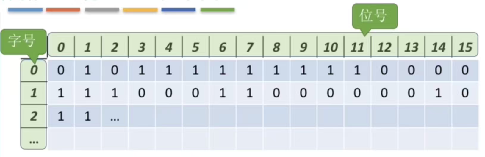
    设：
每行有 n 位
第 i 行第 j 列
则对应的盘块号：
    $$
b=i×n+j
$$
    反过来由盘块推行（位号）列（字号）
    字号：i=b/n（取整）
    位号：j=b%n

    **分配：**
    顺序扫描位示图，找0，并算出盘块号，分配，改为1
    **回收：**
    顺序扫描位示图，找1，并算出行列，回收，改为0
    ### 成组链接法
    对于大型系统，空闲表（链表）可能会过大，因此不适用
    在文件卷的目录区中专门用一个磁盘块作为超级块，系统启动时读入内存
    > 把大量空闲块分成若干组，每组记录下一批空闲盘块号（在栈底那个块）；内存中只保存当前正在使用的一组（超级块），像栈一样进行分配和回收
  4.1.7文件基本操作
    # 创建文件
    Create系统调用参数：
    - 大小
    - 路径
    - 文件名
    步骤
    ```plain text
用户请求创建文件
      ↓
检查目录中是否重名
      ↓
申请FCB(inode)
      ↓
在目录中建立目录项
      ↓
必要时申请数据块
      ↓
写回磁盘
    ```
    # 删除文件
    Delate系统调用参数：
    - 路径
    - 文件名
    步骤
    ```plain text
找到目录项
      ↓
找到FCB(inode)
      ↓
删除目录项
      ↓
检查打开计数
      ↓
回收数据块
      ↓
回收FCB
    ```
    # 打开文件
    open系统调用参数：
    - 路径
    - 文件名
    - 操作类型（读/写）
    步骤
    ```plain text
open()
   ↓
查目录
   ↓
找到FCB(inode)
   ↓
检查权限
   ↓
将FCB调入内存
   ↓
建立系统打开文件表
   ↓
建立进程打开文件表
   ↓
返回fd（文件标识符）

    ```
    **打开文件表**：
    文件打开后系统和进程都会维护一个打开文件表，用来加速文件读写
    **系统打开文件表：（整个系统共享**）
    记录↓
    - 文件本身信息
    - 打开次数（为0则销毁该条目）
    **进程打开文件表：**
    记录↓
    - 文件名
    - 读写指针
    - 指向系统打开文件表
  4.1.8文件共享
    # 基于索引结点（硬链接）
    原理：文件目录中路径直接指向源文件索引节点
    索引节点：是文件目录瘦身策略。由于检索文件时只需用到文件名,因此可以将了文件名之外的其他信息放到索引结点中。这样目录项就只需要包含文件名、索引结点指针。

    - 索引结点中设置一个链接计数count,表示链接的目录数
    - 删除文件只删除该路径的条目，并将count计数-1，不删原文件
    - count计数=0时删除原文件
    # 基于符号链接（软链接）
    原理：在当前目录创建link类型文件，该文件中记录原文件路径
    特性：
    - 原文件删除，软链接（link文件）失效
  4.1.9文件保护
    # 口令保护
    在FCP中保存一段口令（字符串），访问时会与用户提供的口令对比，一致则通过验证
    优点：口令保存和验证开销较小
    缺点：口令明文存储，不安全
    # 加密保护
    使用密码加密文件，访问时要求提供密码
    优点：安全性高
    缺点：加密解密有一定开销
    # 访问控制
    在FCB中添加访问控制表，该表记录了各用户的权限，访问时验证权限
    精简访问控制表：只记录用户组的权限
    优点：比较灵活，精细
  4.3.1文件系统的层次结构
    
    ```javascript
用户→用户接口→文件目录系统→
存取控制模块→逻辑文件系统与文件信息缓冲区→
物理文件系统→辅助分配模块/设备管理模块→
设备
    ```
  4.3.2文件系统布局
    # 在外存中的结构
      如图↓
      
      全新磁盘的初始化过程↓
      ### 1. 低级格式化（物理格式化）
      - 划分扇区
      - 检查各扇区好坏
      - 屏蔽坏扇区，并用备用扇区替换
      ### 2. 高级格式化（逻辑格式化）
      - 分区（分卷/分盘符）
      - 将分区信息记录到一个特殊的分区：主引导记录中（包含引导程序和分区表）
      - 初始化各分区：写引导块，超级块，空闲空间管理，i结点区（顺序存放索引节点），根目录
    # 在内存中结构
    如图↓
    
    工作流程↓
    1. 将目录从外存读入内存作为缓存（首次打开）
    1. 找到索引节点并查找文件FCB，复制到系统打开文件表，等待进程调用
    1. 进程在“进程打开文件表”中新建一个条目，并返回文件描述符（指向“进程打开文件表”的指针）
    PS：“进程打开文件表”是指向系统打开文件表的
  4.3.4虚拟文件系统
    # 普通文件系统的问题
    

    计算机上可能会拓展一些外部存储设备（如：U盘，移动硬盘），它们可能使用了不同的文件系统，由于不同的文件系统的调用函数不同，所以它们无法直接兼容

    虚拟文件系统则解决了这个问题
    # 虚拟文件系统
    虚拟文件系统下可以挂各种文件系统，并对外提供统一的接口，来实现对各文件系统的兼容
    
    - 底层的文件系统需要实现虚拟文件系统指定的函数才能被虚拟文件系统兼容
    - 虚拟文件系统会把各种文件系统不同的数据结构（inode）统一成一种格式（vnode），呈现给上层
    - vnode只存在于主存中，inode既会被调入主存，也会在外存中存储
    - 每一个被打开的文件都有一个vnode
    - vnode中有一个函数功能指针：用于指向对应文件系统的函数功能
    # 文件系统挂载
    将文件系统挂载到操作系统过程↓
    1. 在虚拟文件系统的“挂载表”中注册新挂载的文件系统
    1. 新挂载的文件系统向虚拟文件系统提供一个函数地址列表
    1. 将新文件系统挂载到挂载点
    PS：
    - “挂载表”位于内存中，记录文件系统类型，容量大小，相关信息
    - “函数地址列表”用于记录文件系统有哪些可调用函数
    - 挂载点：挂载的目录
[第五章](第五章/index.md)

  5.1.1 I/O设备的分类
    # 按使用特性分
    人机交互设备
    存储设备
    网络通信设备
    # 按传输速率分
    高速设备
    中速设备
    低速设备
    # 按信息交换单位分
    块设备（传输块，可寻址）
    字符设备（传输慢，不可寻址，采用中断驱动）
  5.1.2 I/O控制器
    CPU无法直接控制I/O设备，而是靠控制I/O控制器来间接控制设备
    I/O控制器是I/O设备的MCU
    # I/O控制器功能
    - 接收并识别CPU命令
    - 向CPU报告设备状态
    - 数据交换
    - 地址识别
    PS：I/O控制器就是个MCU，CPU是它上位机
    # I/O设备的组成
    - I/O逻辑
    - CPU接口
    - 设备接口
    
    PS：
    一个控制器可能对应多个设备
    内存映像I/O：控制器没有寄存器，要借用内存地址存放控制信息，和内存地址统一（不用专用指令）
    寄存器独立编址：控制器有寄存器，不用借内存，地址不和内存统一（需要专用指令）
  5.1.3 I/O控制方式
    # 程序直接控制
    **由CPU直接发出指令控制，io期间CPU轮询等待，数据经CPU中转**

    数据流向：
    ```javascript
读：I/O设备→CPU→内存
写：内存→CPU→I/O设备
    ```
    传输单位：
    每次读写一个字长的数据（字长与ALU位宽，通用寄存器宽度）
    CPU参与频率：
    高，等待I/O时，CPU会不断轮询忙等待，开始结束都需要CPU发送指令

    优点：逻辑简单
    缺点：CPU忙等待，浪费资源
    # 中断驱动方式
    **由CPU直接发出指令控制，io期间，CPU通过中断切换到其他任务，不会轮询等待，数据经CPU中转**

    数据流向：
    ```javascript
读：I/O设备→CPU→内存
写：内存→CPU→I/O设备
    ```
    数据传输单位：
    每次读写一个字长的数据
    CPU参与率：
    中等，开始结束需要发送指令，io时不用等待

    优点：
    CPU不用忙等，CPU利用率提高
    缺点：
    每次只能传输一个字长，太慢
    数据要经CPU中转，浪费CPU资源
    # DMA方式（直接存储器存取）
    按块存取，数据不经CPU中转，CPU只再开始结束给DMA控制器发送指令

    数据流向：
    ```plain text
读：I/O设备→内存
写：内存→I/O设备
    ```
    数据传输单位：
    一次读写一个/多个连续块
    CPU参与频率：
    低，仅开始结束发送命令

    优点：传输效率高，不用让CPU中转
    缺点：
    一次只能读取整个块
    读多个块时，多个块要连续
    ### DMA控制器：
    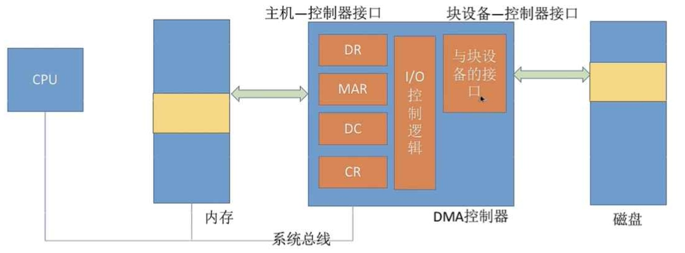

    DR：数据寄存器，暂存读写的数据
    MAR：内存地址寄存器，存放读写的内存地址
    DC：数据计数器，表示剩余要读/写字节数
    CR：命令/状态寄存器，存放CPU命令/设备状态
    # 通道控制方式
    CPU可以一次发出多个io命令，这些命令交给通道执行，通道会依次处理这些任务，完成后向CPU发送中断信号
    数据流向：
    ```plain text
读：io设备→内存
写：内存→io设备
    ```
    数据传输单位：
    一组块
    CPU参与率：
    极低，CPU发送批量任务，具体由通道完成
  5.1.1 I/O软件层次
    # 总览
    
    # 用户层软件
    向上：提供库函数（io操作接口）
    向下：调用系统调用
    # 设备独立性软件
    向上：提供系统调用
    向下：调用驱动程序
    功能：
    - 设备保护
    - 差错处理
    - 设备分配/回收
    - 数据缓冲区管理
    - 建立逻辑设备名到物理设备名的映射关系（用逻辑设备表“LUT表”）
    PS：逻辑设备表
    可以只设一张：单用户操作系统
    也可以给每个用户设一张：多用户操作系统
    # 设备驱动程序
    由设备生产厂家提供
    用于屏蔽硬件差异
    # 中断处理程序
    再中断后决定如何处理，调用谁
  5.2.1 I/O核心子系统
    - 设备独立性软件
    - 设备驱动程序
    - 中断处理程序
    三者共同构成了 I/O核心子系统
    # 设备独立性软件层
    这层有两个功能
    - io调度：用某种算法确定io顺序
    - 设备保护：控制不同用户对设备的访问权限
    # 
PS
    更多再后面章节介绍
  5.2.2 假脱机技术
    # 什么是脱机技术
    脱机技术：脱离主机进行输入输出
    背景：早期电脑io速度慢（纸带机io），为了加速io，会先用纸带机读取到磁带中，主机再从磁带中读取
    核心思想：利用高速缓冲来提高慢速设备性能
    # 假脱机技术 SPOOLing
    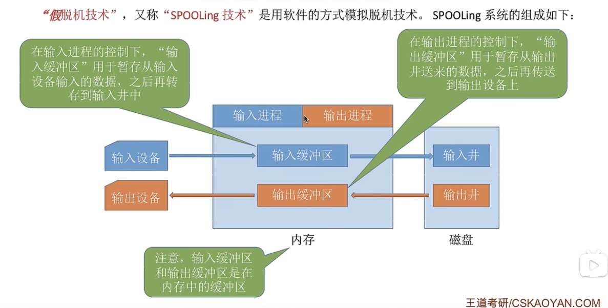
    就这↑
  5.2.3设备分配与回收
    # 设备分配时考虑因素
    ### 设备固有属性
    - 独占设备
    - 共享设备
    - 虚拟设备

    ### 设备分配算法
    - 先来先服务
    - 优先级
    - 短任务优先
    - …
    ### 设备分配中安全性
    - 安全分配方式：为进程分配一个设备后就将其阻塞（不会死锁）
    - 不安全分配方式：进程可被分配多个设备，当某个请求无法满足时才阻塞
      
    # 分配方式
    - 静态分配：进程运行前分配所需资源，运行时不再分配
    - 动态分配：进程运行中可申请资源
    

    # 设备管理中的数据结构
    ### 设备控制表（DCT）：
    记录
    - 设备类型，
    - 设备标识符，
    - 设备状态，
    - 指向控制器表的指针，
    - 重复执行次数/时间，
    - 设备队列队首指针
    ### 控制器控制表（COCT）：
    记录
    - 控制器标识符，
    - 控制器状态，
    - 指向通道表的指针，
    - 控制器队列队首指针，
    - 控制器队列队尾指针
    ### 通道控制表（CHCT）：
    记录
    - 通道标识符，
    - 通道状态，
    - 与通道连接的控制器表首地址，
    - 通道队列队首地址，通道队列队尾地址
    ### 系统设备表（SDT）：
    - 记录系统全部设备情况，
    PS：每个设备对应一个表目
    **表目内容↓**
    - 设备类型，
    - 设备标识符，
    - DCT，
    - 驱动程序入口
    # 设备分配的步骤
    1. 根据物理设备名（设备标识符）查找SDT
    1. 根据SDT找到DCT，若设备正忙，则将进程PCB挂到设备等待队列，不忙将设备分配给进程
    1. 根据DCT找到COCT，若控制器正忙，则将进程PCB挂到控制器等待队列，不忙将控制器分配给进程
    1. 根据COCT找到CHCT，若通道正忙，则将进程PCB挂到通道等待队列，不忙则将通道分配给进程
    流程图↓
    ```plain text
设备
↓
控制器
↓
通道
    ```
    Q：为什么是反着分配？
    A：这样如果发生死锁，系统可以解除，如果是一级一级分配，各级只能看到自己的，系统就需要更复杂的机制才能解除死锁
    缺点：
    - 用户必须使用设备标识符，改变设备就无法运行，编程复杂
    - 设备忙则会阻塞进程
    # 设备分配步骤改进
    在STD的表目中增加逻辑设备名
    将访问过的设备写进逻辑设备表（LUT）中
  5.2.4缓冲区管理
    缓冲区可以用内存（成本低），也可以使用专业寄存器（性能高）
    本节以内存为例介绍
    # 缓冲区作用
    - 缓和CPU与io设备速度不匹配问题
    - 减少对CPU的中断
    - 解决数据粒度不匹配（块↔字）
    - 提高CPU与io设备并行性
    # 单缓冲
    只有一个缓冲区

    工作原理：
    ```plain text
输入设备 → 缓冲区 →工作区→ CPU
    ```
    PS：缓冲区必须整体操作（要么整体取出，要么一次性存入）

    单缓冲一块数据处理平均耗时：
    $$
MAX（C，T）+M
$$
    MAX（C，T）的意思是C，T中取大值
    T：输入缓冲区时间
    M：缓冲区传送到工作区时间
    C：CPU处理时间
    # 双缓冲
    有两个缓冲区

    工作原理：
    ```plain text
输入设备 → 缓冲区1 →工作区→ CPU
       ↘ 缓冲区2 ↗
    ```
    PS：缓冲区必须整体操作（要么整体取出，要么一次性存入）

    双缓冲一块数据处理平均耗时：
    $$
MAX（T，C+M）
$$
    MAX(C，T)的意思是C+M，T中取大值
T：输入缓冲区时间
M：缓冲区传送到工作区时间
C：CPU处理时间
    # 使用单/双缓冲区通信的区别
    单缓冲区：单工通信
    双缓冲区：双工通信
    # 循环缓冲区
    将多个大小相等的缓冲区链接成循环队列
    # 缓冲池
    缓冲池由系统中共用缓冲区组成
    ### 根据使用情况分
    - 空缓冲队列
    - 装满输入数据的缓冲队列（输入队列）
    - 装满输出数据的缓冲队列（输出队列）
    ### 根据功能分
    - 收容输入数据的工作缓冲区
    - 提取输入数据的工作缓冲区
    - 收容输出数据的工作缓冲区
    - 提取输出数据的工作缓冲区
    
  5.3.1 磁盘结构HDD
    # 磁盘，扇区，磁道
    - 磁盘盘面会分为一个个同心的圈，一圈就是一个磁道
    - 一个磁道又会被划分成多个扇区，每个扇区就是一个磁盘块，各扇区容量相同
    PS：最内侧的扇区数据密度最大
    
    # 盘片，柱面
    - 一个磁盘可能有多个盘片，用盘面号标记
    - 柱面：所有盘面中相对位置相同的磁道组成柱面
    - 读写只需要（柱面号，盘面号，扇区号）即可
    
    # 磁盘分类
    ### 按磁头能否移动分类
    - 活动头磁盘（一个磁头）
    - 固定头磁盘（多个磁头）
    ### 按能否换盘片
    - 可换盘磁盘
    - 固定盘磁盘
  5.3.2磁盘调度算法
    # 一次读写时间
      - 寻道时间：
      T_s=S+m×n
      S启动磁头臂时间
      m跨越一个磁道时间
      n跨越磁道数

      - 延迟时间：
      T_R=（1/2）*（1/r）=1/（2r）
      r转速

      - 传输时间：
      T_t=（1/r）*（b/N）=b/（rN）
      r转速
      b待读写字节数
      N每个磁道上字节数

      - 总时间
      T_a=T_s+T_R+T_t


      PS：
      操作系统只能影响寻道时间
    # 调度算法
    调度算法是用于减少寻道时间的
    寻道时间：启动磁臂，磁头移动的时间
    ### 先来先服务
    按io发起先后顺序调度磁头
    优点：公平
    缺点：对应大量进程性能不佳
    ### 最短寻找时间优先
    优先寻找离当前磁头位置最近的磁道
    优点：性能好
    缺点：可能饥饿
    ### 扫描算法
    只有磁头移动到最外/最里时才能改变移动方向
    优点：不会饥饿，性能较好
    缺点：
    到达最边上才能改变方向
    对各位置响应不平均（边上的连续访问两次间隔要么太短要么太长）
    ### LOOK算法
    磁头移动到最外/最里时才能改变移动方向，如果移动方向上没有需要访问的磁道，则可以立即改变方向
    优点：解决了扫描算法的第一个缺点
    ### 循环扫描算法
    磁头只向单个方向移动，到头后直接移回起始位置
    优点：解决了扫描算法响应不平均的问题
    缺点：每次都要回到初始位置（即使初始位置不需要访问）
    ### C-LOOK算法
    磁头单向移动，如果移动方向上没有要访问的磁道，则立即返回到第一个需要访问的磁道
  5.3.3减少磁盘延迟方法
    本节研究如何减少磁盘延迟时间
    磁盘延迟：磁头就绪后，将目标扇区转到磁头下的时间
    # 方法
    ### 交替编号
    由于磁盘读完一个块不能立即读下一个块（需要处理）
    因此
    让逻辑上连续的块在物理上有一定间隔
    ### 磁盘地址结构的设计
    磁盘的物理地址是（最优）
    （柱面号，盘面号，扇区号）
    而不是其他顺序，如
    （盘面号，柱面号，扇区号）
    ### 错位命名
    由于磁盘读完一个块不能立即读下一个块（需要处理）
    因此
    上下两个盘片的扇区号要错位命名
  5.3.4磁盘管理
    # 磁盘初始化
    出厂时磁盘只有磁道，因此需要格式化
    1. 首先是低级格式化，它有以下功能
    - 扇区划分
    扇区组成部分
    - 头
    - 数据区
    - 尾
    其中头尾用来存放管理扇区的数据结构

    1. 然后是分卷（分盘符）
    1. 最后是逻辑格式（高级格式化）它会↓
    - 创建文件系统根目录
    - 初始化存储空间管理所用的数据结构（位示图，空闲分区表）
    # 引导块
    自举程序：计算机开机执行的初始化程序（最早是放在只读存储器中，但现代计算机放在磁盘中，只在ROM中放一个自举装入程序）
    引导块：存放自举程序
    启动盘，系统盘：有引导块的磁盘
    # 坏块管理
    简单磁盘：
    会在在逻辑格式化时，检查坏块，并在分区表中标记（对系统不透明）
    复杂磁盘：
    磁盘控制器会维护一个坏块链表（对系统透明）
  5.3.5固态硬盘
    # 固态硬盘结构
    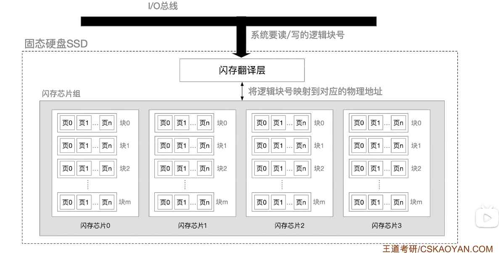
    - 固态硬盘按整页读写
    - SSD的页对应HDD的块/扇区
    - SSD的块对应HDD的磁道
    - 闪存翻译层：将逻辑块号翻译成页
    - 存储介质：闪存芯片
    # 读写特性：
    

    - 随机访问支持好
    - 以页为单位读写
    - 以块为单位擦除（NAND盘）
    - 读快，写慢
    # 与HDD相比
    - HDD擦写几乎没有寿命
    - SSD擦写有次数限制
    - SSD安静，抗震
    - HDD有噪音，不抗震
    # 磨损均衡
    - 动态磨损均衡
    - 静态磨损均衡
