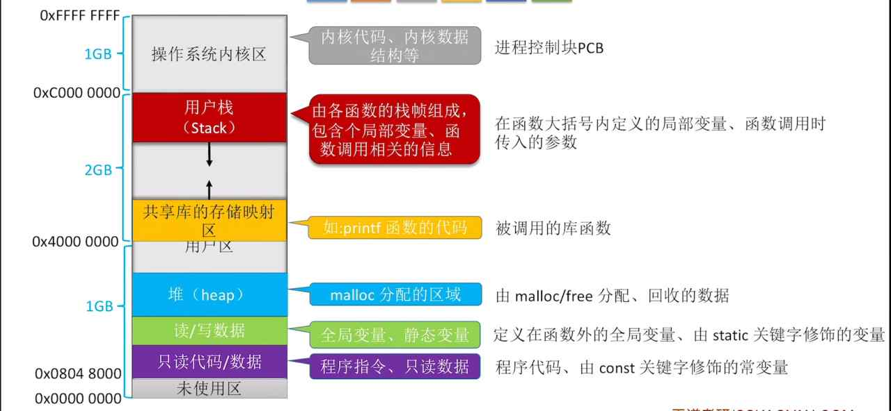

---
{
  "id": "3725a2dd-8276-805f-b080-d0900cc2b89d",
  "url": "https://app.notion.com/p/3-1-1-3725a2dd8276805fb080d0900cc2b89d",
  "created_time": "2026-06-01T09:12:00.000Z",
  "last_edited_time": "2026-06-01T09:40:00.000Z"
}
---

#  3.1.1进程的内存映像

# 内存映像
可能考法：给个代码问哪一句放在哪个地方

# 内存保护
内存保护会给进程设置可访问的内存区间，不能超区间访问，避免破坏其他进程，或窃取数据
