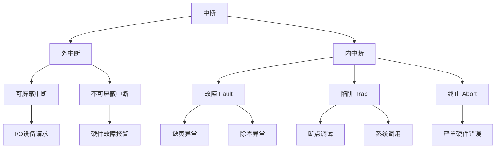

---
{
  "id": "3745a2dd-8276-80e2-a381-f7bb511ed3b5",
  "url": "https://app.notion.com/p/3-2-2-3745a2dd827680e2a381f7bb511ed3b5",
  "created_time": "2026-06-03T07:27:00.000Z",
  "last_edited_time": "2026-06-03T07:44:00.000Z"
}
---

#  3.2.2请求分页内存管理

# 页表机制
普通页表中: 
| 页号 | 块号 |
| --- | --- |
| 1 | 5 |
| 2 | 3 |
请求分页中增加状态位: 
| 页号 | 块号 | 状态位 |
| --- | --- | --- |
| 1 | 5 | 0 |
| 2 | 3 | 1 |
其中状态位：
0→不在内存中（缺页）
1→在内存中
# 缺页中断机制
当发生缺页时，
有空闲内存→直接调入
无空闲内存→使用页面置换机制淘汰一个页面
PS：
缺页属于内中断的中的故障中断

