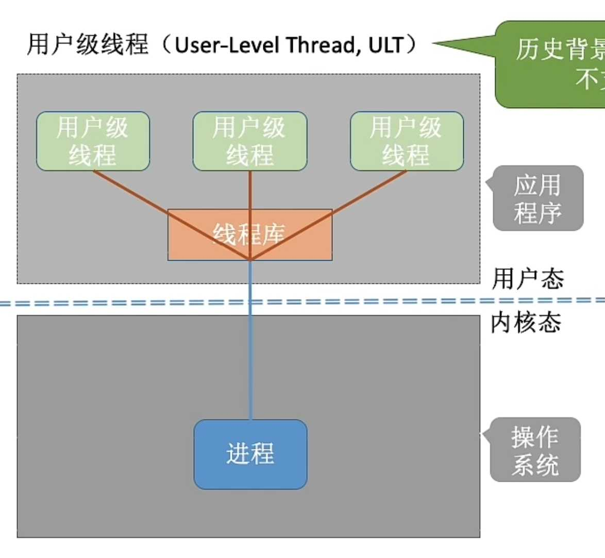

---
{
  "id": "32f5a2dd-8276-80dd-a9c5-f3a77e852fe8",
  "url": "https://app.notion.com/p/2-1-6_2-32f5a2dd827680dda9c5f3a77e852fe8",
  "created_time": "2026-03-26T07:27:00.000Z",
  "last_edited_time": "2026-04-11T07:30:00.000Z"
}
---

#  2.1.6_2 线程的实现方式和多线程模型

# 线程的实现方式
  ### 用户级线程
  早期操作系统不支持线程，所以由线程库实现
  
  优点：切换线程不用切换到内核态，系统开销小
  缺点：一个线程被阻塞，整个进程都会阻塞，在多核处理器上运行没有效率提升
  ### 内核级线程
  
  优点：
  一个线程阻塞不影响其他线程
  可在多核处理器上提高效率
  缺点：
  线程切换需要回到内核态，系统开销大
# 多线程模型（系统支持多线程）
分三种
### 一对一模型：
一个用户线程对应一个内核线程
优：一个线程被阻塞，不影响其他线程
缺：线程切换要回内核态，开销大
### 多对一模型：
多个用户线程对应一个内核线程
优：线程切换在用户态，开销小
缺：一个线程阻塞，整个进程阻塞
### 多对多模型：
n个用户线程对应m个内核线程（n≥m）
优：同时克服了一对一和多对一的缺点
