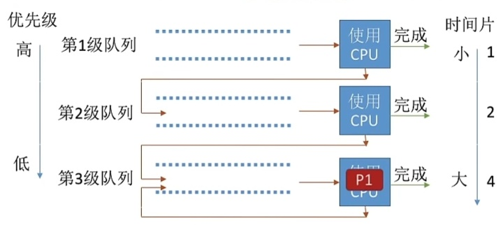

---
{
  "id": "33f5a2dd-8276-8013-83db-cddbbf12aef5",
  "url": "https://app.notion.com/p/2-2-5-2-33f5a2dd8276801383dbcddbbf12aef5",
  "created_time": "2026-04-11T08:23:00.000Z",
  "last_edited_time": "2026-04-11T09:02:00.000Z"
}
---

#  2.2.5-2调度算法

上节的调度算法都是早期操作系统的调度，没考虑响应时间，对用户的交互很不友好
本节是现代操作系统调度算法（多道批处理系统）
# 时间片轮转调度RR
思想：按进程到达的先后顺序，让各进程轮流执行一个时间片，时间片结束剥夺处理机
是否抢占：抢占
优点：响应快，公平
缺点：不区分任务紧急程度
是否饥饿：否
PS：
如果时间片设计太大，就会变成先来先服务调度算法
如果时间片设计太小，进程切换开销太大
# 优先级调度算法
思想：各进程有各自优先级，调度时选择优先级高的
是否抢占：有抢占，有不抢占
优点：区分优先级
缺点：可能会饥饿（一直来高优先级）
是否饥饿：会
PS：
- 就绪队列未必只有一个，可按照不同优先级组织，也可以把优先级高的放在靠近队头的位置
根据优先级是否可以动态改变可分为
- 静态优先级：创建时确定，之后一直不变
- 动态优先级：创建时设置一个初始值，后面根据情况调整
通常：
**系统进程优先级高于用户进程**
**用户进程优先级高于后台进程**
** 操作系统更偏好io型进程（io可以和处理机并行工作）**
与之相对的是计算型进程
如果某个进程等待时间过长可提高优先级
# 多级反馈队列调度
原理：
设置多级就绪队列，各级优先级从高到低，时间片从低到高
新进程到达，先进入第一级队列，按先来先服务排队，若时间片用完，进程还未结束，则进入下一级队列队尾
如果已经处于最下级队列，则重新放回最下级队列队尾
只有上级队列为空时才会给下级队列分配时间片
被io抢占处理机的进程，重新放回当前队列队尾

是否抢占：是
优点：公平，短进程优先，避免用户伪造运行时间
缺点：有可能饥饿（一直来短进程）
饥饿：会
