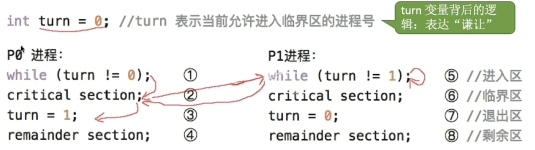
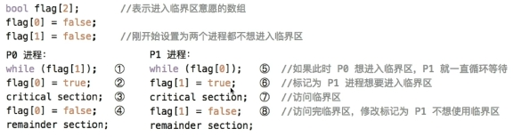
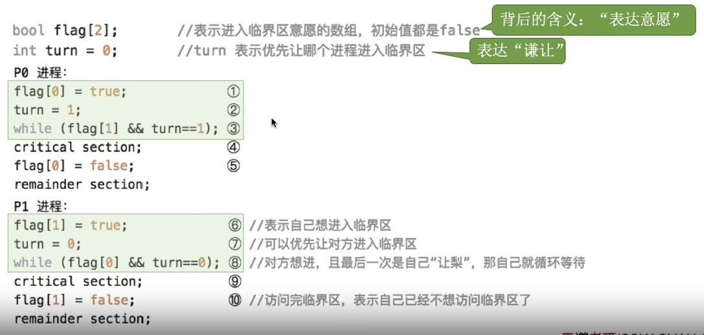

---
{
  "id": "36a5a2dd-8276-80cd-926b-f51aeba31b21",
  "url": "https://app.notion.com/p/2-3-1-36a5a2dd827680cd926bf51aeba31b21",
  "created_time": "2026-05-24T09:06:00.000Z",
  "last_edited_time": "2026-05-29T09:02:00.000Z"
}
---

#  2.3.1同步与互斥

# 概念
  ## 进程同步
  多个进程（或线程）在并发执行时，为了正确共享资源、按照预期顺序运行，而进行的协调与控制机制
  ## 进程互斥
  进程互斥的访问资源
  **分4个部分：**
  进入区（检查是否可进临界区，并上锁）
  临界区（访问互斥资源的代码）
  退出区（解锁）
  剩余区（其他处理）
  **遵循以下原则：**
  1. 空闲让进（临界区空闲，允许进程进入临界区）
  1. 忙则等待（临界区有进程，其他进程必须等待）
  1. 有限等待（确保不会饥饿）
  1. 让权等待（没准备好的进程立即释放，不会进入）
# 进程互斥软件实现
  ## 单标志法
  思想：一个进程访问完资源后将访问权限交给下一个进程
  （每个进程进入临界区的权限只能被另一个进程赋予）
  实现：
  1. 全局：定义一个变量turn来标记当前允许进入临界区的进程号
  1. 一个进程使用完将turn标记改写为下一个进程的编号
  1. 进程在头部循环检查turn标记
  
  缺点：如果下一个进程没准备好就会让处理机干等（违反空闲让进）
  ## 双标志先检查法
  思想：用一个布尔型数组存储各进程进入临界区的意愿，让有意愿的进程进入，进程会先检查数组中其他进程的意愿，其他进程没有意愿，它才会改写自己的意愿状态
  （进程主动谦让）
  实现：
  1. 全局：设置一个布尔型数组flag[]存储各进程进入意愿
  1. 初始意愿全设置为不进入
  1. 进程头部循环检查数组中其他进程意愿值
  1. 其他进程值都为0则将自己的意愿值设为1
  1. 执行完将自己的意愿值改为0
  
  缺点：如果两个进程并发检查，都检查不到对方
  ## 双标准后检查法
  思想：与双标志先检查法相似，只不过先改标记后检查
  实现：不写了，把改标记移到检查前面
  缺点：并行运行有可能出现两个进程相互无限等待（双方都能检查到对方有意愿）
  ## peterson算法
  思想：结合单标志和双标志的优点
  实现：
  1. 全局：设置单标记变量turn，和双标志数组flag[]
  1. 每个进程先将自己的意愿值设为1（表达意愿）
  1. 将单标志turn改为对方的进程号（谦让）
  1. 写一个空循环，检查对方的意愿是否为1且turn没被改成本进程ID，成立则一直循环卡住，不成立就退出循环继续执行↓
  1. 直接执行
  1. 将自己的意愿值改0
  并发情况：
  让给别人后被让回来→直接执行
  
  缺点：
  1. 让来让去和空循环浪费处理机资源
  1. 得检查每个进程的意愿，进程多了系统开销很大
# 进程互斥硬件实现
  ## 中断屏蔽法
  使用开/关中断实现中断屏蔽
  缺点：不使用于多处理机（不能把所有核心全部关中断），开关中断权限过大
  ## testandset指令
  TSL指令，是硬件实现的，执行过程不可打断
  ## swap指令
  swap指令，执行过程不可打断
  和tsl指令区别不大
