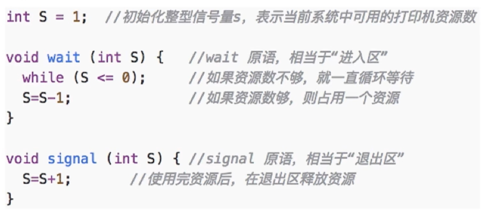
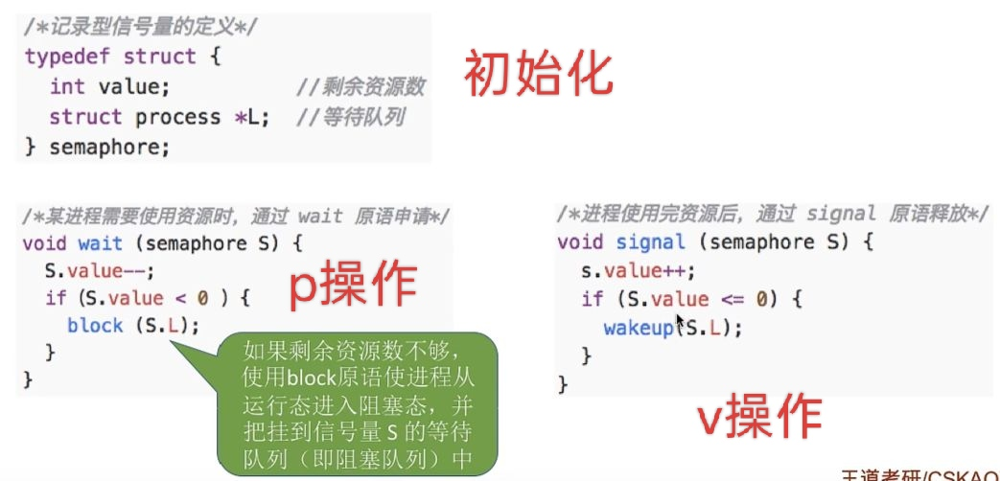

---
{
  "id": "36f5a2dd-8276-8064-b949-fa863113b31c",
  "url": "https://app.notion.com/p/2-3-4-36f5a2dd82768064b949fa863113b31c",
  "created_time": "2026-05-29T07:16:00.000Z",
  "last_edited_time": "2026-06-28T10:22:00.000Z"
}
---

#  2.3.4信号量机制

信号量也是一种并发同步机制，用来：
控制多个线程/进程对共享资源的访问

# 信号量机制
- 信号量机制用原语解决了上锁和检查不能一气呵成的问题（上锁和检查顺序导致的并发问题）
- 信号量就是一个变量（可以是整型，也可以是更复杂的记录型）
- 注意⚠️：信号量可以为负值（表示等待该资源的进程数）
# 一对原语
wait（S）：P操作（尝试获取资源并上锁）
signal（S）：V操作（释放资源并解锁）
# 整型信号量
一个整型的变量作为信号量，表示系统中某资源数量
**可以对其执行三种操作**
- 初始化
- P操作
- V操作
**原理**
1. 系统会根据硬件初始化各资源的信号量（初始化）
1. 进程先在wait原语中检查资源并将对应信号量数值-1（上锁）（P操作）
1. 执行语句
1. 进程使用完资源在signal原语中将信号量+1（释放）（V操作）

**问题**
会出现忙等（部分时间片空跑）
# 记录型信号量
用一个结构体作为信号量，结构体包含剩余资源数和一个等待队列（存放等待资源进程指针的队列）
**可以对其执行三种操作**
- 初始化
- P操作
- V操作
**原理**
- 用一个结构体作为信号量，结构体包含剩余资源数和一个等待队列（存放等待资源进程指针的队列）
- 进程在wait原语中先将资源数-1，再检查有没有资源，没有资源则将进程地址放入等待队列最后使用block原语阻塞该进程
- 进程使用完资源在signal原语中先将资源数+1，再将等待队列队头进程取出用wakeup原语唤醒（如果等待队列不为空）

**好处：**
不会出现忙等待（没有资源阻塞进程）
# 总结
本节将两段原子操作的代码抽象成了P操作（上锁）和V操作（解锁），为了降低复杂度，后面将会直接使用P/V操作这两个名称
