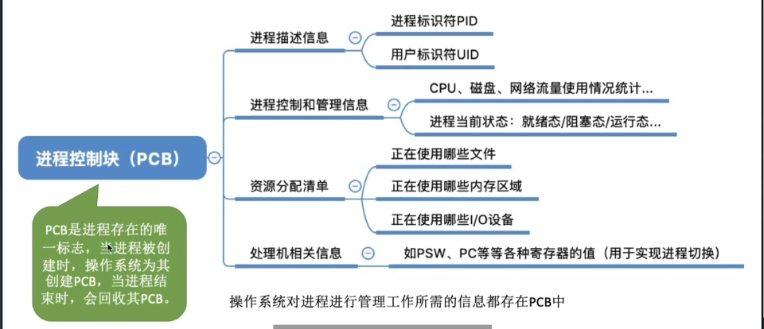
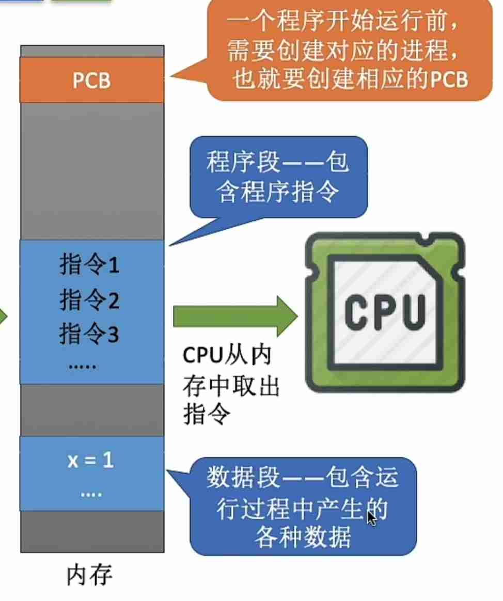
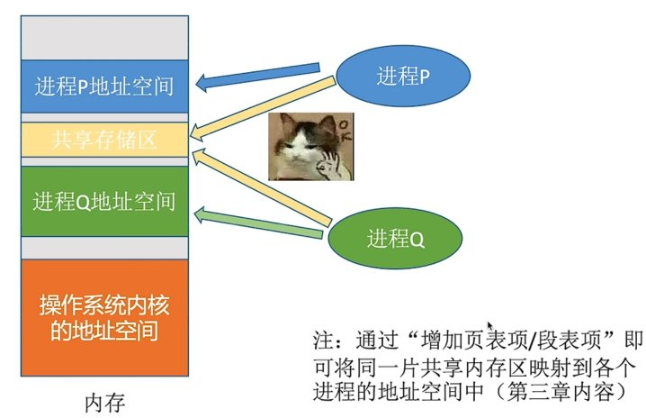
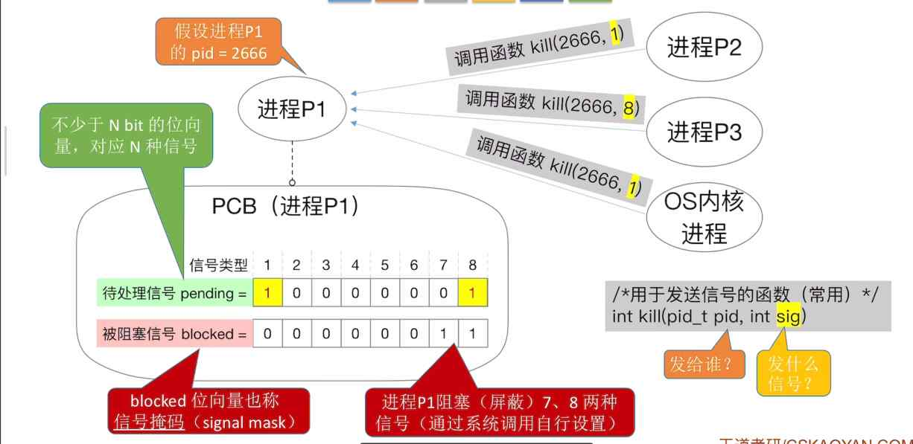
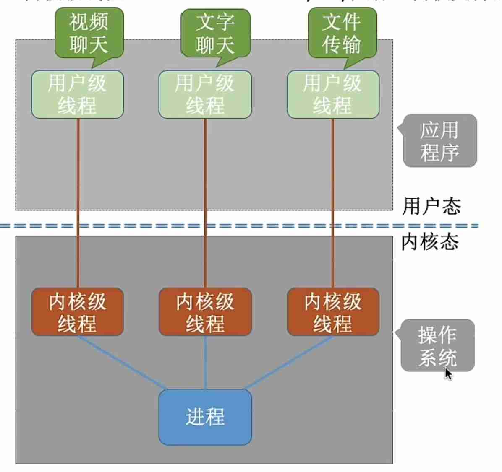
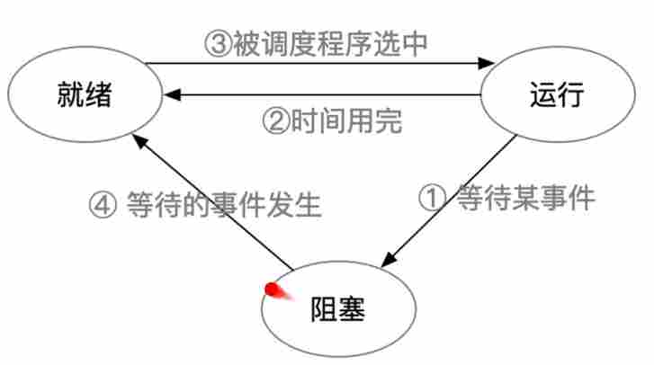
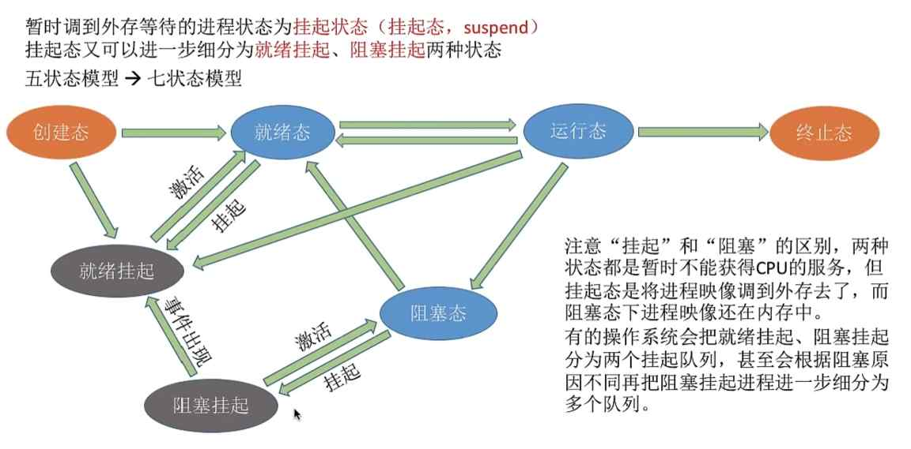
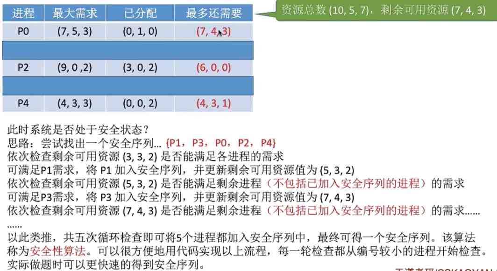

---
{
  "id": "33f5a2dd-8276-8054-ba8b-fff9cf342471",
  "url": "https://app.notion.com/p/33f5a2dd82768054ba8bfff9cf342471",
  "created_time": "2026-04-11T07:29:00.000Z",
  "last_edited_time": "2026-05-31T09:08:00.000Z"
}
---

#  第二章

[a2.1.1+2.1.2进程概念，组成，特征](a211212进程概念组成特征/index.md)
  ### 进程概念
  程序：静态的可执行文件
  进程：动态，程序的一次执行过程
  ### 进程组成（在内存中）
  1. 进程控制块PCB
  

  1. 程序段
  该程序的各种指令
  1. 数字段
  该程序运行产生的各种数据

  
  进程实体是进程在运行中某一时刻的状态，是静态的
  进程是动态的
[2.1.3进程的状态与转换](213进程的状态与转换/index.md)
  # 进程的状态
  操作系统在PCB（进程控制块）中标记进程的状态
  ### 创建态
  指系统正在创建该进程：
  系统为该进程分配资源，初始化PCB
  ### 就绪态
  进程创建完成就进入就绪态
  （只有就绪态的进程才能上CPU运行）
  ### 运行态
  指该进程正在CPU上运行
  ### 阻塞态
  指该进程执行指令被阻塞：
  如等待io
  （被阻塞的进程要先回到就绪态才能继续运行）
  ### 终止态
  指该进程运行完毕，系统正在回收资源（CPU，外设，内存，PCB等）
  # 进程的转换
  
  # 进程的组织方式
  ### 链式方式
  按照进程状态分成多个队列（队列先进先出）
  优先级高的进程排前面
  ### 索引方式
  按照进程状态创建几张索引表（表想取哪就取哪）
  操作系统控制指向索引表的指针
[2.1.4进程控制](214进程控制/index.md)
  进程控制就是实现进程状态转换
  # 如何实现进程控制
  需要使用原语实现：
  因为原语可以一气呵成不被中断，如果在进程状态转换中被中断了，可能导致数据不统一（就绪队列和阻塞队列不同步）
  # 原语如何实现原子性？
  因为使用了“关中断”和“开中断”两个特权指令
  关中断：执行后，机器不再理会中断信号
  开中断：执行后，恢复正常中断效果
  # 进程控制相关原语
  ## 进程创建
    ### 进程创建
      申请空白PCB→为进程分配资源→初始化PCB→将PCB插入就绪队列
    ### 引起进程创建的事件
      用户登录
      作业调度：将内容从硬盘移动到内存
      提供服务
      应用请求
  ## 进程终止
    ### 撤销原语
      从PCB集合中找到相应PCB→若进程正在运行，则立即剥夺CPU→终止子进程→回收相应资源→删除PCB
    ### 引起终止的事件
      正常结束：程序调用exit系统调用
      异常：系统给程序抛个异常
      外界干预：用户手动杀死
  ## 进程阻塞和唤醒
    ### 进程阻塞
      阻塞原语：找到对应进程PCB→保存运行状态→将PCB插入阻塞队列
      引起阻塞的事件：等待资源，等其他进程
    ### 进程唤醒
      唤醒原语：找到对应PCB→将对应PCB从阻塞队列移除，设置PCB为就绪态→将PCB放入就绪队列
      引起唤醒的事件：等待的资源加载完成
  ## 进程切换
    ### 切换原语
      将运行环境存入PCB→PCB移入相应队列→选择另一个进程运行，并更新PCB→（后续）根据PCB恢复进程运行环境
    ### 引起进程切换的事件
      当前进程时间片到了
      有更高优先级进程插队
      当前进程主动阻塞
      当前进程终止
[2.1.5-1进程通信IPC](215-1进程通信ipc/index.md)
  Q：进程通信为什么要操作系统支持
  A：各进程拥有的内存空间相互独立（为了保证安全）
  ## **进程通信有三种方式**
  ## 共享存储
    一个进程可以申请一个共享存储区，共享存储区的内容可被其他进程访问
    
    使用共享存储做进程间通信方式需要注意访问互斥，避免同时访问造成数据冲突（需要进程自己处理）
    可使用内核提供的同步互斥工具（P/V操作）
    **共享存储分两种↓**
    ### 基于数据结构的共享
      如：共享空间只能放10位的数组
    ### 基于存储区的共享
      直接给一片内存，共享内存里写什么都行（更自由）
  ## 消息传递
    进程间以格式化的消息传递信息，通过操作系统的“发送/接收消息”原语进行交换
    消息分：消息头，消息体
    消息头：发送进程ID，接收进程ID，消息长度等
    
    **↓消息传递也有两种↓**
    ### 直接通信
      消息发送要指定接收进程ID
      详细步骤：
      发送：
      发送进程写好消息→发送进程调用发送原语→消息从发送进程的内存中被复制到接受进程的消息队列（消息队列在PCB中，PCB在属于内核的内存中）
      接收：
      接收进程调用接收原语→消息队列中对应的数据被复制到接收进程的内存中
    ### 间接通信
      通过信箱间接通信
      详细步骤：
      创建信箱：
      接收进程使用系统调用在内核空间创建一个信箱或多个信箱
      发送：
      发送进程调用发送原语给某个信箱发送信息
      接收：
      接收进程调用接收原语从一个或多个信箱接收信息
      与直接通信区别：
      信箱通信可以多个进程从一个信箱接收，多个进程可以给一个信箱发送
  ## 管道通信
    像管道一样，数据在某时间内只能单向流动
    管道是一类特殊共享文件：pipe文件，就是在内存中开辟一个大小固定的缓存区
    Q：**那这和共享内存通信有什么区别？**
    A：**共享内存可以随机读写，管道通信是先进先出（队列）**
    **特点**：
    - 只支持半双工通信（除非建两个管道）
    - 互斥访问（但由操作系统自动管理，不用进程实现）
    - 管道实际上是缓冲区，有容量上限，写满后写进程被阻塞
    - 管道读空后，读进程阻塞
    - 管道数据一旦被取出，就彻底消失，有两种解决方案：①一个管道允许多个写进程，只允许一个读进程  ②允许多个读，多个写，但系统控制读进程轮流读
[2.1.5-2信号](215-2信号/index.md)
  信号量：实现进程同步，互斥
  信号：实现进程间通信IPC
  # 信号作用
    信号：用于通知进程某事件完成✅
    不同操作系统信号不一样
    例：
    | 序号 | 信号名 | 事件 | 处理 |
    | --- | --- | --- | --- |
    | 1 | SIGINT | 键盘中断 | 终止 |
    | … | … | … | … |
    注意⚠️：
    信号名实际上就是宏定义的名称
    如：`#define SIGINT 2`
  # 实现原理—信号发送和保存
    ### 发送
    在进程PCB中，有两个nbit的位向量（数据结构：位图）：待处理信号，被阻塞信号
    - 待处理信号：已经发送给进程，但还没有被处理的信号
    - 被阻塞信号/信号掩码：收到也不处理的信号（可自行设置）
    

    注意⚠️：由于待处理信号是位图数据结构，所以同一个信号重复发送，只会生效第一个
    用户→用户（有限制），内核→用户，是可以发送信号的
    ### 处理
    Q：什么时候处理信号？
    A：进程从内核态转为用户态时，例行检查有无待处理信号，如果有就处理
    （人话：内核把CPU还给进程后立刻处理）

    Q：如何选择处理程序？
    A：
    1. 将待处理信号与取反的被阻塞信号按位与
    1. 根据第一步得到的值就可以确定对应的信号处理程序
    1. 运行对应程序
    

    Q：怎么处理？
    A：操作系统给每个信号都有默认处理程序，也可以自定义处理程序
    如：按下Ctrl+c会触发信号：SIGINT→默认处理：终止。
    在文本编辑器中则会复制（自定义）

    Q：处理完发生什么？
    A：返回进程继续执行下一条指令（除非终止或阻塞）
    注意⚠️：
    重复信号只会处理第一个
    当收到多个信号，优先处理信号序号小的（信号有处理优先级）
  # 信号与异常的关系
  信号可以作为异常的配套机制
  有些异常可以由内核独自处理
  例：整数除0→内核默认：终止进程
  有些异常内核无法独自处理，需要用户进程配合处理
  例：整数除0→自定义：“输入错误”
[2.1.6_1 线程概念多线程模型](216-1-线程概念多线程模型/index.md)
  # 什么是线程，为什么引入线程
  没有线程程序只能串行执行一个进程，引入线程增加了并发度，加快进程运行速度，提高多核CPU利用率
  # 引入线程的变化
    ### 调度，资源分配
    传统进程机制：进程是资源分配和调度的基本单位
    线程：进程是资源分配的基本单位，线程是调度的基本单位
    ### 并发
    传统进程机制：只能进程间并发
    线程：线程间可以并发
    ### 系统开销
    传统进程机制：单核条件下，如果要实现进程间并发，由于进程是轮流运行的，需要频繁运行环境，系统开销大
    线程：如果是同一进程内的线程切换，不需要频繁切换环境，系统开销小
  # 线程的属性
    - 线程是处理机调度的单位
    - 多CPU计算机中,各个线程可占用不同的CPU
    - 每个线程都有一个线程ID、线程控制块(TCB)
    - 线程也有就绪、阻塞、运行三种基本状态
    - 线程几乎不拥有系统资源
    - 同一进程的不同线程间共享进程的资源
    - 由于共享内存地址空间,同一进程中的线程间通信甚至无需系统干预
    - 同一进程中的线程切换，不会引起进程切换
    - 不同进程中的线程切换，会引起进程切换
    - 切换同进程内的线程，系统开销很小
    - 切换进程,系统开销较大
[2.1.6_2 线程的实现方式和多线程模型](216-2-线程的实现方式和多线程模型/index.md)
  # 线程的实现方式
    ### 用户级线程
    早期操作系统不支持线程，所以由线程库实现
    
    优点：切换线程不用切换到内核态，系统开销小
    缺点：一个线程被阻塞，整个进程都会阻塞，在多核处理器上运行没有效率提升
    ### 内核级线程
    
    优点：
    一个线程阻塞不影响其他线程
    可在多核处理器上提高效率
    缺点：
    线程切换需要回到内核态，系统开销大
  # 多线程模型（系统支持多线程）
  分三种
  ### 一对一模型：
  一个用户线程对应一个内核线程
  优：一个线程被阻塞，不影响其他线程
  缺：线程切换要回内核态，开销大
  ### 多对一模型：
  多个用户线程对应一个内核线程
  优：线程切换在用户态，开销小
  缺：一个线程阻塞，整个进程阻塞
  ### 多对多模型：
  n个用户线程对应m个内核线程（n≥m）
  优：同时克服了一对一和多对一的缺点
[2.1.6_3线程的状态与转换](216-3线程的状态与转换/index.md)
  线程的转换与进程的转换一致
  
  # 线程的组织与控制
  TCB（线程控制块）
  
  多个TCB组织起来就形成线程表
[2.2.1 调度的概念](221-调度的概念/index.md)
  # 调度的三个层次
    ### 高级调度
    作业：一个具体任务
    **高级调度（作业调度）：按一定的原则从外存的作业后备队列挑一个作业调入内存，并创建进程**
    每个作业只调入一次，调出一次
    作业调入时会建立PCB，调出时撤销PCB
    发生频率：低
    ### 低级调度
    **低级调度（进程调度/处理机调度）：按某策略从就绪队列中选取一个进程，将处理机分配给它**
    发生频率：高
    ### 中级调度
    内存不足时，某些进程的数据会被调出内存，在适当时机再调回来
    暂时被移出内存的进程状态为**挂起状态**
    被挂起的进程PCB会组成**挂起队列**
    **中级调度（内存调度）：按照某种策略决定将那个挂起的进程调回内存**
    发生频率：中
  # 七状态模型
    我们通常看到的是五状态模型，但也有七状态模型
    
  # 总结
  | 层次 | 频率 | 方向 |
  | --- | --- | --- |
  | 高级调度 | 低 | 外存→内存 |
  | 中级调度 | 中 | 挂起→激活 |
  | 低级调度 | 高 | 内存→处理器 |
[2.2.2_1+2.2.4进程调度时机](222-1224进程调度时机/index.md)
  # 进程调度的时机
    ### 需要进行进程调度的
      进程主动放弃处理机：
      - 程序终止
      - 发生异常
      - 主动阻塞
      被动放弃处理机：
      - 时间片用完
      - 高优先级进程插队
      - io中断
    ### 不能调度的情况
      1. 中断处理中
      1. 进程在内核临界区
      1. 原子操作中
    临界资源：只同时允许一个进程访问的资源（访问互斥）
    临界区：访问临界资源的代码
    PS：在用户态时，就算程序处在临界区，也可以被打断（调度），只有原语才能保证操作不被打断，打断不会影响互斥锁的状态（不会解锁）
  # 进程调度方式
    ### 非剥夺调度方式
    只允许进程主动放弃处理机
    ### 剥夺调度方式
    有更高优先级的进程会剥夺处理机
  # 进程切换过程
  1. 保存原来进程的运行数据
  1. 恢复新进程的数据
[2.2.2_2调度器，闲逛进程](222-2调度器闲逛进程/index.md)
  # 调度器/调度程序
  调度器控制：让谁上处理机（调度算法），运行多久（时间片大小）
  ### 触发调度的事件
  - 创建新进程
  - 进程退出
  - 运行进程阻塞
  - io中断
  - 非抢占式调度策略：只有运行进程阻塞或退出时才会触发
  - 强占式调度策略：每个时钟中断或k个时钟中断后会触发
  PS：
  不支持内核级线程的操作系统，调度对象是进程
  支持内核级线程的操作系统，调度对象是线程
  # 闲逛进程
  在没有进程需要处理机时，CPU不会关闭，而是运行一个闲逛进程
  ### 特性
  - 优先级最低
  - 可以是0地址进程，占一个完整的指令周期（指令周期末尾例行检查中断）
  - 能耗低
[2.2.3调度的目标](223调度的目标/index.md)
  # 调度算法的评价指标
  ## CPU利用率
  **利用率=使用时间/总时间**
  ## 系统吞吐量
  单位时间内完成的作业数量
  **系统吞吐量=总共完成作业数/总时间**
  ## 周转时间
  作业从提交到完成的时间间隔
  **周转时间=作业完成时刻-作业提交时刻**
  **平均周转时间=各作业周转时间之和/作业数**
  **加权周转时间=作业周转时间/作业实际运行时间**
  平均带权周转时间=各作业带权周转时间之和/作业数
  ## 等待时间
  指作业处于等待处理机状态的时间之和
  PS：
  对于进程来说：等待io不算等待时间（进程正在被io设备服务）
  对于作业来说：不仅要考虑建立进程后（进入内存后）的等待时间，还要考虑作业在外存后备队列中的（没进内存的）等待时间
  同样的也有平均等待时间
  ## 相应时间
  指用户提交请求到首次响应的时间
  ## 响应比
  **响应比=（等待时间+要求服务时间）/要求服务时间**
[2.2.5-1调度算法](225-1调度算法/index.md)
  计算方法：
  
  用这种图计算各种调度算法指标
  # 先来先服务FCFS
  思想：按先后顺序服务
  是否抢占：非抢占
  优点：实现简单
  缺点：对长作业有利，短作业不利
  是否会饥饿（某进程长期得不到运行）：不会
  # 短作业优先SJF
  思想：用时最短的进程优先
  是否抢占：有的抢占（会中断当前进程），有的不抢占（不中断当前进程）
  优点：平均等待时间，平均周转时间，平均平均带权等待时间都降低
  缺点：可能导致长作业饿死（一直不运行），作业时间由用户提供（可能长作业被伪装成短作业）
  是否会饥饿：会
  # 高响应比优先HRRN
  思想：越高响应比，优先级越高
  响应比=（等待时间+要求服务时间）/要求服务时间
  是否抢占：非抢占
  优点：既保证了服务时间短的优先，也确保长服务不会饿死
  缺点：不关心响应时间，也不区分紧急程度
  是否会饥饿：不会
[2.2.5-2调度算法](225-2调度算法/index.md)
  上节的调度算法都是早期操作系统的调度，没考虑响应时间，对用户的交互很不友好
  本节是现代操作系统调度算法（多道批处理系统）
  # 时间片轮转调度RR
  思想：按进程到达的先后顺序，让各进程轮流执行一个时间片，时间片结束剥夺处理机
  是否抢占：抢占
  优点：响应快，公平
  缺点：不区分任务紧急程度
  是否饥饿：否
  PS：
  如果时间片设计太大，就会变成先来先服务调度算法
  如果时间片设计太小，进程切换开销太大
  # 优先级调度算法
  思想：各进程有各自优先级，调度时选择优先级高的
  是否抢占：有抢占，有不抢占
  优点：区分优先级
  缺点：可能会饥饿（一直来高优先级）
  是否饥饿：会
  PS：
  - 就绪队列未必只有一个，可按照不同优先级组织，也可以把优先级高的放在靠近队头的位置
  根据优先级是否可以动态改变可分为
  - 静态优先级：创建时确定，之后一直不变
  - 动态优先级：创建时设置一个初始值，后面根据情况调整
  通常：
  **系统进程优先级高于用户进程**
  **用户进程优先级高于后台进程**
  ** 操作系统更偏好io型进程（io可以和处理机并行工作）**
  与之相对的是计算型进程
  如果某个进程等待时间过长可提高优先级
  # 多级反馈队列调度
  原理：
  设置多级就绪队列，各级优先级从高到低，时间片从低到高
  新进程到达，先进入第一级队列，按先来先服务排队，若时间片用完，进程还未结束，则进入下一级队列队尾
  如果已经处于最下级队列，则重新放回最下级队列队尾
  只有上级队列为空时才会给下级队列分配时间片
  被io抢占处理机的进程，重新放回当前队列队尾
  
  是否抢占：是
  优点：公平，短进程优先，避免用户伪造运行时间
  缺点：有可能饥饿（一直来短进程）
  饥饿：会
[进程调度（RTOS）](进程调度rtos/index.md)
  前面介绍了分时操作系统，接下来介绍实时操作系统RTOS
  # RTOS分类
  硬实时系统：不能延迟
  软实时系统：尽量别延迟
  # 实时调度算法
  ## 基于优先级的调度
    固定优先级抢占调度（FPPS）
  ## 动态优先级调度
    ### EDF 算法（最早截止时间优先）：
    谁的截止时间（deadline）最早，谁先执行
    ### LLF 算法（最小松弛度优先）：
    谁“最来不及”谁先执行
    ```plain text
松弛度 L = 截止时间 D − 当前时间 t − 剩余执行时间 C
    ```
  ## 时间驱动
    时钟驱动 / 表驱动调度（Time-Triggered）：
    基于时钟中断的抢占
  ## 非抢占式调度（软实时）
    非抢占式优先级 / 轮转调度
[2.2.6多处理机调度](226多处理机调度/index.md)
  多处理机调度就是多核CPU调度
  其中每个核心都能运行一个进程
  **需要考虑两个指标**
  1. 处理机亲和性：尽量让一个进程上一个处理机，以最大效率利用缓存
  1. 负载均衡
  # 方案1:公共就绪队列
  - 所有CPU共享一个就绪队列
  - 每个CPU都运行一个调度程序
  - CPU间访问就绪队列是互斥的（上锁）
  优点：
  天然具有负载均衡
  缺点：
  处理机亲和性不好

  改善处理机亲和性：
  - 软亲和：让调度程序尽量调度同一个进程
  - 硬亲和：进程调用系统调用，主动要求分配固定CPU
  # 方案2:私有就绪队列
  - 每个CPU都有一个私有的就绪队列
  - CPU从私有就绪队列中调度进程
  优点：
  天然具有处理机亲和性
  缺点：
  负载均衡不好

  解决负载均衡问题：
  - 推迁移：一个系统进程定期检查各CPU负载，将高负载的CPU就绪队列，匀给低负载的
  - 拉迁移：每个CPU运行一个进程，定期检查自己和其他CPU的负载，低负载时将别的CPU的进程拉给自己
  PS私有就绪队列同样可以由进程调用系统调用，来获得固定CPU
[2.3.1同步与互斥](231同步与互斥/index.md)
  # 概念
    ## 进程同步
    多个进程（或线程）在并发执行时，为了正确共享资源、按照预期顺序运行，而进行的协调与控制机制
    ## 进程互斥
    进程互斥的访问资源
    **分4个部分：**
    进入区（检查是否可进临界区，并上锁）
    临界区（访问互斥资源的代码）
    退出区（解锁）
    剩余区（其他处理）
    **遵循以下原则：**
    1. 空闲让进（临界区空闲，允许进程进入临界区）
    1. 忙则等待（临界区有进程，其他进程必须等待）
    1. 有限等待（确保不会饥饿）
    1. 让权等待（没准备好的进程立即释放，不会进入）
  # 进程互斥软件实现
    ## 单标志法
    思想：一个进程访问完资源后将访问权限交给下一个进程
    （每个进程进入临界区的权限只能被另一个进程赋予）
    实现：
    1. 全局：定义一个变量turn来标记当前允许进入临界区的进程号
    1. 一个进程使用完将turn标记改写为下一个进程的编号
    1. 进程在头部循环检查turn标记
    
    缺点：如果下一个进程没准备好就会让处理机干等（违反空闲让进）
    ## 双标志先检查法
    思想：用一个布尔型数组存储各进程进入临界区的意愿，让有意愿的进程进入，进程会先检查数组中其他进程的意愿，其他进程没有意愿，它才会改写自己的意愿状态
    （进程主动谦让）
    实现：
    1. 全局：设置一个布尔型数组flag[]存储各进程进入意愿
    1. 初始意愿全设置为不进入
    1. 进程头部循环检查数组中其他进程意愿值
    1. 其他进程值都为0则将自己的意愿值设为1
    1. 执行完将自己的意愿值改为0
    
    缺点：如果两个进程并发检查，都检查不到对方
    ## 双标准后检查法
    思想：与双标志先检查法相似，只不过先改标记后检查
    实现：不写了，把改标记移到检查前面
    缺点：并行运行有可能出现两个进程相互无限等待（双方都能检查到对方有意愿）
    ## peterson算法
    思想：结合单标志和双标志的优点
    实现：
    1. 全局：设置单标记变量turn，和双标志数组flag[]
    1. 每个进程先将自己的意愿值设为1（表达意愿）
    1. 将单标志turn改为对方的进程号（谦让）
    1. 写一个空循环，检查对方的意愿是否为1且turn没被改成本进程ID，成立则一直循环卡住，不成立就退出循环继续执行↓
    1. 直接执行
    1. 将自己的意愿值改0
    并发情况：
    让给别人后被让回来→直接执行
    
    缺点：
    1. 让来让去和空循环浪费处理机资源
    1. 得检查每个进程的意愿，进程多了系统开销很大
  # 进程互斥硬件实现
    ## 中断屏蔽法
    使用开/关中断实现中断屏蔽
    缺点：不使用于多处理机（不能把所有核心全部关中断），开关中断权限过大
    ## testandset指令
    TSL指令，是硬件实现的，执行过程不可打断
    ## swap指令
    swap指令，执行过程不可打断
    和tsl指令区别不大
[2.3.3互斥锁](233互斥锁/index.md)
  互斥锁：
  基于acquire（）和release（）函数的硬件机制实现互斥访问的锁叫做**互斥锁**
  互斥锁缺点：
  忙等待，CPU需要循环调用acquire（）达到锁住的目的，浪费部分时间片
  自旋锁：
  进程拿不到访问权限就不退出就绪队列，一直循环检查锁是否释放（如TSL指令，swap指令）
[2.3.4信号量机制](234信号量机制/index.md)
  信号量也是一种并发同步机制，用来：
控制多个线程/进程对共享资源的访问

  # 信号量机制
  - 信号量机制用原语解决了上锁和检查不能一气呵成的问题（上锁和检查顺序导致的并发问题）
  - 信号量就是一个变量（可以是整型，也可以是更复杂的记录型）
  - 注意⚠️：信号量可以为负值（表示等待该资源的进程数）
  # 一对原语
  wait（S）：P操作（尝试获取资源并上锁）
  signal（S）：V操作（释放资源并解锁）
  # 整型信号量
  一个整型的变量作为信号量，表示系统中某资源数量
  **可以对其执行三种操作**
  - 初始化
  - P操作
  - V操作
  **原理**
  1. 系统会根据硬件初始化各资源的信号量（初始化）
  1. 进程先在wait原语中检查资源并将对应信号量数值-1（上锁）（P操作）
  1. 执行语句
  1. 进程使用完资源在signal原语中将信号量+1（释放）（V操作）
  

  **问题**
  会出现忙等（部分时间片空跑）
  # 记录型信号量
  用一个结构体作为信号量，结构体包含剩余资源数和一个等待队列（存放等待资源进程指针的队列）
  **可以对其执行三种操作**
  - 初始化
  - P操作
  - V操作
  **原理**
  - 用一个结构体作为信号量，结构体包含剩余资源数和一个等待队列（存放等待资源进程指针的队列）
  - 进程在wait原语中先将资源数-1，再检查有没有资源，没有资源则将进程地址放入等待队列最后使用block原语阻塞该进程
  - 进程使用完资源在signal原语中先将资源数+1，再将等待队列队头进程取出用wakeup原语唤醒（如果等待队列不为空）
  
  **好处：**
  不会出现忙等待（没有资源阻塞进程）
  # 总结
  本节将两段原子操作的代码抽象成了P操作（上锁）和V操作（解锁），为了降低复杂度，后面将会直接使用P/V操作这两个名称
[2.3.5生产者消费者问题](235生产者消费者问题/index.md)
  系统中有一组生产者进程和一组消费者进程，生产者进程将产品（数据）写入缓冲区，消费者进程将产品（数据）取走
  这要求：
  - 缓冲区没满生产者才能生产
  - 缓冲区没空消费者才能消费
  - 各进程互斥访问缓冲区
  ## 实现
  因此我们可以设置3个信号量来满足需求
  - mutex：标识当前缓冲区访问状态
  - empty：标识缓冲区余量
  - full：标识产品数量
  

  1. 初始化上面三个信号量
  1. 生产者：先对empty执行p操作（empty-1）并上锁缓冲区（emtpy取反）写完数据对full执行V操作（full+1并解锁（emtpy取反）
  1. 消费者：先对full执行p操作（full-1）并上锁缓冲区（emtpy取反）读完数据对empty执行V操作（empty+1）并解锁（emtpy取反）
  ## PS
  p操作和上锁顺序能不能交换？（能不能先上锁后判断）
  **p操作和上锁顺序不能交换，否则有可能发生死锁**（生产者先上锁后发现缓冲区满被阻塞，但由于没有释放锁消费者没办法运行来消耗产品）
[2.3.5多生产者多消费者](235多生产者多消费者/index.md)
  多生产者多消费者与上一节不同的是：多个生产者和消费者生产和消费不同的产品，但共用一个缓冲区
  ## 实现
  - mutex：标识当前缓冲区访问状态
  - empty：标识缓冲区余量
  - full1：标识产品1数量
  - full2：标识产品2数量
  - …
  ps:**多生产者多消费者问题，一种产品需要一个信号量，各生产/消费者使用各自产品的信号量，共用缓冲区余量**

  
  ## 提问
  1. 能不能不用mutex来标识当前缓冲区访问状态？
  当缓冲区大小为1时可以（因为只要缓冲区有东西就会阻塞）
  1. 能不能先上锁后检查？
  不行，有可能死锁
[总结](总结/index.md)
  这里只说比较成熟的访问互斥算法
  单标志法和双标志法由于有较大缺陷不算在内
  ## peterson算法（不需要硬件支持原语）：
  先谦让后上锁
  缺点：每个进程都要检查其他进程的意愿，进程一多开销大
  ## 整型信号量机制（需要硬件支持原语）
  用整型表示资源数量，资源不足循环检查是否被释放
  P操作：
  **检查锁状态，被锁了→循环等待；没被锁→上锁（资源数-1）**
  V操作：
  **解锁（资源数+1）**

  缺点：对于单核处理器循环检查没有意义，因为单个时间片内只能运行一个进程，所以缺少的资源不可能在该时间片内被释放（忙等待）
  ## 记录型信号量（需要硬件支持原语）
  用结构体表示多个信号量，如果缺少资源则主动阻塞并放入等待队列
  **P操作（原语）：**
  **检查锁状态，被锁了→把进程地址放进等待队列并执行陷入指令（阻塞）；没被锁→上锁（资源数-1）**
  **v操作（原语）：**
  **解锁（资源数+1）然后执行唤醒指令唤醒等待队列中的进程**

  优点：不会忙等待（需要定义等待队列才行）
  缺点：有可能造成死锁
  ## PS：
  Q：别问我为什么整形信号量不这么干？
  A：整形信号量只有一个信号量，这个信号量已经用来存储资源状态了，没地方放那个等待队列
[2.3.5读者-写者问题](235读者-写者问题/index.md)
  读者-写者问题有几个要求：
  1. 可以同时读
  1. 不能同时写
  1. 写时不许读
  1. 写前其他进程退出读写
  ## 读优先实现
  思想：
  用3个信号量来控制↓
  - rw：表示文件上锁状态
  - count：记录当前有几个进程在读（等全读完再解锁rw）
  - mutex：记录count上锁状态（避免并发改count）
  写进程：
  1. 写前用原语改写rw信号量，加锁文件
  1. 写文件
  1. 写完用原语改写rw信号量，解锁文件
  读进程：
  1. 读前先用原语改写mutex信号量，锁上count（避免并发改count）
  1. 判断count是否为0，为0则改写rw（上锁文件）
  1. count+1
  1. 改写mutex，解锁count
  1. 读文件
  1. 用原语改写mutex信号量，锁上count（避免并发改count）
  1. count-1
  1. 判断count是否为0，为0则为0则改写rw（解锁文件）
  1. 改写mutex，解锁count

  

  ## 写优先实现
  读优先实现下如果没读完时间片耗尽，那么即便是切换到写进程也没办法写，因为文件没解锁，得等所有读进程读完才能写
  这样容易饿死写进程😢
  核心思想
  > 一旦有写者来了，后续新来的读者不允许再进入。
  需要加入一个信号量↓
  W：写预备标志，改变这个信号量，新来的读者会被直接阻塞（已有的不影响）
  
  PS：改写写预备标准不会立刻写，还得等文件rw解锁

  ## Q&A
  Q：为什么读也要加锁文件？读之间不是不互斥吗？
  A：这个锁是为了告诉写进程正在读，否则写进程不知道正在读

  Q：为什么需要count信号量？
  A：由于不能重复加锁，另一个并发的读进程会报错卡住，跳过锁直接读可能导致读一半锁开了，这时再写就会读到错误的东西

  Q：为什么需要mutex信号量？怎么不用原语把那几个步骤包住↓
  ```c
atomic {
    if(count==0)
        P(rw);
    count++;
}
  ```
  A：如果读进程没有得到锁那P（rw）就会阻塞，阻塞意味着进程下处理机，但原子操作不让下→直接卡死   所以不能这么干

  Q：锁真的锁住了吗？
  A：当然锁不住，这种锁不是硬件特性，只要我不检查锁状态，锁就跟我没关系😅（P操作内部会检查锁状态，详见 [总结](https://app.notion.com/p/36f5a2dd82768093ba34fe24f34084cd) 和 [2.3.4信号量机制](https://app.notion.com/p/36f5a2dd82768064b949fa863113b31c) ）

  Q：P/V操作阻塞会发生什么
  A：这个根据你使用的信号量机制来定↓
  使用整形信号量→阻塞会循环等待直到耗尽时间片
  使用记录型信号量→阻塞会直接切换进程，不过阻塞解除会被主动拉回来

  Q：mutex信号量解决了并发问题吗？没解决有啥用？
  A：不完全，在mutex被解锁前的并发依然会阻塞，不过它避免了同时访问并计算count造成“2个读进程count却为1的情况”（不管你这么写count++还是这么写count=count++）
[2.3.5哲学家进餐问题](235哲学家进餐问题/index.md)
  哲学家进餐问题主要讨论的是当一个进程需要多个资源时如何避免死锁
  规则：一个圆桌5个人，每人中间放一根筷子，一个人要拿起两根筷子才能吃饭，用什么规则调度？
  ## 三种方案
  1. 对人做限制，如最多允许4人同时进餐
  1. 要求奇数号的人先拿左边的筷子，偶数号的人先拿右边的筷子
  1. 所有人拿筷子需要互斥

  代码不写了，也没咋讲
[2.3.6管程](236管程/index.md)
  ## 管程是什么
  管程是基于信号量机制开发的高级同步机制，致力于解决信号量机制复杂的PV操作和死锁问题
  **管程就是将一系列PV操作封装成函数，开发者不用再关心如何底层操作**
  ## 管程的定义和基本特征
  管程包含以下几个部分
  1. 共享数据
  1. 操作共享数据的函数
  1. 互斥机制：同一时刻只允许一个线程使用管程
  1. 条件变量
  管程的特性
  - **管程中的共享数据只能被管程的操作函数修改**
  - **同一时刻只允许一个线程使用管程**
[2.4.1死锁的概念](241死锁的概念/index.md)
  ## 死锁，饥饿，死循环
  - 死锁：互相等待对方手里的资源，导致进程都被阻塞
  - 饥饿：资源分配不合理，某进程长期得不到资源
  - 死循环：程序一直循环无法跳出
  ## 死锁产生的必要条件
  - 互斥：资源需互斥访问
  - 不剥夺：资源没用完前不能被剥夺
  - 请求和保持：进程保有了至少一个资源，又请求新资源，还不释放已持有的资源
  - 循环等待条件：有循环等待链
  PS：出现单个条件不一定造成死锁，只有同时出现4个才会死锁
[2.4.2预防死锁](242预防死锁/index.md)
  ## 破坏互斥条件
  可以让资源不互斥访问，用另外的手段保证不发生冲突
  如：SPOOLing技术
  ## 破坏不剥夺条件
  方案1：当进程的新资源请求无法满足时，则释放其拥有的其他资源
  缺点：进程申请的资源越多越容易饥饿

  方案2：操作系统强制剥夺低优先级进程的资源给高优先级进程
  缺点：可能导致被剥夺资源的进程运行进度回滚

  ## 破坏请求和保持条件
  采用静态分配：进程运行前一次性申请完所以资源，如果无法满足则不让运行
  缺点：进程申请的资源越多越容易饥饿

  ## 破坏循环等待条件
  顺序资源分配法：将资源排号，要求按编号递增的顺序请求资源（持有小编号才能申请大编号），一次申请完
  缺点：
  增加设备还得重新分配编号
  用户编程麻烦
[2.4.3避免死锁](243避免死锁/index.md)
  ## 什么是安全序列
  银行借钱顺序问题：3个企业已经欠你一些钱，现在3个企业同时借钱（不限时间），要求必须满足各企业最大需求（固定值）才能要回钱（立刻），按什么顺序借最安全？
  
  ## 与死锁的关系
  安全序列：系统按照这种顺序分配资源，一定不会死锁
  不安全状态：分配资源后，系统找不到一个安全序列，那就进入了不安全状态，但进入不安全状态不一定会死锁
  # 银行家算法
  上面说的就是银行家算法
  思想：
  将各种资源的总数、进程需要各种资源的最大需求、进程已分配的各种资源用多维的向量表示
  用进程需要各种资源的最大需求-进程已分配的各种资源=最多还需要资源（向量）
  如果，剩余可用资源数>最多还需要资源 则将该进程加入安全队列
  
  ## 代码实现
  假设系统有n个进程m种资源
  各进程运行前先声明对各资源的最大需求数
  **初始化↓**
  最大需求矩阵（max矩阵）：定义一个n*m的二维数组存储所有进程的最大需求
  分配情况矩阵（allocation矩阵）：定义一个n*m的二维数组存储所有进程的资源分配情况
  最多所需资源矩阵（need矩阵）：定义一个n*m的二维数组存储最多所需资源矩阵
  Need矩阵=Max矩阵-Allocation矩阵
  当前可用资源（Available数组）：定义一个m长度的一维数组来存放当前系统可用资源
  请求资源（Request数组）：定义一个m长度的一维数组来存放本次申请的各种资源
  **主要分配逻辑↓**
  1. 判断申请是否超出最大需求值：
  `Request[j]≤Need[i，j]`成立则下一步，否则报错
  1. 判断是否有足够资源：
  `Request[j]≤Available[j]`成立则下一步，否则让进程等待
  1. 试探性分配：
  `Available=Available-Request`
  `Allocation[i,j]=Allocation[i,j]+Request[j]`
  `Need[i，j]=Need[i，j]-Request[j]`
  1. 运行安全性算法，若安全→正式分配；不安全→恢复相应数据，阻塞等待
  安全性算法：检查当前可用资源是否能满足某个进程的最大需求
[2.4.4死锁检测和解除](244死锁检测和解除/index.md)
  # 死锁检测
  1. 在资源分配图中， 找出既不阻塞又不是孤点的进程Pi（即找出一条有向边与它相连,且该有向边对应资源的申请数量小于等于系统中已有空闲资源数量。 如下图中， R1没有空闲资源，R2有一个空闲资源。若所有的连接该进程的边均满足上述条件， 则这个进程能继续运行直至完成，然后释放它所占有的所有资源） 。消去它所有的请求边和分配变，使之称为孤立的结点。在下图中，P1是满足这一条件的进程结点，于是将P1的所有边消去。
  1. 进程Pi所释放的资源，可以唤醒某些因等待这些资源而阻塞的进程，原来的阻塞进程可能变为非阻塞进程。在下图中， P2就满足这样的条件。根据1 中的方法进行一系列简化后，若能消去途中所有的边，则称该图是可完全简化的。
  人话：依次消除与不阻塞进程相连的边，直到无边可消（能办到说明不死锁）

  死锁定理：如果某时刻资源分配图不可完全简化，则系统死锁
  # 死锁解除
  ## 资源剥夺法
  暂时挂起某些死锁进程，并抢占他们的资源，分配给其他进程
  ## 撤销进程法
  强制撤销一些或全部死锁进程，代价大，进程需要重新运行
  ## 进程回退法
  系统给进程设置还原点，死锁时回退某些进程
  可以按照以下参考还原/关闭谁
  - 进程优先级
  - 已执行时间
  - 剩余执行时间
  - 交互/批处理
