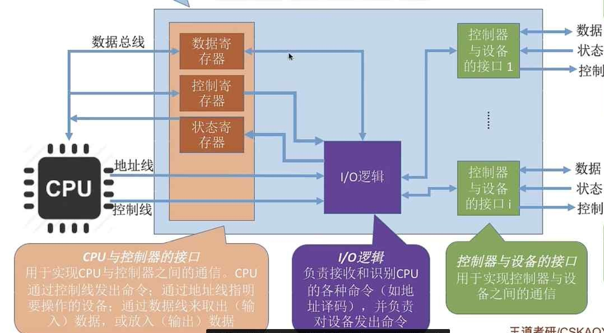

---
{
  "id": "3775a2dd-8276-8021-9beb-e192807f897c",
  "url": "https://app.notion.com/p/5-1-2-I-O-3775a2dd827680219bebe192807f897c",
  "created_time": "2026-06-06T13:21:00.000Z",
  "last_edited_time": "2026-06-06T13:45:00.000Z"
}
---

#  5.1.2 I/O控制器

CPU无法直接控制I/O设备，而是靠控制I/O控制器来间接控制设备
I/O控制器是I/O设备的MCU
# I/O控制器功能
- 接收并识别CPU命令
- 向CPU报告设备状态
- 数据交换
- 地址识别
PS：I/O控制器就是个MCU，CPU是它上位机
# I/O设备的组成
- I/O逻辑
- CPU接口
- 设备接口

PS：
一个控制器可能对应多个设备
内存映像I/O：控制器没有寄存器，要借用内存地址存放控制信息，和内存地址统一（不用专用指令）
寄存器独立编址：控制器有寄存器，不用借内存，地址不和内存统一（需要专用指令）
