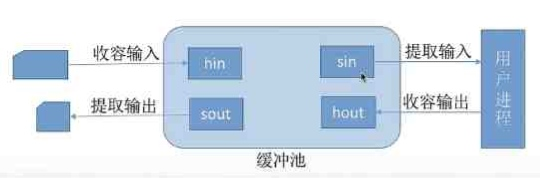

---
{
  "id": "3785a2dd-8276-8025-9e79-e41d33856af9",
  "url": "https://app.notion.com/p/5-2-4-3785a2dd827680259e79e41d33856af9",
  "created_time": "2026-06-07T09:47:00.000Z",
  "last_edited_time": "2026-06-07T10:21:00.000Z"
}
---

#  5.2.4缓冲区管理

缓冲区可以用内存（成本低），也可以使用专业寄存器（性能高）
本节以内存为例介绍
# 缓冲区作用
- 缓和CPU与io设备速度不匹配问题
- 减少对CPU的中断
- 解决数据粒度不匹配（块↔字）
- 提高CPU与io设备并行性
# 单缓冲
只有一个缓冲区

工作原理：
```plain text
输入设备 → 缓冲区 →工作区→ CPU
```
PS：缓冲区必须整体操作（要么整体取出，要么一次性存入）

单缓冲一块数据处理平均耗时：
$$
MAX（C，T）+M
$$
MAX（C，T）的意思是C，T中取大值
T：输入缓冲区时间
M：缓冲区传送到工作区时间
C：CPU处理时间
# 双缓冲
有两个缓冲区

工作原理：
```plain text
输入设备 → 缓冲区1 →工作区→ CPU
       ↘ 缓冲区2 ↗
```
PS：缓冲区必须整体操作（要么整体取出，要么一次性存入）

双缓冲一块数据处理平均耗时：
$$
MAX（T，C+M）
$$
MAX(C，T)的意思是C+M，T中取大值
T：输入缓冲区时间
M：缓冲区传送到工作区时间
C：CPU处理时间
# 使用单/双缓冲区通信的区别
单缓冲区：单工通信
双缓冲区：双工通信
# 循环缓冲区
将多个大小相等的缓冲区链接成循环队列
# 缓冲池
缓冲池由系统中共用缓冲区组成
### 根据使用情况分
- 空缓冲队列
- 装满输入数据的缓冲队列（输入队列）
- 装满输出数据的缓冲队列（输出队列）
### 根据功能分
- 收容输入数据的工作缓冲区
- 提取输入数据的工作缓冲区
- 收容输出数据的工作缓冲区
- 提取输出数据的工作缓冲区

