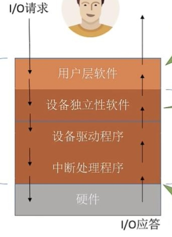
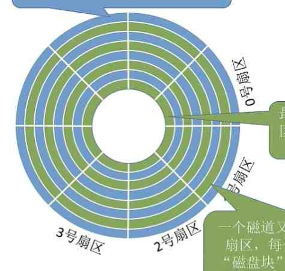
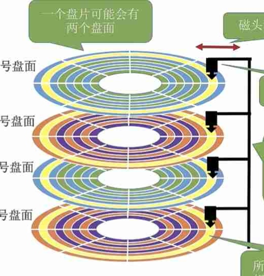

---
{
  "id": "3775a2dd-8276-80e5-a8d6-c4deab1024da",
  "url": "https://app.notion.com/p/3775a2dd827680e5a8d6c4deab1024da",
  "created_time": "2026-06-06T13:14:00.000Z",
  "last_edited_time": "2026-06-27T01:53:00.000Z"
}
---

#  第五章


[5.1.1 I/O设备的分类](511-io设备的分类/index.md)
  # 按使用特性分
  人机交互设备
  存储设备
  网络通信设备
  # 按传输速率分
  高速设备
  中速设备
  低速设备
  # 按信息交换单位分
  块设备（传输块，可寻址）
  字符设备（传输慢，不可寻址，采用中断驱动）
[5.1.2 I/O控制器](512-io控制器/index.md)
  CPU无法直接控制I/O设备，而是靠控制I/O控制器来间接控制设备
  I/O控制器是I/O设备的MCU
  # I/O控制器功能
  - 接收并识别CPU命令
  - 向CPU报告设备状态
  - 数据交换
  - 地址识别
  PS：I/O控制器就是个MCU，CPU是它上位机
  # I/O设备的组成
  - I/O逻辑
  - CPU接口
  - 设备接口
  
  PS：
  一个控制器可能对应多个设备
  内存映像I/O：控制器没有寄存器，要借用内存地址存放控制信息，和内存地址统一（不用专用指令）
  寄存器独立编址：控制器有寄存器，不用借内存，地址不和内存统一（需要专用指令）
[5.1.3 I/O控制方式](513-io控制方式/index.md)
  # 程序直接控制
  **由CPU直接发出指令控制，io期间CPU轮询等待，数据经CPU中转**

  数据流向：
  ```javascript
读：I/O设备→CPU→内存
写：内存→CPU→I/O设备
  ```
  传输单位：
  每次读写一个字长的数据（字长与ALU位宽，通用寄存器宽度）
  CPU参与频率：
  高，等待I/O时，CPU会不断轮询忙等待，开始结束都需要CPU发送指令

  优点：逻辑简单
  缺点：CPU忙等待，浪费资源
  # 中断驱动方式
  **由CPU直接发出指令控制，io期间，CPU通过中断切换到其他任务，不会轮询等待，数据经CPU中转**

  数据流向：
  ```javascript
读：I/O设备→CPU→内存
写：内存→CPU→I/O设备
  ```
  数据传输单位：
  每次读写一个字长的数据
  CPU参与率：
  中等，开始结束需要发送指令，io时不用等待

  优点：
  CPU不用忙等，CPU利用率提高
  缺点：
  每次只能传输一个字长，太慢
  数据要经CPU中转，浪费CPU资源
  # DMA方式（直接存储器存取）
  按块存取，数据不经CPU中转，CPU只再开始结束给DMA控制器发送指令

  数据流向：
  ```plain text
读：I/O设备→内存
写：内存→I/O设备
  ```
  数据传输单位：
  一次读写一个/多个连续块
  CPU参与频率：
  低，仅开始结束发送命令

  优点：传输效率高，不用让CPU中转
  缺点：
  一次只能读取整个块
  读多个块时，多个块要连续
  ### DMA控制器：
  

  DR：数据寄存器，暂存读写的数据
  MAR：内存地址寄存器，存放读写的内存地址
  DC：数据计数器，表示剩余要读/写字节数
  CR：命令/状态寄存器，存放CPU命令/设备状态
  # 通道控制方式
  CPU可以一次发出多个io命令，这些命令交给通道执行，通道会依次处理这些任务，完成后向CPU发送中断信号
  数据流向：
  ```plain text
读：io设备→内存
写：内存→io设备
  ```
  数据传输单位：
  一组块
  CPU参与率：
  极低，CPU发送批量任务，具体由通道完成
[5.1.1 I/O软件层次](511-io软件层次/index.md)
  # 总览
  
  # 用户层软件
  向上：提供库函数（io操作接口）
  向下：调用系统调用
  # 设备独立性软件
  向上：提供系统调用
  向下：调用驱动程序
  功能：
  - 设备保护
  - 差错处理
  - 设备分配/回收
  - 数据缓冲区管理
  - 建立逻辑设备名到物理设备名的映射关系（用逻辑设备表“LUT表”）
  PS：逻辑设备表
  可以只设一张：单用户操作系统
  也可以给每个用户设一张：多用户操作系统
  # 设备驱动程序
  由设备生产厂家提供
  用于屏蔽硬件差异
  # 中断处理程序
  再中断后决定如何处理，调用谁
[5.2.1 I/O核心子系统](521-io核心子系统/index.md)
  - 设备独立性软件
  - 设备驱动程序
  - 中断处理程序
  三者共同构成了 I/O核心子系统
  # 设备独立性软件层
  这层有两个功能
  - io调度：用某种算法确定io顺序
  - 设备保护：控制不同用户对设备的访问权限
  # 
PS
  更多再后面章节介绍
[5.2.2 假脱机技术](522-假脱机技术/index.md)
  # 什么是脱机技术
  脱机技术：脱离主机进行输入输出
  背景：早期电脑io速度慢（纸带机io），为了加速io，会先用纸带机读取到磁带中，主机再从磁带中读取
  核心思想：利用高速缓冲来提高慢速设备性能
  # 假脱机技术 SPOOLing
  
  就这↑
[5.2.3设备分配与回收](523设备分配与回收/index.md)
  # 设备分配时考虑因素
  ### 设备固有属性
  - 独占设备
  - 共享设备
  - 虚拟设备

  ### 设备分配算法
  - 先来先服务
  - 优先级
  - 短任务优先
  - …
  ### 设备分配中安全性
  - 安全分配方式：为进程分配一个设备后就将其阻塞（不会死锁）
  - 不安全分配方式：进程可被分配多个设备，当某个请求无法满足时才阻塞
    
  # 分配方式
  - 静态分配：进程运行前分配所需资源，运行时不再分配
  - 动态分配：进程运行中可申请资源
  

  # 设备管理中的数据结构
  ### 设备控制表（DCT）：
  记录
  - 设备类型，
  - 设备标识符，
  - 设备状态，
  - 指向控制器表的指针，
  - 重复执行次数/时间，
  - 设备队列队首指针
  ### 控制器控制表（COCT）：
  记录
  - 控制器标识符，
  - 控制器状态，
  - 指向通道表的指针，
  - 控制器队列队首指针，
  - 控制器队列队尾指针
  ### 通道控制表（CHCT）：
  记录
  - 通道标识符，
  - 通道状态，
  - 与通道连接的控制器表首地址，
  - 通道队列队首地址，通道队列队尾地址
  ### 系统设备表（SDT）：
  - 记录系统全部设备情况，
  PS：每个设备对应一个表目
  **表目内容↓**
  - 设备类型，
  - 设备标识符，
  - DCT，
  - 驱动程序入口
  # 设备分配的步骤
  1. 根据物理设备名（设备标识符）查找SDT
  1. 根据SDT找到DCT，若设备正忙，则将进程PCB挂到设备等待队列，不忙将设备分配给进程
  1. 根据DCT找到COCT，若控制器正忙，则将进程PCB挂到控制器等待队列，不忙将控制器分配给进程
  1. 根据COCT找到CHCT，若通道正忙，则将进程PCB挂到通道等待队列，不忙则将通道分配给进程
  流程图↓
  ```plain text
设备
↓
控制器
↓
通道
  ```
  Q：为什么是反着分配？
  A：这样如果发生死锁，系统可以解除，如果是一级一级分配，各级只能看到自己的，系统就需要更复杂的机制才能解除死锁
  缺点：
  - 用户必须使用设备标识符，改变设备就无法运行，编程复杂
  - 设备忙则会阻塞进程
  # 设备分配步骤改进
  在STD的表目中增加逻辑设备名
  将访问过的设备写进逻辑设备表（LUT）中
[5.2.4缓冲区管理](524缓冲区管理/index.md)
  缓冲区可以用内存（成本低），也可以使用专业寄存器（性能高）
  本节以内存为例介绍
  # 缓冲区作用
  - 缓和CPU与io设备速度不匹配问题
  - 减少对CPU的中断
  - 解决数据粒度不匹配（块↔字）
  - 提高CPU与io设备并行性
  # 单缓冲
  只有一个缓冲区

  工作原理：
  ```plain text
输入设备 → 缓冲区 →工作区→ CPU
  ```
  PS：缓冲区必须整体操作（要么整体取出，要么一次性存入）

  单缓冲一块数据处理平均耗时：
  $$
MAX（C，T）+M
$$
  MAX（C，T）的意思是C，T中取大值
  T：输入缓冲区时间
  M：缓冲区传送到工作区时间
  C：CPU处理时间
  # 双缓冲
  有两个缓冲区

  工作原理：
  ```plain text
输入设备 → 缓冲区1 →工作区→ CPU
       ↘ 缓冲区2 ↗
  ```
  PS：缓冲区必须整体操作（要么整体取出，要么一次性存入）

  双缓冲一块数据处理平均耗时：
  $$
MAX（T，C+M）
$$
  MAX(C，T)的意思是C+M，T中取大值
T：输入缓冲区时间
M：缓冲区传送到工作区时间
C：CPU处理时间
  # 使用单/双缓冲区通信的区别
  单缓冲区：单工通信
  双缓冲区：双工通信
  # 循环缓冲区
  将多个大小相等的缓冲区链接成循环队列
  # 缓冲池
  缓冲池由系统中共用缓冲区组成
  ### 根据使用情况分
  - 空缓冲队列
  - 装满输入数据的缓冲队列（输入队列）
  - 装满输出数据的缓冲队列（输出队列）
  ### 根据功能分
  - 收容输入数据的工作缓冲区
  - 提取输入数据的工作缓冲区
  - 收容输出数据的工作缓冲区
  - 提取输出数据的工作缓冲区
  
[5.3.1 磁盘结构HDD](531-磁盘结构hdd/index.md)
  # 磁盘，扇区，磁道
  - 磁盘盘面会分为一个个同心的圈，一圈就是一个磁道
  - 一个磁道又会被划分成多个扇区，每个扇区就是一个磁盘块，各扇区容量相同
  PS：最内侧的扇区数据密度最大
  
  # 盘片，柱面
  - 一个磁盘可能有多个盘片，用盘面号标记
  - 柱面：所有盘面中相对位置相同的磁道组成柱面
  - 读写只需要（柱面号，盘面号，扇区号）即可
  
  # 磁盘分类
  ### 按磁头能否移动分类
  - 活动头磁盘（一个磁头）
  - 固定头磁盘（多个磁头）
  ### 按能否换盘片
  - 可换盘磁盘
  - 固定盘磁盘
[5.3.2磁盘调度算法](532磁盘调度算法/index.md)
  # 一次读写时间
    - 寻道时间：
    T_s=S+m×n
    S启动磁头臂时间
    m跨越一个磁道时间
    n跨越磁道数

    - 延迟时间：
    T_R=（1/2）*（1/r）=1/（2r）
    r转速

    - 传输时间：
    T_t=（1/r）*（b/N）=b/（rN）
    r转速
    b待读写字节数
    N每个磁道上字节数

    - 总时间
    T_a=T_s+T_R+T_t


    PS：
    操作系统只能影响寻道时间
  # 调度算法
  调度算法是用于减少寻道时间的
  寻道时间：启动磁臂，磁头移动的时间
  ### 先来先服务
  按io发起先后顺序调度磁头
  优点：公平
  缺点：对应大量进程性能不佳
  ### 最短寻找时间优先
  优先寻找离当前磁头位置最近的磁道
  优点：性能好
  缺点：可能饥饿
  ### 扫描算法
  只有磁头移动到最外/最里时才能改变移动方向
  优点：不会饥饿，性能较好
  缺点：
  到达最边上才能改变方向
  对各位置响应不平均（边上的连续访问两次间隔要么太短要么太长）
  ### LOOK算法
  磁头移动到最外/最里时才能改变移动方向，如果移动方向上没有需要访问的磁道，则可以立即改变方向
  优点：解决了扫描算法的第一个缺点
  ### 循环扫描算法
  磁头只向单个方向移动，到头后直接移回起始位置
  优点：解决了扫描算法响应不平均的问题
  缺点：每次都要回到初始位置（即使初始位置不需要访问）
  ### C-LOOK算法
  磁头单向移动，如果移动方向上没有要访问的磁道，则立即返回到第一个需要访问的磁道
[5.3.3减少磁盘延迟方法](533减少磁盘延迟方法/index.md)
  本节研究如何减少磁盘延迟时间
  磁盘延迟：磁头就绪后，将目标扇区转到磁头下的时间
  # 方法
  ### 交替编号
  由于磁盘读完一个块不能立即读下一个块（需要处理）
  因此
  让逻辑上连续的块在物理上有一定间隔
  ### 磁盘地址结构的设计
  磁盘的物理地址是（最优）
  （柱面号，盘面号，扇区号）
  而不是其他顺序，如
  （盘面号，柱面号，扇区号）
  ### 错位命名
  由于磁盘读完一个块不能立即读下一个块（需要处理）
  因此
  上下两个盘片的扇区号要错位命名
[5.3.4磁盘管理](534磁盘管理/index.md)
  # 磁盘初始化
  出厂时磁盘只有磁道，因此需要格式化
  1. 首先是低级格式化，它有以下功能
  - 扇区划分
  扇区组成部分
  - 头
  - 数据区
  - 尾
  其中头尾用来存放管理扇区的数据结构

  1. 然后是分卷（分盘符）
  1. 最后是逻辑格式（高级格式化）它会↓
  - 创建文件系统根目录
  - 初始化存储空间管理所用的数据结构（位示图，空闲分区表）
  # 引导块
  自举程序：计算机开机执行的初始化程序（最早是放在只读存储器中，但现代计算机放在磁盘中，只在ROM中放一个自举装入程序）
  引导块：存放自举程序
  启动盘，系统盘：有引导块的磁盘
  # 坏块管理
  简单磁盘：
  会在在逻辑格式化时，检查坏块，并在分区表中标记（对系统不透明）
  复杂磁盘：
  磁盘控制器会维护一个坏块链表（对系统透明）
[5.3.5固态硬盘](535固态硬盘/index.md)
  # 固态硬盘结构
  
  - 固态硬盘按整页读写
  - SSD的页对应HDD的块/扇区
  - SSD的块对应HDD的磁道
  - 闪存翻译层：将逻辑块号翻译成页
  - 存储介质：闪存芯片
  # 读写特性：
  

  - 随机访问支持好
  - 以页为单位读写
  - 以块为单位擦除（NAND盘）
  - 读快，写慢
  # 与HDD相比
  - HDD擦写几乎没有寿命
  - SSD擦写有次数限制
  - SSD安静，抗震
  - HDD有噪音，不抗震
  # 磨损均衡
  - 动态磨损均衡
  - 静态磨损均衡
