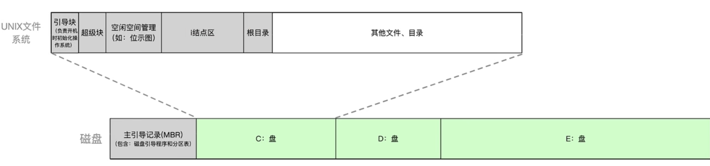

---
{
  "id": "3775a2dd-8276-8037-a216-d3330d21a4ce",
  "url": "https://app.notion.com/p/4-3-2-3775a2dd82768037a216d3330d21a4ce",
  "created_time": "2026-06-06T12:13:00.000Z",
  "last_edited_time": "2026-06-06T12:43:00.000Z"
}
---

#  4.3.2文件系统布局

# 在外存中的结构
  如图↓
  
  全新磁盘的初始化过程↓
  ### 1. 低级格式化（物理格式化）
  - 划分扇区
  - 检查各扇区好坏
  - 屏蔽坏扇区，并用备用扇区替换
  ### 2. 高级格式化（逻辑格式化）
  - 分区（分卷/分盘符）
  - 将分区信息记录到一个特殊的分区：主引导记录中（包含引导程序和分区表）
  - 初始化各分区：写引导块，超级块，空闲空间管理，i结点区（顺序存放索引节点），根目录
# 在内存中结构
如图↓

工作流程↓
1. 将目录从外存读入内存作为缓存（首次打开）
1. 找到索引节点并查找文件FCB，复制到系统打开文件表，等待进程调用
1. 进程在“进程打开文件表”中新建一个条目，并返回文件描述符（指向“进程打开文件表”的指针）
PS：“进程打开文件表”是指向系统打开文件表的
