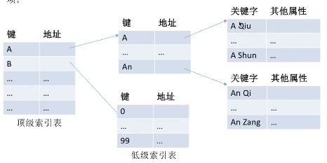
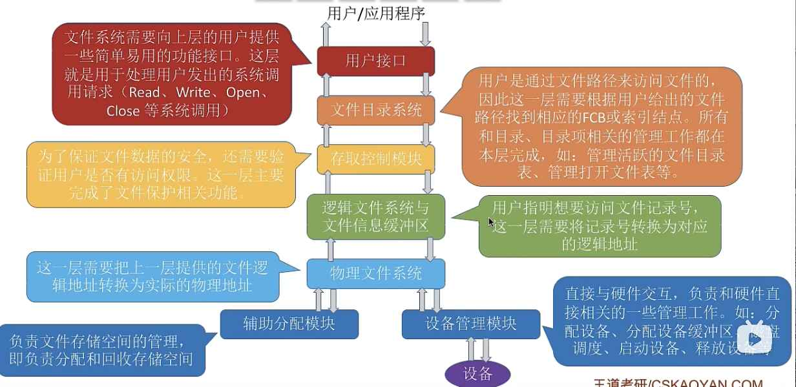
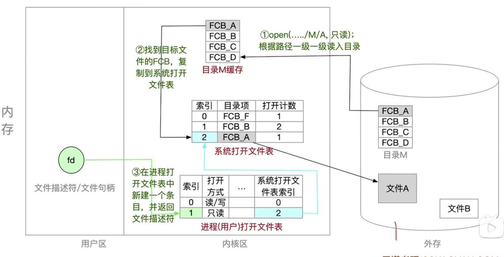
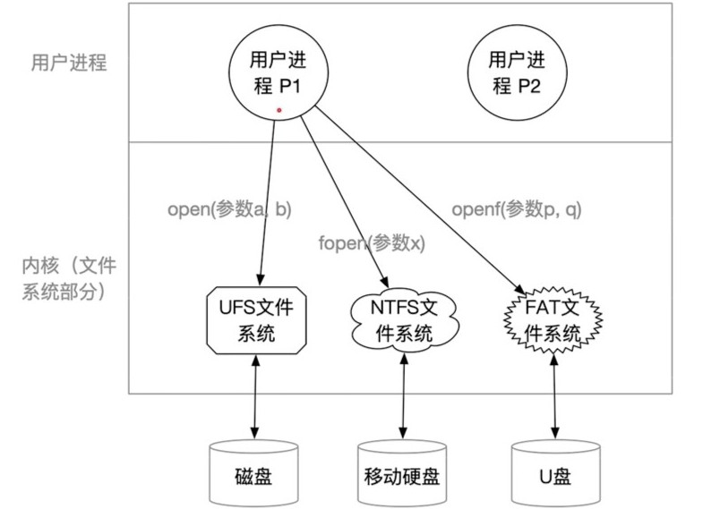
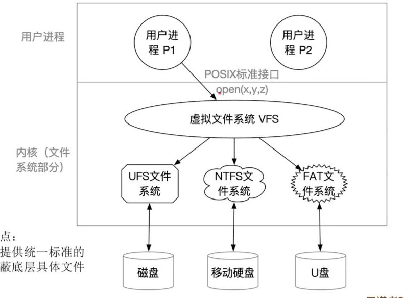

---
{
  "id": "3745a2dd-8276-8089-8e9e-fe7badaf86dc",
  "url": "https://app.notion.com/p/3745a2dd827680898e9efe7badaf86dc",
  "created_time": "2026-06-03T09:39:00.000Z",
  "last_edited_time": "2026-06-06T12:43:00.000Z"
}
---

#  第四章

[4.1.1文件管理](411文件管理/index.md)
  # 文件属性
  - 文件名
  - 标识符：系统给文件的唯一标识
  - 文件类型
  - 文件位置：包括路径和地址
  - 大小
  - 保护信息
  # 文件逻辑结构
  - 有结构文件：有一定结构如mp4
  - 无结构文件：二进制或字符流
  # 文件系统对上层提供什么功能
  - 创建文件
  - 读文件
  - 写文件
  - 删除文件
  - 打开文件
  - 关闭文件
  # 文件如何存储
  - 与内存相似，外存也被分为一个个块
  - 每块包含2的整数幂个地址
  - 同样的，文件系统也分逻辑逻辑地址和物理地址（块内地址），一样需要地址转换
  - 文件系统以块为单位进行操作（防止元数据过大）
  # 其他文件管理功能
  - 文件保护
  - 文件共享
[4.1.2文件逻辑结构](412文件逻辑结构/index.md)
  # 分类
    ## 无结构文件
    内部就是字符流/二进制
    ## 有结构文件
    - 由一系列记录组成
    - 每条记录包含若干数据项
    - 每条记录有一个数据项作为关键字
    - 根据记录长度是否可变分为：定长记录，可变长记录
  # 有结构文件的逻辑结构
  ### 顺序文件
  文件中的记录顺序排列（逻辑上），记录可以是定长或变长，各记录在物理上可以顺序存储也可以链式存储
  

  - 串结构：按时间先后存储
  - 顺序结构：按记录的关键字顺序排列
  ### 索引文件
  逻辑：
  ```plain text
FCB→硬盘索引块→硬盘数据块
  ```
  想要获取顺序文件中的某个内容就得遍历前面的内容，非常低效
  因此我们以数据某种特征建立一张索引表，在查找时只需要遍历索引表即可
  通过索引表查找的文件叫索引文件
  ### 索引顺序文件
  不再是给一个记录做一个索引表，而是类似数据库，将所有记录放到一张表里
  ### 多级索引顺序文件
  逻辑：
  

  索引顺序文件的查询效率依旧不高，因此发明了多级索引文件
  通过分级查找来提高性能
[4.1.3文件目录](413文件目录/index.md)
  # 文件控制块FCB
    和进程PCB类似，每个文件都都有自己的FCB
    FCB中的内容：
    - 文件的基本信息（文件名，物理地址，逻辑结构等）
    - 存取控制信息（读写权限，所属用户）
    - 使用信息（创建时间，修改时间）
  # 文件目录
    > 这东西就是FCB快查表（仅供理解） 🤓👆
    - 文件目录是对应文件夹FCB的集合（逻辑上）
    - 文件目录也是一个真实文件（只不过是隐藏的）
    - 实际上文件目录里只有文件名+索引号（为了提高性能）
    - 每个文件夹对应一个文件目录
  # 索引节点inode
    为了减小文件索引大小，提高查找效率，系统将除了文件名以外的所有信息都放到索引节点中
    > 这东西就是文件目录DLC🤓👆
    - 每个文件对应一个索引节点
    - 目录项中只包含文件名和索引指针
    - 索引节点也是一个真实的文件
  # 目录结构
    ### 单级目录结构
    单级目录就是只有文件系统只有一级，因此不能重名
    ### 两级目录结构
    将不同用户分为不同的目录，各用户目录下采用单级目录结构
    - 两级目录实现了访问限制
    - 允许不同用户拥有重名文件
    ### 多级目录结构
    又叫数形目录结构
    就是将单级目录层层套娃
    优点：
    - 可以对文件进行分类
    - 可以使用相对路径
    - 不同路径下可以重名
    缺点：
    - 不便于文件共享
    ### 无环图目录结构
    在多级目录基础上，允许不同文件名指向同一个文件
    删除：删除时并非直接删除文件，而是删除该处的FCB，并使共享文件的共享计数器-1（直到为0，才会被删除）
[4.1.4文件的物理结构](414文件的物理结构/index.md)
  与内存管理相同，外存管理也将外存分为了大小相同的块
  # 连续分配
    将文件放在连续的物理块上
    实现：
    在FCB中记录起始起始块号，物理块号=起始块号+逻辑块号
    优点：
    - 连续分配**支持随机访问**和顺序访问
    （由于起始块号可以直接查到，因此可以直接计算物理块号）
    - 由于在磁盘上连续，因此读写最快
    缺点：
    - 拓展不便（磁盘不一定有连续的块）
    - 无法利用磁盘碎片（磁盘不一定有足够大小的连续的块）
  # 链接分配
    ### 隐式链接
    文件不存放在连续的块上
    实现：
    在FCB中记录起始块（物理）和结束块（物理），每个块末尾有下一个块的指针
    优点：
    - 不会有碎片问题（外部碎片）
    缺点：
    - 不支持随机访问
    - 每个块包含下一个块的指针，占用一定空间
    ### 显式链接
    文件不存放在连续的块上
    实现：
    在FCB中只需记录一个文件的起始块号，另外使用一张表记录物理块顺序链（FAT表）
    - 一个磁盘对应一个FAT表
    - FAT表开机即被放入内存并常驻内存

    优点：
    - 没有碎片问题（外部碎片）
    - 支持随机访问
    - 访问速度快
    缺点：
    - FAT表需要占用一定空间
    - 所有文件共用一个FAT表，查询较慢
  # 索引分配
  文件不存放在连续的块上
  实现：
  系统会为每个文件建立一张索引表（记录逻辑块与物理块的对应关系），FCB中需要记录索引块的地址
  - 索引表存放的块叫索引块
  - 文件数据存放的块叫数据块
  优点：
  - 方便拓展
  - 支持随机访问
  缺点：
  - 索引块要占用空间
  ### 索引表过大（超过一个块）解决方案
  1. 链接方案：分配多个索引块，并链接起来，FCB中只需记录第一个索引块
  缺点：若要查后面的索引块，则需要遍历前面所有，效率低

  1. 多层索引：每层对应一段逻辑地址区间，直到最后一层
  缺点：对小文件来说反而降低了性能

  1. 混合索引：文件的顶级索引表即包含直接索引，也包含多层索引

  # 重点：
  - 根据索引计算文件最大支持大小
  - 分析访问某数据需io次数（将FCB读入内存那次不算）
[4.1.6存储空间管理](416存储空间管理/index.md)
  # 存储空间划分和初始化
  ### 存储空间划分：
  - 将物理磁盘划分为逻辑卷（逻辑盘，文件卷）
  - 有的系统支持将多个物理磁盘划分成一个卷（RAID阵列）
  ### 存储空间初始化：
  - 将文件卷（逻辑卷）再分为目录区和文件区两部分
  - 文件区存放：文件数据
  - 目录区存放：FCB，磁盘管理信息
  # 存储空间管理
  ### 空闲表法
  维护一张空闲表，它记录空闲块起始块号和连续块数
  分配算法：
  首次适应，最佳适应，最坏适应
  回收策略：
  当两个空闲区连续时，要合并
  ### 空闲链表法
  1. 空闲盘块链：将空闲的盘块组成链表
  操作系统保存链头，链尾指针
  分配：从链头取出
  回收：从链尾放入

  1. 空闲盘区链：将空闲的盘区组成链表（盘区：记录第一个盘块，盘区长度，下一盘区指针）
  操作系统保存链头，链尾指针
  分配：使用首次适应，最佳适应，最坏适应算法找到空闲盘区，找不到就分配多个空闲盘区
  回收：如果与空闲盘区相邻，则合并，不相邻，则挂到链尾
  ### 位示图法
  将所有块的使用状态用0/1表示
  通常把位示图按行存放
  
  设：
每行有 n 位
第 i 行第 j 列
则对应的盘块号：
  $$
b=i×n+j
$$
  反过来由盘块推行（位号）列（字号）
  字号：i=b/n（取整）
  位号：j=b%n

  **分配：**
  顺序扫描位示图，找0，并算出盘块号，分配，改为1
  **回收：**
  顺序扫描位示图，找1，并算出行列，回收，改为0
  ### 成组链接法
  对于大型系统，空闲表（链表）可能会过大，因此不适用
  在文件卷的目录区中专门用一个磁盘块作为超级块，系统启动时读入内存
  > 把大量空闲块分成若干组，每组记录下一批空闲盘块号（在栈底那个块）；内存中只保存当前正在使用的一组（超级块），像栈一样进行分配和回收
[4.1.7文件基本操作](417文件基本操作/index.md)
  # 创建文件
  Create系统调用参数：
  - 大小
  - 路径
  - 文件名
  步骤
  ```plain text
用户请求创建文件
      ↓
检查目录中是否重名
      ↓
申请FCB(inode)
      ↓
在目录中建立目录项
      ↓
必要时申请数据块
      ↓
写回磁盘
  ```
  # 删除文件
  Delate系统调用参数：
  - 路径
  - 文件名
  步骤
  ```plain text
找到目录项
      ↓
找到FCB(inode)
      ↓
删除目录项
      ↓
检查打开计数
      ↓
回收数据块
      ↓
回收FCB
  ```
  # 打开文件
  open系统调用参数：
  - 路径
  - 文件名
  - 操作类型（读/写）
  步骤
  ```plain text
open()
   ↓
查目录
   ↓
找到FCB(inode)
   ↓
检查权限
   ↓
将FCB调入内存
   ↓
建立系统打开文件表
   ↓
建立进程打开文件表
   ↓
返回fd（文件标识符）

  ```
  **打开文件表**：
  文件打开后系统和进程都会维护一个打开文件表，用来加速文件读写
  **系统打开文件表：（整个系统共享**）
  记录↓
  - 文件本身信息
  - 打开次数（为0则销毁该条目）
  **进程打开文件表：**
  记录↓
  - 文件名
  - 读写指针
  - 指向系统打开文件表
[4.1.8文件共享](418文件共享/index.md)
  # 基于索引结点（硬链接）
  原理：文件目录中路径直接指向源文件索引节点
  索引节点：是文件目录瘦身策略。由于检索文件时只需用到文件名,因此可以将了文件名之外的其他信息放到索引结点中。这样目录项就只需要包含文件名、索引结点指针。

  - 索引结点中设置一个链接计数count,表示链接的目录数
  - 删除文件只删除该路径的条目，并将count计数-1，不删原文件
  - count计数=0时删除原文件
  # 基于符号链接（软链接）
  原理：在当前目录创建link类型文件，该文件中记录原文件路径
  特性：
  - 原文件删除，软链接（link文件）失效
[4.1.9文件保护](419文件保护/index.md)
  # 口令保护
  在FCP中保存一段口令（字符串），访问时会与用户提供的口令对比，一致则通过验证
  优点：口令保存和验证开销较小
  缺点：口令明文存储，不安全
  # 加密保护
  使用密码加密文件，访问时要求提供密码
  优点：安全性高
  缺点：加密解密有一定开销
  # 访问控制
  在FCB中添加访问控制表，该表记录了各用户的权限，访问时验证权限
  精简访问控制表：只记录用户组的权限
  优点：比较灵活，精细
[4.3.1文件系统的层次结构](431文件系统的层次结构/index.md)
  
  ```javascript
用户→用户接口→文件目录系统→
存取控制模块→逻辑文件系统与文件信息缓冲区→
物理文件系统→辅助分配模块/设备管理模块→
设备
  ```
[4.3.2文件系统布局](432文件系统布局/index.md)
  # 在外存中的结构
    如图↓
    
    全新磁盘的初始化过程↓
    ### 1. 低级格式化（物理格式化）
    - 划分扇区
    - 检查各扇区好坏
    - 屏蔽坏扇区，并用备用扇区替换
    ### 2. 高级格式化（逻辑格式化）
    - 分区（分卷/分盘符）
    - 将分区信息记录到一个特殊的分区：主引导记录中（包含引导程序和分区表）
    - 初始化各分区：写引导块，超级块，空闲空间管理，i结点区（顺序存放索引节点），根目录
  # 在内存中结构
  如图↓
  
  工作流程↓
  1. 将目录从外存读入内存作为缓存（首次打开）
  1. 找到索引节点并查找文件FCB，复制到系统打开文件表，等待进程调用
  1. 进程在“进程打开文件表”中新建一个条目，并返回文件描述符（指向“进程打开文件表”的指针）
  PS：“进程打开文件表”是指向系统打开文件表的
[4.3.4虚拟文件系统](434虚拟文件系统/index.md)
  # 普通文件系统的问题
  

  计算机上可能会拓展一些外部存储设备（如：U盘，移动硬盘），它们可能使用了不同的文件系统，由于不同的文件系统的调用函数不同，所以它们无法直接兼容

  虚拟文件系统则解决了这个问题
  # 虚拟文件系统
  虚拟文件系统下可以挂各种文件系统，并对外提供统一的接口，来实现对各文件系统的兼容
  
  - 底层的文件系统需要实现虚拟文件系统指定的函数才能被虚拟文件系统兼容
  - 虚拟文件系统会把各种文件系统不同的数据结构（inode）统一成一种格式（vnode），呈现给上层
  - vnode只存在于主存中，inode既会被调入主存，也会在外存中存储
  - 每一个被打开的文件都有一个vnode
  - vnode中有一个函数功能指针：用于指向对应文件系统的函数功能
  # 文件系统挂载
  将文件系统挂载到操作系统过程↓
  1. 在虚拟文件系统的“挂载表”中注册新挂载的文件系统
  1. 新挂载的文件系统向虚拟文件系统提供一个函数地址列表
  1. 将新文件系统挂载到挂载点
  PS：
  - “挂载表”位于内存中，记录文件系统类型，容量大小，相关信息
  - “函数地址列表”用于记录文件系统有哪些可调用函数
  - 挂载点：挂载的目录
