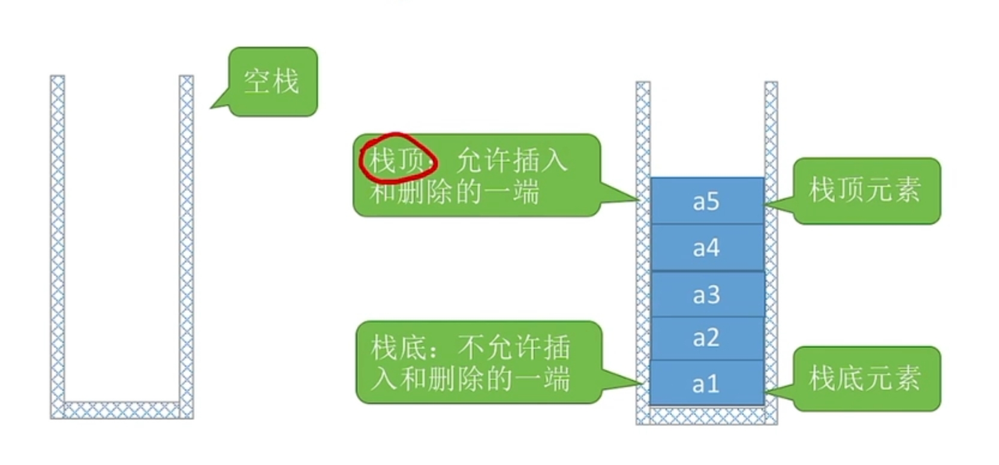

---
{
  "id": "2ca5a2dd-8276-81fa-9d0a-f715af784ea4",
  "url": "https://www.notion.so/2ca5a2dd827681fa9d0af715af784ea4",
  "created_time": "2025-12-15T12:14:00.000Z",
  "last_edited_time": "2025-12-15T13:12:00.000Z"
}
---

#  栈与队列


[栈](栈/index.md)
  # 介绍
  栈(Stack)是一种遵循后进先出(LIFO, Last In First Out)原则的线性数据结构。它就像一摞盘子,只能从顶部添加或移除元素。
  只允许在一端插入/删除/修改
  

  # 内存特点
  视情况而定：顺序栈使用数组，内存连续。链式栈用链表实现，内存不连续
  # 可访问性
  **只能访问/插入/删除栈顶**
  **不能访问中间**
  所以要操作某个指定数据，必须先将其上面数据弹出

  # 特点（人为规定）
  - 后进先出(LIFO):最后压入栈的元素最先被弹出
  - 只能在栈顶进行操作:所有的插入和删除操作都在栈顶进行
  - 访问受限:不能随机访问栈中的元素
  # 分类
  - 顺序栈:使用数组实现,容量固定或可动态扩展
  - 链式栈:使用链表实现,容量动态变化
[队列](队列/index.md)
  # 介绍
  队列(Queue)是一种先进先出(FIFO, First In First Out)的线性数据结构。它只允许在表的一端进行插入操作,而在另一端进行删除操作。
  

  # 内存特点
  视情况而定，顺序队列/循环队列用数组实现，内存连续。链式队列用链表实现，内存不连续。
  # 可访问性
  **普通队列（链式队列/顺序队列）只能在**
  **队头：删除/访问**
  **队尾：插入**
  双端队列：队头队尾都能插入/访问/删除
  **队中间不可访问**
  # 特点
  1. **先进先出**（FIFO，First In First Out）最先进入队列的元素最先被删除与栈的“后进先出”相对
  1. **操作受限：**线性表只允许在队尾插入只允许在队头删除
  1. **有两个基本指针：**队头（front）：指向可删除元素队尾（rear）：指向可插入位置
  1. **不支持随机访问**：要访问对列中某个数据，要遍历
  # 分类
  - **顺序队列**:使用**数组实现**的队列,有固定大小
  - **链式队列:**使用**链表实现**的队列,大小动态变化
  - **循环队列**:用**数组实现**的队列，**顺序队列的改进**,解决"假溢出"问题
  - **双端队列**：用**双向链表**或**数组**实现，两端都能删除/插入/访问，但中间依旧不能访问
  


  注意⚠️：多数人会误会的点：普通队列从头取，但与直觉不同的是，**队列不会自动往前**，会出现假溢出，循环队列解决了这个问题
  # 常见问题
  队头指针：指示队头的位置
  队尾指针：指示队尾的下一个位置
  队头队尾指针共用一套编号系统，也就是
  判空：队头指针==队尾指针
  判满（非循环队列）：队尾指针==队列容量
  判满（循环队列）：浪费一个单元
  ```plain text
(rear + 1) % MaxSize == front
  ```
  %maxsize是为了让前面的结果为正
栈的初始化，进栈，出栈，销毁，读栈顶元素，判空没看
栈在括号匹配中/求值中/递归中的应用，
队列的应用
