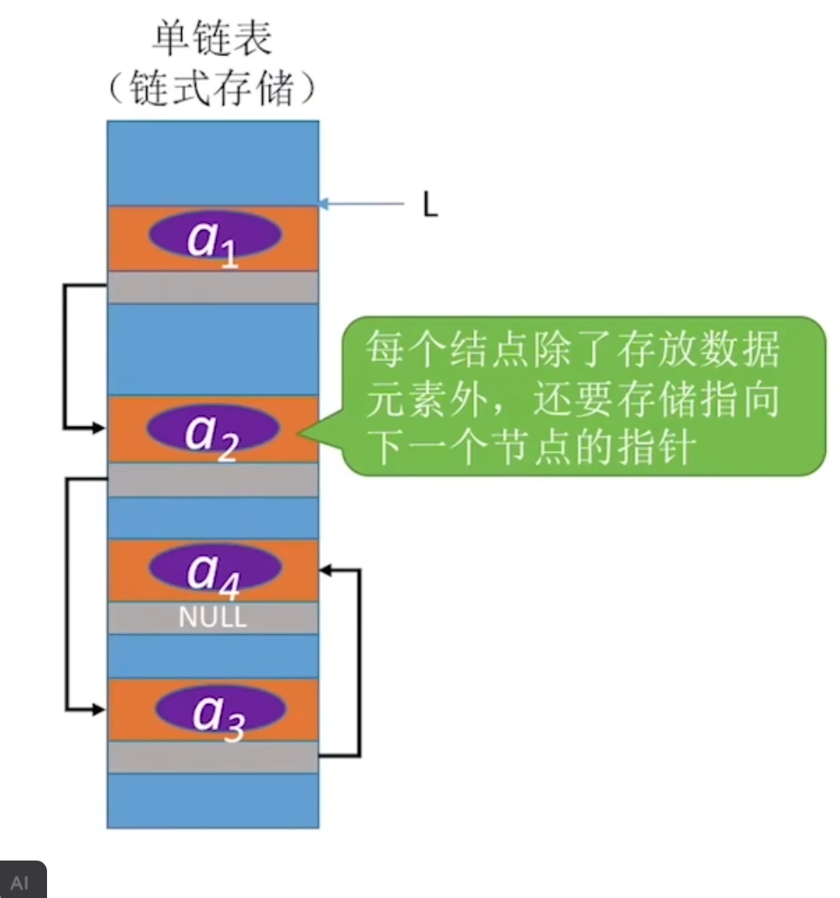
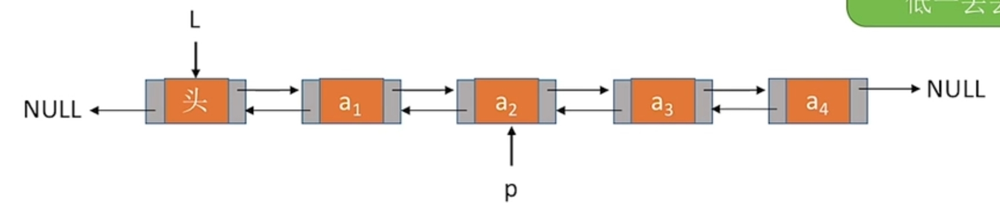
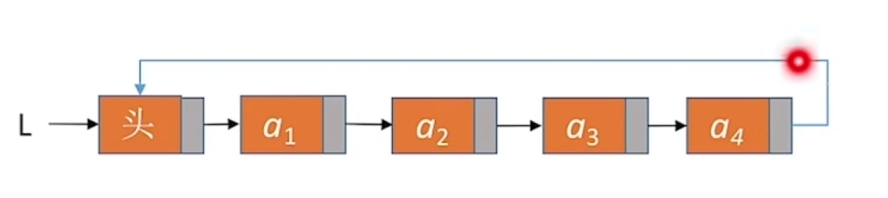

---
{
  "id": "2c95a2dd-8276-81ac-90c3-de0f99b56e4f",
  "url": "https://www.notion.so/2c95a2dd827681ac90c3de0f99b56e4f",
  "created_time": "2025-12-14T08:50:00.000Z",
  "last_edited_time": "2025-12-15T13:10:00.000Z"
}
---

#  线性表

[顺序表](顺序表/index.md)
  # 描述
    顺序表是一种线性数据结构,它使用一组连续的内存空间来存储数据元素。在顺序表中,元素按照逻辑顺序依次存放,每个元素的位置由其下标(索引)确定。这种存储方式使得顺序表可以实现快速的随机访问,时间复杂度为O(1)。
    **顺序表 = 用一段连续的内存顺序存放数据的线性表。**

    
    （以上图为内存结构）
  # 内存特点
  连续的内存
  # 节点结构
  只有数据
  # 特点
    - **随机访问效率高:**可以通过下标直接访问任意元素,时间复杂度为O(1)
    - **存储密度高:**不需要额外的空间存储元素之间的逻辑关系
    - **插入删除效率低:**在中间位置插入或删除元素时,需要移动其后面大量元素,时间复杂度为O(n)
    - **空间固定:**需要预先分配固定大小的连续内存空间,可能造成空间浪费或溢出
    - **内存连续**
  # 顺序表有两类
    ## 静态分配的顺序表
    **用数组实现**，长度固定
    ## 动态分配的顺序表
    **用malloc函数申请内存空间，用指针访问，修改，删除，添加，**长度可扩展
  # 适用场景
  频繁读取/修改
  不经常插入删除（慢）

  定义+初始化
    ## 顺序表的实现——静态分配
      使用静态数组（固定大小的数组）叫静态分配
      ### 定义顺序表结构（结构体）
      ```c
#include <stdio.h>
#include <stdlib.h>
#define MAX_SIZE 100 // 定义顺序表大小
typedef struct {
   int data[MAX_SIZE]; // 用数组存数据
   int length; // 顺序表当前长度
} SeqList;
      ```
      **速记：**
      **用结构体打包一个数组（存数据），一个变量（存顺序表当前长度）**

      ### 初始化顺序表（函数）
      - 需要将length变量（顺序表长度）赋为0
      - 需要将数组中的每个元素赋值为0（内存中有脏数据）（用一个for循环实现）
      ```c
void InitList (SeqList){
  for (int i=0; i<MaxSize; i++)
    L.data=0;
  L.length=0;
}
      ```
      速记：
      这是一个函数，执行：遍历数组并赋0，记录顺序表长度的变量赋0。
      ### 主函数
      ```c
int main(){
  SeqList L; //声明一个顺序表
  InitList(L); //初始化顺序表
  //...后续操作
  return 0;
}
      ```
[单链表](单链表/index.md)
  # 描述
  单链表由一系列节点组成,每个节点包含数据域和指向下一个节点的指针域。链表中的节点在内存中不必连续存储,通过指针将各个节点串联起来。

  
  （以上图为内存结构）
  # 内存特点
  不连续的内存
  # 节点结构
  数据+下一个节点的指针
  # 特点
  - **无需连续内存**: 链表的大小可以动态调整,无需预先分配固定的内存空间
  - **插入删除高效**: 插入删除只需要修改指针
  - **访问效率低**: 不支持随机访问,查找特定元素需要从头节点开始遍历,时间复杂度为O(n)
  - 只能单向查找
  # 分类
  ### 按有无头节点分：
  **带头节点的单链表**
  带头节点的单链表在链表的开始位置增加了一个不存储有效数据的头节点,头节点的指针域指向第一个实际存储数据的节点。
  **好处**：
  - 第一个节点不需要特殊处理
  **不带头结点的单链表**
  不带头节点的单链表直接从第一个存储有效数据的节点开始,没有额外的头节点。
  **坏处**：
  - 修改第一个节点需要修改整个链表的指针（整个链表的指针就是指向第一个节点的指针）
  ### 按循环与否分：
  **循环单链表**
  循环单链表的最后一个节点的指针域不指向NULL,而是指向头节点(或第一个节点),形成一个环形结构。这样可以从任意节点出发遍历整个链表。
  **非循环单链表**
  非循环单链表的最后一个节点的指针域指向NULL,表示链表的结束。这是最常见的单链表形式。
[双链表](双链表/index.md)
  # 描述
  双链表每个节点包含三个部分:数据域、指向前一个节点的指针和指向后一个节点的指针。与单链表相比,双链表可以双向遍历,既能向前访问也能向后访问。
  
  # 内存特点
  不连续的内存
  # 节点结构
  上一个节点指针 + 数据 + 下一个节点指针
  # 特点
  - 可以双向遍历,提高了查找效率
  - 在已知某个结点的情况下，删除该结点不需要遍历找到其前驱，插入结点时，能直接同时调整前后指针
  - 占用更多内存空间,因为每个节点需要两个指针域
  # 分类
  按循环与否分：
  - 循环双链表:首尾相连,头节点的前驱指向尾节点,尾节点的后继指向头节点
  - 非循环双链表:头节点的前驱和尾节点的后继均为空指针
  按有无头节点分：
  - 带头节点的双链表:有一个不存储有效数据的头节点,便于统一处理插入和删除操作
  - 不带头节点的双链表:第一个节点即存储有效数据,操作时需要特殊处理边界情况
[循环链表](循环链表/index.md)
  # 介绍
  循环链表最后一个节点的指针域指向链表的第一个节点,形成一个环形结构。与普通单链表相比,循环单链表没有明确的"结束"标志,可以从任意节点出发遍历整个链表。
  
  # 内存特点
  视情况而定，循环的静态链表是连续内存，循环的单/双链表内存不连续
  # 节点结构
  视情况而定如果是循环单链表与单链表一致，如果是循环双链表与双链表一致
  # 特点
  - **无明确尾节点**:最后一个节点指向头节点
  - **可从任意节点遍历整个链表**
  - **空表和非空表判定方式不同**：空循环链表：头指针为空，或头结点的 next 指向自身（视实现而定）
  # 分类
  按有无头节点分：
  根据是否使用头节点,循环单链表可以分为以下两种实现方式:
  - **带头节点的循环单链表**:设置一个不存储数据的头节点,头节点的 next 指向第一个数据节点,最后一个节点的 next 指向头节点
  - **不带头节点的循环单链表**:头指针直接指向第一个数据节点,最后一个节点的 next 指向第一个数据节点
  按单双链表分：
  - **循环单链表**:每个节点只有一个指针域,指向下一个节点,最后一个节点指向第一个节点
  - **循环双链表**:每个节点有两个指针域(前驱和后继),可以双向遍历,首尾节点相互连接形成环
[静态链表](静态链表/index.md)
  # 介绍
  静态链表是用数组来描述的链表结构,它把数组元素分为两个部分:数据域和游标域。数据域用来存储数据元素,游标域用来存储下一个元素的数组下标,从而模拟链表中的指针功能。这种数据结构在一些不支持指针的编程语言中特别有用,同时也便于实现内存的统一管理。
  
  PS：静态链表与其他链表不同，需要申请连续的内存空间
  PS：静态链表与顺序表的区别：
  顺序表按顺序存储（直接使用数组），
  静态链表虽然使用连续内存空间，但不按顺序存储（用数组+游标模拟指针）
  # 内存特点
  连续内存
  # 节点结构
  数据+游标（游标记录了下一个节点的数组下标）
  要点：
  如：静态链表的游标顺序：2-15613；数组第4个数是头节点
  代表按照：数组第四个→第六个→第三个→第五个→第一个→第二个  的顺序访问
  PS：**一般规定第一个节点（也就是数组下标为0）的节点为头节点，最后一个节点的游标为-1**
  # 特点
  - 使用数组实现,需要预先分配固定大小的存储空间
  - 通过游标(cur)来模拟指针,实现元素之间的逻辑链接
  - 插入和删除操作不需要移动大量元素,只需修改游标值
  # 分类
  ## 按存储方式分类
  - 单链静态链表:每个节点只包含一个游标,指向下一个节点
  - 双链静态链表:每个节点包含两个游标,分别指向前驱和后继节点
  ## 按功能分类
  - 备用链表:用于管理空闲节点,便于动态分配和回收
  - 数据链表:实际存储数据的链表结构
  ## 按是否循环分
  - 循环静态链表:最后一个节点的游标指向头节点,形成环形结构
  - 非循环静态链表:最后一个节点的游标为-1,表示链表结束
  # 备用链表
  使用静态数组：数组申请的空间是固定的，在插入等一系列操作完，会留下剩余未使用空间，将这些空间的下标组成一个静态链表，当需要插入一个节点时可以直接通过备用链表找到空闲位置
  PS：没有备用链表就只能遍历

没看：
初始化，销毁，插入，删除，按值查找，按位查找
求表长，输出操作，判空
