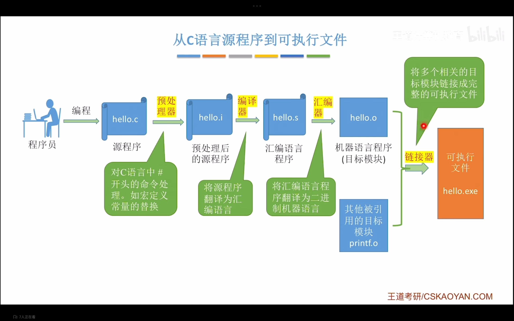

---
{
  "id": "28a5a2dd-8276-80a6-b306-c85873473df3",
  "url": "https://www.notion.so/1-2-5-28a5a2dd827680a6b306c85873473df3",
  "created_time": "2025-10-12T11:36:00.000Z",
  "last_edited_time": "2025-10-12T11:42:00.000Z"
}
---

#  1.2.5计算机系统的工作原理

### 从C语言源程序到可执行文件

