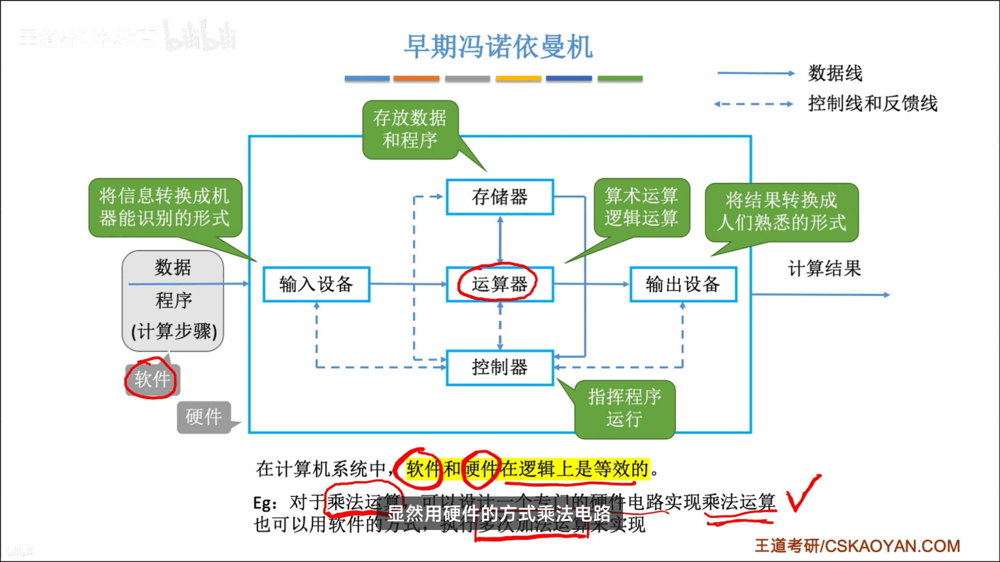
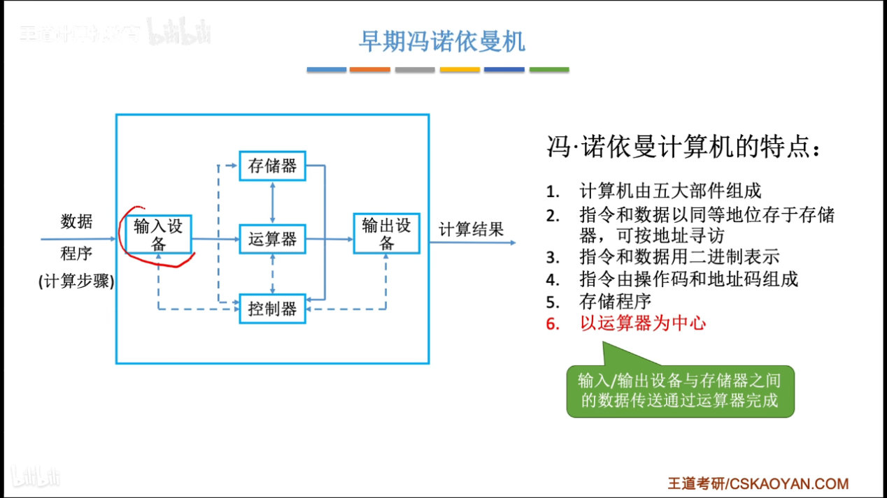

---
{
  "id": "26e5a2dd-8276-80ce-b37d-c2dd1db522f6",
  "url": "https://www.notion.so/26e5a2dd827680ceb37dc2dd1db522f6",
  "created_time": "2025-09-14T07:42:00.000Z",
  "last_edited_time": "2025-10-12T11:45:00.000Z"
}
---

# 🤖 计算机组成

[1.2.1计算机硬件基本组成](121计算机硬件基本组成/index.md)
  
  
  冯诺依曼结构是以运算器为中心的
  现代计算机结构是以存储器为核心的
  主存就是内存，辅存是硬盘
  主机=CPU（运算器+控制器）+主存储器
[1.2.2各硬件工作原理](122各硬件工作原理/index.md)
  ### 主存储器
  
  存储体存放数据
  **MAR（存储地址寄存器）****：**
  是CPU的一个寄存器，存放当前 CPU 想要访问的内存单元的地址，（其位数决定了字长）（不是分区表）
  **MDR（存储数据寄存器）****：**
  是CPU的一个寄存器，用于与主存交换数据（不是L1，2，3缓存）（不是CPU中的通用寄存器，是专用寄存器）
  MAR，MDR逻辑上属于主存
  **存储体：**
  存储体可分为一个个存储单元
  **存储单元：**
  一个存储单元可存放一串二进制代码
  **存储字：**
  存储单元中存储的一串二进制代码叫存储字
  **存储字长：**
  存储字的长度
  **存储元：**
  存储数据的最小物理单位，一个电容

  注意⚠️：
  一字节是8位
  一个字指的是一个存储单元的字长（不一定是8位）（取决于MAR的位数）
  ### 运算器
  **ACC（累加器）**
  累加器是一个寄存器，用于存放操作数和运算结果
  **MQ（乘商寄存器）**
  是一个寄存器，用于存放操作数和运算结果
  **X（通用寄存器）**
  用于存放操作数
  **ALU（算术逻辑单元）**
  实现算术和逻辑运算
  ### 控制器
  **CU（控制单元）**
  分析指令，给出控制信号
  **IR（指令寄存器）**
  存放当前指令
  **PC（程序计数器）**
  存放下一条指令的地址，有自动+1的功能

  程序运行过程：
  取指令→分析指令→执行指令
[1.2.3计算机软件](123计算机软件/index.md)
  计算机软件分系统软件和用户软件
  ### 三种级别的语言
  机器码
  汇编语言
  高级语言（可以翻译运行，也可以编译运行）
  ### 软件和硬件逻辑等价
  指令集（isa）定义了软件如何使用硬件
  # 完
[1.2.4计算机系统的层次结构](124计算机系统的层次结构/index.md)
  **M0微程序机器**
  将二进制指令拆成多个步骤执行的层级
  **M1传统机器**
  就是正常识别二进制的层级
  **M2虚拟机器**
  操作系统的层级
  **M3虚拟机器**
  使用汇编语言的层级
  **M4虚拟机器**
  使用高级语言的层级
[1.2.5计算机系统的工作原理](125计算机系统的工作原理/index.md)
  ### 从C语言源程序到可执行文件
  
[1.3.0计算机的性能指标](130计算机的性能指标/index.md)
